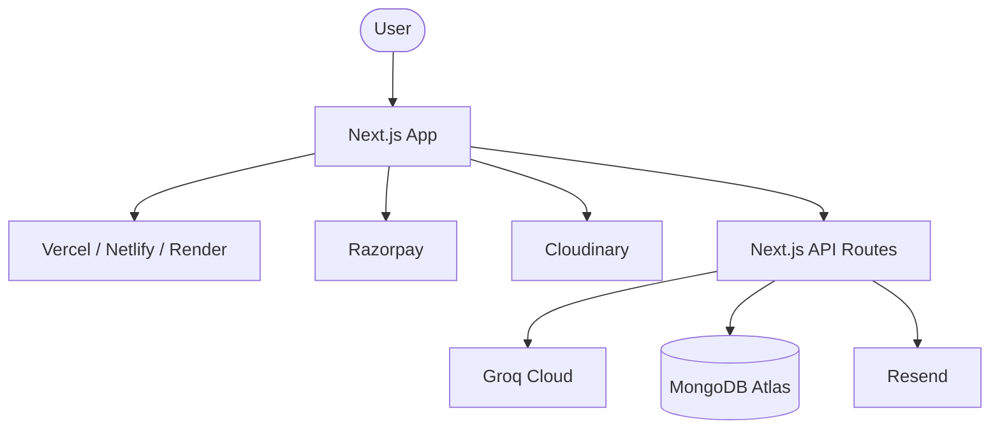

<div align="center">
  
</div>

# Authors & Acknowledgments

**Discover the creators, maintainers, and foundational technologies powering DevFlow AI.**

---

## Table of Contents

- [Overview](#overview)
- [Creator & Lead Developer](#creator--lead-developer)
- [Acknowledgments](#acknowledgments)
- [Technology Ecosystem](#technology-ecosystem)
- [Citation](#citation)
- [Best Practices for Reaching Out](#best-practices-for-reaching-out)
- [Related Documents](#related-documents)
- [Next Reading](#next-reading)

---

## Overview

DevFlow AI is built and maintained by dedicated developers and relies on a robust ecosystem of open-source projects and premium SaaS services. This document highlights the individuals and the technology stack that make DevFlow AI possible, reflecting our commitment to transparency and community gratitude.

---

## Creator & Lead Developer

The architecture, core development, and vision for DevFlow AI are led by:

### Digvijay Kumar Singh

- **GitHub:** [@chauhandigvijay1](https://github.com/chauhandigvijay1)
- **LinkedIn:** [Digvijay Kumar Singh](https://www.linkedin.com/in/digvijaykumarsingh)
- **Email:** [chauhandigvijay669@gmail.com](mailto:chauhandigvijay669@gmail.com)

> [!NOTE]
> Contributions, feedback, and collaborations are always welcome. Feel free to reach out via email or connect on LinkedIn to discuss the project.

---

## Acknowledgments

DevFlow AI stands on the shoulders of giants. We extend our deepest gratitude to the teams and maintainers behind the following technologies and platforms:

- **Next.js Team:** For creating the foundational React framework.
- **Vercel:** For developing Next.js and providing an unparalleled deployment ecosystem.
- **Groq Cloud:** For powering ultra-low-latency LPU inference capabilities.
- **Razorpay:** For robust and secure payment gateway infrastructure.
- **MongoDB Atlas:** For reliable and scalable cloud database hosting.
- **Cloudinary:** For seamless media storage and on-the-fly transformations.
- **Resend:** For dependable and fast email delivery services.
- **Netlify & Render:** For providing reliable alternative hosting and deployment solutions.

> [!IMPORTANT]
> A special thank you to all the open-source library maintainers. Your dedication to the open-source community makes projects like DevFlow AI possible.

---

## Technology Ecosystem

The following diagram illustrates how the acknowledged technologies interact within the DevFlow AI ecosystem:



---

## Citation

If you use DevFlow AI in your research or project, please consider citing it as follows:

```json
{
  "name": "DevFlow AI",
  "author": "Digvijay Kumar Singh",
  "year": 2025,
  "url": "https://github.com/chauhandigvijay1/devflow-AI"
}
```

---

## Best Practices for Reaching Out

To ensure effective communication with the maintainers:
1. **Check Issues First:** Before emailing about bugs or feature requests, please check the GitHub Issues tracker to see if it has already been reported.
2. **Be Specific:** When reaching out via email or LinkedIn, clearly state your intent (e.g., collaboration, enterprise inquiry, or general feedback).
3. **Professional Courtesy:** Maintain a professional and constructive tone in all communications.

---

## Related Documents

- [README.md](./README.md) - Project overview and quick start guide.
- [CONTRIBUTING.md](./CONTRIBUTING.md) - Guidelines for contributing to DevFlow AI.

## Next Reading

- [SECURITY.md](./SECURITY.md) - Learn about our security practices and how to report vulnerabilities.
- [CHANGELOG.md](./CHANGELOG.md) - Stay up to date with the latest features and fixes.

---

<div align="center">
  <p>
    <a href="./README.md">Home</a> &nbsp;&bull;&nbsp;
    <a href="https://github.com/chauhandigvijay1/devflow-AI">GitHub</a> &nbsp;&bull;&nbsp;
    <a href="./CONTRIBUTING.md">Contribute</a>
  </p>
  <sub>© 2025 DevFlow AI. Built with Next.js, Groq, and MongoDB.</sub>
</div>
