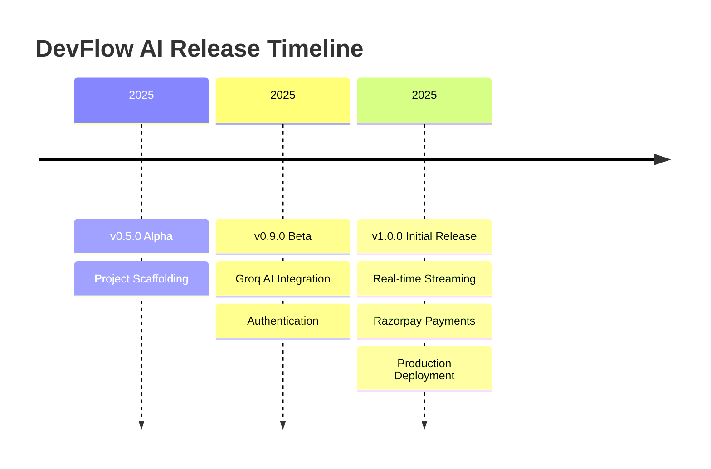

<div align="center">
  <picture>
    
  </picture>
  <br/>
  <h1>Changelog & Release Notes</h1>
  <p><b>Track the evolution, new features, and notable changes to DevFlow AI.</b></p>
</div>

---

## Table of Contents

- [Overview](#overview)
- [Release Timeline](#release-timeline)
- [Version History](#version-history)
  - [v1.0.0 — Initial Release](#v100--initial-release)
  - [v0.9.0 — Beta](#v090--beta)
  - [v0.5.0 — Alpha](#v050--alpha)
- [Upcoming Features](#upcoming-features)
- [Best Practices](#best-practices)
- [Related Documents](#related-documents)
- [Next Reading](#next-reading)

---

## Overview

Welcome to the DevFlow AI Changelog. This document provides a comprehensive history of the platform's development lifecycle, structural enhancements, and feature rollouts. The project is currently in its initial release phase with active, ongoing development.

> [!NOTE]
> We follow [Semantic Versioning (SemVer)](https://semver.org/) for all our releases. Major versions indicate breaking changes, minor versions add functionality in a backward-compatible manner, and patches provide backward-compatible bug fixes.

---

## Release Timeline



---

## Version History

### v1.0.0 — Initial Release

**Release Date:** 2025

Our first major stable release introduces a full-fledged production environment designed for scalable, real-time AI interactions.

> [!IMPORTANT]  
> If upgrading from Beta (v0.9.0), you must ensure your environment variables (including Razorpay and Resend keys) are fully configured before deployment.

#### ✨ Core Features
- **AI-powered Chat:** Integrated with Groq Cloud (Llama 3.1 8B) for ultra-low latency inference.
- **Real-time SSE Streaming:** Token-by-token response generation via Server-Sent Events.
- **Advanced Markdown rendering:** Includes syntax-highlighted code blocks for developer-friendly outputs.
- **Authentication & Security:** JWT-based flows (register, signup, login, logout) with secure, HttpOnly cookies.
- **Password Recovery:** Resend email API integration for secure resets.
- **Monetization & Subscriptions:** Seamless Razorpay payment integration for Pro subscriptions.
- **Coupon & Promotional System:** Apply codes like `FREETRIAL`, `OFF50`, and exclusive owner coupons.
- **Usage Tracking Engine:** 20 free prompts/day vs. 999 prompts/day for Pro users.
- **Media Management:** Cloudinary-backed image uploads featuring automatic cropping and compression.
- **UI/UX Enhancements:**
  - User preferences securely synced to the backend server.
  - Native dark/light mode with intelligent system preference detection.
  - Resizable, fully collapsible navigation sidebar.
  - Fluid, responsive design optimized for mobile, tablet, and desktop.
  - Smooth entry animations applied to messages and interactions.

#### 🏗️ Architecture & Infrastructure
- **Frontend Engine:** Next.js 16 (App Router, React 19).
- **Backend Service:** Express 5 (CommonJS).
- **Database:** MongoDB Atlas utilizing Mongoose 8 ODM.
- **Data Modeling:** Highly optimized embedded subdocuments for messages and subscriptions to minimize latency.
- **Resilience:** Graceful shutdown handling (intercepting `SIGINT`, `SIGTERM`).
- **Error Handling:** Comprehensive error middleware mapping Mongoose validation errors strictly to standard HTTP status codes.

#### 🚀 Deployment
- **Frontend:** Hosted on Netlify utilizing `@netlify/plugin-nextjs`.
- **Backend:** Distributed as a robust web service via Render.
- **CI/CD:** Automated Netlify deployments triggered upon commits to the `main` branch.

<details>
<summary><b>View Example: Validating Environment Configuration in v1.0.0</b></summary>

```bash
# Verify new environment variables required in v1.0.0
NODE_ENV=production
GROQ_API_KEY=your_key_here
RAZORPAY_KEY_ID=your_key
RAZORPAY_KEY_SECRET=your_secret
RESEND_API_KEY=your_resend_key
CLOUDINARY_URL=your_cloudinary_url
```
</details>

---

### v0.9.0 — Beta

**Release Date:** 2025

The Beta release focused on establishing core end-to-end user journeys and connecting the AI endpoints.

> [!WARNING]  
> Data from the Beta testing phase (including Razorpay test mode transactions) is isolated from the v1.0.0 production database schema.

- **AI Integration:** Initial Groq AI integration with streaming chat capabilities.
- **Security:** Basic auth primitives established (register, login, JWT).
- **Database:** Finalized MongoDB schema design with embedded subscriptions.
- **Payments:** Integrated Razorpay test mode payments for subscription validation.
- **Profile Management:** Cloudinary-powered profile image uploads.
- **UI Implementations:** 
  - Comprehensive dashboard featuring recent chat lists.
  - Dedicated settings portal managing user preferences.

---

### v0.5.0 — Alpha

**Release Date:** 2025

Initial foundations and architectural scaffolding.

- **Project Scaffolding:** Initialized monorepo/polyrepo structure for Next.js + Express.
- **Database Connections:** Established MongoDB persistence with baseline Mongoose models.
- **Design System:** Engineered basic UI components (Button, Input, Textarea) paired with Tailwind CSS configuration.
- **Middleware Integration:** Implemented robust authentication middleware pipelines.

---

## Upcoming Features

Our engineering team is actively working on the next generation of capabilities for DevFlow AI:

| Feature | Description | Status |
| :--- | :--- | :--- |
| **Token Counting** | Granular billing mechanics based on exact token usage for finer-grained billing. | Planning |
| **Model Selection** | Allow users to select alternate LLMs as a preference. | In Design |
| **Context Truncation** | Intelligent conversation context truncation for excessively long chats. | In Progress |
| **Email Verification** | Hardened signup flow requiring email verification on signup. | Backlog |
| **Recurring Billing** | Subscription lifecycle management via Razorpay subscriptions. | Next Up |
| **Webhook Engine** | Robust handling mechanisms for payment events. | Development |
| **Invoice Generation** | Automated PDF billing statements. | Planning |
| **Multi-currency** | Global localized pricing models support. | Research |
| **E2E Test Suites** | Comprehensive automation testing with Playwright. | Ongoing |

---

## Best Practices

> [!TIP]  
> **How to stay updated**
>
> 1. Watch this repository on GitHub to receive notifications on new releases.
> 2. Always review the **Architecture & Infrastructure** sections before major version bumps to ensure your local environments match production dependencies.
> 3. Utilize the provided migration snippets (when available) if transitioning from legacy versions.

---

## Related Documents

Expand your understanding of DevFlow AI's technical footprint by reviewing the following core materials:

- [Architecture Overview](./docs/architecture.md) — Dive into system diagrams and data flow.
- [Project Roadmap](./ROADMAP.md) — Detailed view of our upcoming milestones.
- [Contributing Guidelines](./CONTRIBUTING.md) — Learn how to propose features or fix bugs.

---

## Next Reading

Continue your journey through our documentation ecosystem:

<div align="center">
  <a href="./docs/README.md">
    
  </a>
</div>

---

<div align="center">
  <p>Built with Next.js, Express, and Groq</p>
  <p>&copy; 2025 DevFlow AI. All rights reserved.</p>
</div>
