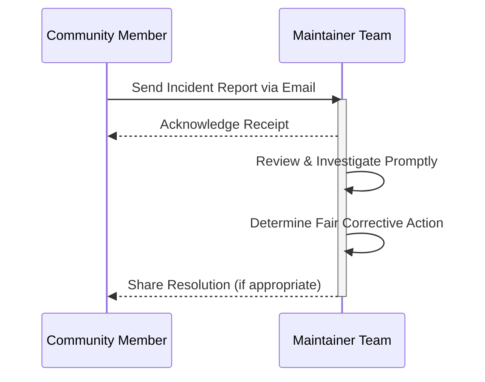

<div align="center">
  <picture>
    
  </picture>
</div>

# Code of Conduct

*Fostering an open, welcoming, diverse, inclusive, and healthy community.*

---

## Table of Contents

- [Overview](#overview)
- [Our Pledge](#our-pledge)
- [Our Standards](#our-standards)
  - [Positive Environment](#positive-environment)
  - [Unacceptable Behavior](#unacceptable-behavior)
- [Enforcement Responsibilities](#enforcement-responsibilities)
- [Scope](#scope)
- [Enforcement & Reporting Process](#enforcement--reporting-process)
- [Best Practices](#best-practices)
- [Related Documents](#related-documents)
- [Next Reading](#next-reading)
- [Attribution](#attribution)

---

## Overview

Welcome to the DevFlow AI Code of Conduct. We are dedicated to providing a collaborative, safe, and harassment-free experience for everyone in our community. This document outlines our shared values, expected standards of behavior, and the process for reporting any violations.

> [!NOTE]
> By participating in any DevFlow AI project or community space, you agree to abide by this Code of Conduct.

---

## Our Pledge

We as members, contributors, and leaders pledge to make participation in our community a harassment-free experience for everyone, regardless of:
- Age
- Body size
- Visible or invisible disability
- Ethnicity
- Sex characteristics
- Gender identity and expression
- Level of experience
- Education
- Socio-economic status
- Nationality
- Personal appearance
- Race
- Religion
- Sexual identity and orientation

We pledge to act and interact in ways that contribute to an open, welcoming, diverse, inclusive, and healthy community.

---

## Our Standards

To ensure a thriving community, we have established guidelines for both expected positive contributions and strictly prohibited behaviors.

### Positive Environment

Examples of behavior that contributes to a positive environment include, but are not limited to:

- **Demonstrating empathy and kindness** toward other people.
- **Being respectful** of differing opinions, viewpoints, and experiences.
- **Giving and gracefully accepting** constructive feedback.
- **Accepting responsibility** and apologizing to those affected by our mistakes.
- **Focusing on what is best** not just for us as individuals, but for the overall community.

### Unacceptable Behavior

> [!WARNING]
> Violations of these rules may lead to immediate moderation actions, including permanent bans from community spaces.

Examples of unacceptable behavior include:

- The use of sexualized language or imagery, and sexual attention or advances.
- Trolling, insulting or derogatory comments, and personal or political attacks.
- Public or private harassment.
- Publishing others' private information without explicit permission.
- Other conduct which could reasonably be considered inappropriate in a professional setting.

---

## Enforcement Responsibilities

Project maintainers are responsible for clarifying and enforcing our standards of acceptable behavior. They will take appropriate and fair corrective action in response to any behavior that they deem inappropriate, threatening, offensive, or harmful.

> [!IMPORTANT]
> Maintainers have the right and responsibility to remove, edit, or reject comments, commits, code, wiki edits, issues, and other contributions that are not aligned to this Code of Conduct.

---

## Scope

This Code of Conduct applies within all community spaces, and also applies when an individual is officially representing the community in public spaces.

---

## Enforcement & Reporting Process

Instances of abusive, harassing, or otherwise unacceptable behavior may be reported to the project team at [chauhandigvijay669@gmail.com](mailto:chauhandigvijay669@gmail.com).

All complaints will be reviewed and investigated promptly and fairly. The project team is obligated to respect the privacy and security of the reporter of any incident.

### Reporting Flow



### Template for Incident Report

When reporting an incident, please provide as much context as possible:

```text
Subject: Code of Conduct Incident Report - [Date]

- Your Name / Handle:
- Offender Name / Handle:
- Date and Time of Incident:
- Location/Platform (e.g., Issue #123, Discord channel):
- Description of the Incident:
- Any evidence (links, screenshots):
```

---

## Best Practices

To maintain our premium SaaS standards in community interaction, we encourage all contributors to follow these best practices:
1. **Assume Positive Intent:** Understand that written communication can be misinterpreted. Ask for clarification before reacting.
2. **Use Inclusive Language:** Avoid jargon and idioms that may not translate well globally.
3. **Be Constructive:** Frame feedback around the work, not the person.

---

## Related Documents

- [Contributing Guidelines](./CONTRIBUTING.md)
- [Security Policy](./SECURITY.md)
- [License](./LICENSE)

---

## Next Reading

- Dive into our architecture in the [README](./README.md).

---

## Attribution

This Code of Conduct is adapted from the [Contributor Covenant](https://www.contributor-covenant.org), version 2.1.

---

<div align="center">
  <p><sub>DevFlow AI — © 2025</sub></p>
  <p><em>Built with modern web technologies. Fostering a healthy open-source ecosystem.</em></p>
</div>
