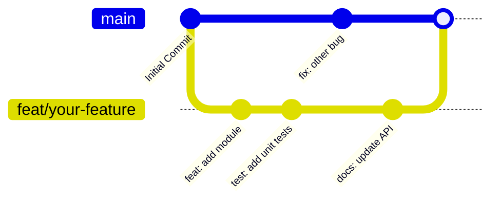

<div align="center">
  <picture>
    
  </picture>
</div>

# Contributing to DevFlow AI

> Comprehensive guidelines for contributing to DevFlow AI, covering coding standards, development workflows, and the pull request process.

## Table of Contents

- [Overview](#overview)
- [Development Setup](#development-setup)
- [Coding Standards](#coding-standards)
- [Git Workflow](#git-workflow)
- [Pull Request Process](#pull-request-process)
- [Testing](#testing)
- [Documentation](#documentation)
- [Code of Conduct](#code-of-conduct)
- [Best Practices](#best-practices)
- [Related Documents](#related-documents)

---

## Overview

Thank you for considering contributing to DevFlow AI! This document outlines the development workflow, coding standards, and expectations for contributors. To ensure a low barrier to entry, the project is built using **plain JavaScript (no TypeScript)**. We strive for high code quality, comprehensive testing, and clear communication.

---

## Development Setup

> [!IMPORTANT]
> Ensure you have all the prerequisite accounts and software installed before beginning the setup process.

### Prerequisites

- **Node.js 18+**
- **MongoDB Atlas** cluster (free tier is sufficient)
- **Groq Cloud API** key
- **Razorpay** test keys
- **Cloudinary** account
- **Resend API** key (optional, for password reset functionality)

### Setup Steps

Get your local environment running by cloning the repository and setting up both the server and the client.

```bash
# Clone the repository
git clone https://github.com/chauhandigvijay1/devflow-AI.git
cd devflow-AI

# Server setup
cd server
cp .env.example .env          # Use `copy .env.example .env` on Windows
npm install                   # Use `npm.cmd install` on Windows

# Edit the newly created .env file with your specific credentials
```

```bash
# Client setup
cd ../client
cp .env.local.example .env.local  # Use `copy` on Windows
npm install                       # Use `npm.cmd` on Windows

# Run both in separate terminal windows
# Terminal 1:
cd server && npm run dev          # Use `npm.cmd run dev` on Windows

# Terminal 2:
cd client && npm run dev          # Use `npm.cmd run dev` on Windows
```

---

## Coding Standards

### Language & Syntax

- **Plain JavaScript**: We use CommonJS on the server and ES Modules + JSX on the client.
- **No TypeScript**: We intentionally avoid TypeScript to keep the contribution barrier low.
- **Linting & Formatting**: We enforce strict standards using ESLint and Prettier.

### Server (Express)

- Use CommonJS (`require` / `module.exports`).
- Wrap all async route handlers with the `asyncHandler` utility.
- Throw custom errors using `new AppError(message, statusCode)`.
- Use Mongoose models, leveraging embedded subdocuments where appropriate.

### Client (Next.js)

- Use ES Modules (`import` / `export`).
- Write React components using JSX.
- Manage state via **Redux Toolkit** (using the slices pattern).
- Style components with **Tailwind CSS v4** (utility classes only; no CSS modules).

### Code Style

> [!TIP]
> Prefer early returns to keep the code flat and easily readable. Always use `const` over `let`, and strictly avoid `var`.

```javascript
// Preferred: use const and try/catch for async operations
const handleSubmit = async () => {
  try {
    await api.post("/endpoint", data);
  } catch (error) {
    // Handle error gracefully
  }
};

// Preferred: early returns
if (!condition) return;
```

### Naming Conventions

| Entity | Convention | Example |
|---|---|---|
| **Files/Directories** | `kebab-case` | `auth-controller.js` |
| **Functions/Variables** | `camelCase` | `getUserById` |
| **Constants** | `UPPER_SNAKE_CASE` | `DAILY_LIMIT` |
| **Components** | `PascalCase` | `ChatWindow` |
| **CSS Classes** | `kebab-case` | `message-enter` |

### Linting & Formatting

> [!WARNING]
> Your pull request will fail CI checks if the code is not properly linted and formatted.

```bash
# Linting (Use npm.cmd on Windows)
cd server && npm run lint
cd client && npm run lint:strict

# Formatting - Prettier with shared config (Use npm.cmd on Windows)
cd server && npm run format
cd client && npm run format
```

---

## Git Workflow

Our workflow relies on atomic commits and a clean feature branch model.



1. **Fork** the repository to your own GitHub account.
2. **Create a feature branch** originating from `main`:
   ```bash
   git checkout -b feat/your-feature-name
   # or for bug fixes:
   git checkout -b fix/your-bug-fix
   ```
3. **Write descriptive commit messages** following the Conventional Commits specification:
   ```text
   feat: add new feature
   fix: correct bug in auth
   docs: update API reference
   refactor: extract utility function
   ```
4. **Keep commits atomic**: Make sure each commit represents one logical change.
5. **Rebase on main** before submitting your Pull Request to ensure a clean history:
   ```bash
   git fetch origin
   git rebase origin/main
   ```

---

## Pull Request Process

A high-quality PR makes the review process faster and more efficient.

1. **Pass Linting**: Ensure code passes linting (`npm run lint` on server and client).
2. **Run Tests**: Execute backend tests (`npm test` on server) and confirm they all pass.
3. **Format Code**: Run `npm run format` across both server and client codebases.
4. **Test Functionality**: Write or update tests for any new logic introduced.
5. **Update Documentation**: Modify the docs if your changes affect the API, architecture, or features.
6. **Submit PR**: Provide a clear title and detailed description answering:
   - What does this PR do?
   - How was it tested?
   - Are there any breaking changes?
   - *Include screenshots or GIFs for any UI changes.*

### PR Title Format

Use conventional commit scoping for PR titles:
```text
<type>(<scope>): <description>
```
*Examples:*
- `feat(auth): add GitHub OAuth login`
- `fix(chat): handle empty stream response`
- `docs(api): add rate limit documentation`

---

## Testing

> [!IMPORTANT]
> Aim for at least **80% coverage** on any new code you submit.

- **Backend Tests**: We use Jest for unit testing. All tests live in `server/src/__tests__/`.
- **Running Tests**:
  ```bash
  cd server && npm test # Use npm.cmd test on Windows
  ```
- **Guidelines**:
  - Whenever you add new controllers or models, create corresponding test files.
  - Always mock external services (e.g., Groq, Razorpay, Cloudinary) to ensure tests run reliably and without network dependencies.

---

## Documentation

- All system documentation is located in the `docs/` directory.
- Use **Markdown** and maintain consistent, beautiful formatting.
- Follow our established document template: Hero Section → Table of Contents → Content → Related Docs → Navigation.
- Embed **Mermaid diagrams** for architecture, sequences, and complex data flows.
- Keep documentation tightly synced with codebase changes.

---

## Code of Conduct

We are committed to providing a welcoming and inspiring community.
- **Be respectful and inclusive**: Treat all contributors with kindness.
- **Provide constructive feedback**: Frame reviews in a helpful, collaborative way.
- **Focus on the code**: Direct critique at the implementation, never the person.
- **Welcome newcomers**: Answer questions patiently and help new developers onboard.

---

## Best Practices

> [!TIP]
> - **Self-Review**: Always review your own code diffs before opening a PR.
> - **Communicate**: If you're working on a massive feature, open a draft PR early to get alignment.
> - **Performance**: Be mindful of unneeded re-renders on the client and inefficient database queries on the server.

---

## Related Documents

- [Architecture Overview](./docs/architecture.md)
- [Testing Guide](./docs/testing.md)
- [Changelog](./CHANGELOG.md)

## Next Reading

> **Next:** [Architecture Overview](./docs/architecture.md) — Dive into the system architecture, data flows, and our core design decisions.

---

<div align="center">
  <p>Built with ❤️ by the DevFlow AI Contributors</p>
  <p>
    <sub>DevFlow AI — © 2026</sub>
  </p>
</div>
