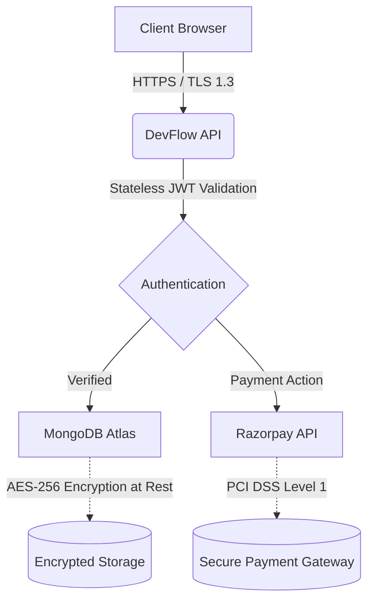

<picture>
  
</picture>

# Privacy Policy

**Last updated: July 2025**

This Privacy Policy describes how DevFlow AI collects, uses, and discloses your information when you use our platform, ensuring full transparency in our data practices.

## Table of Contents

- [Overview](#overview)
- [Information We Collect](#information-we-collect)
- [How We Use Your Information](#how-we-use-your-information)
- [Third-Party Services](#third-party-services)
- [Data Retention](#data-retention)
- [Your Rights](#your-rights)
- [Security Measures](#security-measures)
- [Children's Privacy](#childrens-privacy)
- [Best Practices for Privacy](#best-practices-for-privacy)
- [Changes to This Policy](#changes-to-this-policy)
- [Contact](#contact)
- [Next Reading](#next-reading)

## Overview

At DevFlow AI, we are committed to protecting your personal information and your right to privacy. This policy outlines our data processing practices, emphasizing transparency, security, and user autonomy. 

> [!IMPORTANT]
> By using DevFlow AI, you agree to the collection and use of information in accordance with this Privacy Policy. If you do not agree with any part of this policy, please discontinue your use of the platform.

## Information We Collect

### Information You Provide

| Category | Data | Purpose |
|---|---|---|
| **Account** | Email address, username, password (hashed with bcrypt) | Registration, authentication, account management |
| **Profile** | Profile image (uploaded to Cloudinary) | Display on account page |
| **AI Chat** | Chat messages, conversation history | Provide AI assistant service, improve responses |
| **Billing** | Subscription plan selection, Razorpay payment ID, order ID | Process payments, manage subscriptions |
| **Support** | Emails sent via contact form | Customer support inquiries |

### Information Collected Automatically

| Category | Data | Purpose |
|---|---|---|
| **Usage** | Page views, feature interactions | Improve user experience, analytics |
| **Device** | Browser type, operating system, screen size | Optimise rendering, browser compatibility |
| **Network** | IP address, request timestamps | Security monitoring, rate limiting |

## How We Use Your Information

Our primary goal in collecting information is to provide you with a secure, efficient, and customized experience. We use your data to:

- **Provide the Service** — Authenticate users, process AI chat requests, and manage subscriptions.
- **Improve the Platform** — Analyse usage patterns to optimise features and platform performance.
- **Communicate** — Send password reset emails via Resend, and notify you of billing changes.
- **Enhance Security** — Detect and prevent abuse, enforce API rate limits, and block disposable email domains.
- **Ensure Legal Compliance** — Maintain essential records as required by applicable law.

> [!NOTE]
> ### Our Commitment to Your Privacy
> - **We DO NOT sell** your personal data to third parties.
> - **We DO NOT use** your chat data to train external AI models.
> - **We DO NOT share** your payment details (all payment processing is handled strictly by Razorpay).
> - **We DO NOT send** marketing emails without your explicit consent.

## Third-Party Services

DevFlow AI integrates with trusted third-party services to deliver its capabilities. Each service has its own privacy policy governing data handling.

| Service | Data Shared | Privacy Policy |
|---|---|---|
| **Groq Cloud** | AI chat messages (for inference only) | [Groq Privacy Policy](https://groq.com/privacy) |
| **Razorpay** | Name, email, payment amount | [Razorpay Privacy Policy](https://razorpay.com/privacy) |
| **Cloudinary** | Profile images | [Cloudinary Privacy Policy](https://cloudinary.com/privacy) |
| **Resend** | Email address (for password reset) | [Resend Privacy Policy](https://resend.com/privacy) |
| **MongoDB Atlas** | All persisted data (encrypted at rest) | [MongoDB Privacy Policy](https://www.mongodb.com/privacy) |
| **Render** | Server logs (IP addresses, timestamps) | [Render Privacy Policy](https://render.com/privacy) |
| **Netlify** | Frontend access logs | [Netlify Privacy Policy](https://www.netlify.com/privacy) |

> [!TIP]
> AI chat messages sent to Groq are used strictly to generate immediate responses and are **not** retained by Groq for any model training purposes.

## Data Retention

We retain your data only for as long as necessary to fulfill the purposes outlined in this policy.

| Data Type | Retention Period | Rationale |
|---|---|---|
| **Account Data** | Until account is deleted | Active service requirement |
| **Chat History** | Until account is deleted | User convenience, conversation continuity |
| **Billing Records**| 7 years (tax compliance) | Legal requirement (India IT Act) |
| **Server Logs** | 90 days rolling | Security monitoring, debugging |
| **Soft-Deleted Accounts** | Indefinite (data retained, account inaccessible) | Recovery option, data integrity |

### Account Deletion

> [!WARNING]
> When you delete your account, this action triggers a specific data removal process that cannot be fully reversed.

- Your **email and username** are immediately released for reuse.
- Your **chat history** is retained in the database but rendered inaccessible to you.
- **Billing records** are retained for legal and tax compliance.
- **Profile images** stored on Cloudinary are permanently removed.

## Your Rights

Depending on your jurisdiction (such as GDPR for the EEA, or CCPA for California), you may have specific rights regarding your personal data:

- **Access** — Request a copy of your personal data currently in our possession.
- **Rectification** — Correct inaccurate or incomplete data via your account settings.
- **Erasure** — Request permanent deletion of your data from our active systems.
- **Portability** — Receive your data in a structured, machine-readable format.
- **Objection** — Object to the processing of your data for specific purposes.

> [!IMPORTANT]
> To exercise any of these rights, please contact us at [chauhandigvijay669@gmail.com](mailto:chauhandigvijay669@gmail.com). We aim to respond to all legitimate requests within **30 days**.

## Security Measures

We implement robust architectural and software measures to protect your data from unauthorized access, alteration, or destruction:

Our detailed security protocols include:

- **Encryption in Transit** — All API traffic uses HTTPS/TLS protocols to ensure secure data transfer.
- **Encryption at Rest** — MongoDB Atlas encrypts data at rest using industry-standard AES-256 encryption.
- **Password Hashing** — All passwords are cryptographically hashed using `bcrypt` with 12 salt rounds before storage.
- **JWT Authentication** — We utilize stateless JSON Web Tokens with a maximum 7-day expiry.
- **Payment Security** — All payments are processed directly by Razorpay. No card data ever touches our servers, ensuring full PCI DSS Level 1 compliance.
- **Rate Limiting** — API rate limiting is enforced globally to prevent abuse and ensure service availability for all users.
- **Security Headers** — Helmet middleware sets robust Content Security Policy (CSP), HTTP Strict Transport Security (HSTS), X-Frame-Options, and other essential security headers.

## Children's Privacy

DevFlow AI is not intended for use by individuals under 13 years of age. We do not knowingly collect personal data from children. 

> [!CAUTION]
> If you are a parent or guardian and believe your child has provided us with personal data, please contact us immediately so we can identify and securely delete that information.

## Best Practices for Privacy

> [!TIP]
> We encourage all users to adopt the following best practices:
> - Use a strong, unique password for your DevFlow AI account.
> - Do not share your login credentials or JWT tokens.
> - Review your chat history periodically and clear out information you no longer need.

## Changes to This Policy

We may update this Privacy Policy from time to time to reflect changes in our operational practices or legal requirements. Material changes will be communicated directly via email or through a prominent notice on the DevFlow AI platform. Continued use of the platform after these changes constitutes your active acceptance of the revised policy.

## Contact

For any privacy-related inquiries, support, or data requests, please reach out to us:

- **Email:** [chauhandigvijay669@gmail.com](mailto:chauhandigvijay669@gmail.com)
- **GitHub:** [@chauhandigvijay1](https://github.com/chauhandigvijay1)
- **Response Time:** Within 30 days

---

## Next Reading

- [Terms of Service](./TERMS_OF_SERVICE.md) — Terms and conditions governing your use of the DevFlow AI platform.

---

  DevFlow AI — © 2025 • Engineered with ❤️ for the community

