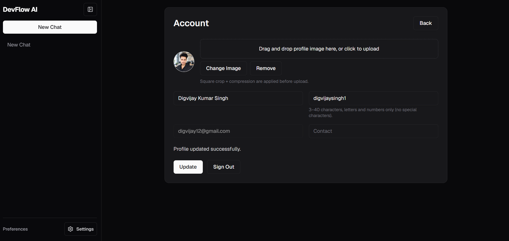

<picture>
  <source media="(prefers-color-scheme: dark)" srcset="./client/public/logo.svg">
  
</picture>

# DevFlow AI

**AI-Powered Development Assistant** — A premium SaaS platform providing real-time AI chat, code explanations, and developer workflow automation.

<br clear="left">

<p>
  
  
  
  
  
  
  
  
</p>

---

## Live Demo

| Service | URL |
|---|---|
| **Frontend** | [https://devflow-ai-client.netlify.app](https://devflow-ai-client.netlify.app) |
| **Backend API** | [https://devflow-api-ubnd.onrender.com](https://devflow-api-ubnd.onrender.com) |
| **Health Check** | [https://devflow-api-ubnd.onrender.com/api/health](https://devflow-api-ubnd.onrender.com/api/health) |

### Demo Video

[**View Demo Walkthrough**](https://drive.google.com/file/d/1i_7GaBoV9wYduITWSZtkO-jt4Ic7SoVD/view?usp=sharing)

### Screenshots

<details>
<summary>Authentication (Click to expand)</summary>


</details>

<details>
<summary>Core Application (Click to expand)</summary>



</details>

---

## Features

### AI Chat
- Real-time streaming responses via Groq API (Llama 3.1 8B)
- Markdown rendering with syntax-highlighted code blocks (Prism/oneDark)
- Persistent chat history with auto-generated titles
- Server-Sent Events (SSE) for token-by-token streaming
- Code explanation endpoint (non-streaming, single-turn)

### Authentication & Security
- JWT-based stateless auth (7-day expiry)
- Password hashing with bcrypt (12 rounds)
- Disposable email domain blocklist
- Strong password policy (8+ chars, upper + lower + digit)
- Soft account deletion with email/username release
- Password reset via Resend email API

### Billing & Subscriptions
- Free tier: 20 prompts/day
- Pro tier: Unlimited prompts (₹299/month)
- Razorpay payment gateway with HMAC-SHA256 signature verification
- Coupon system (FREETRIAL, OFF50, owner coupon)
- Instant subscription cancellation

### User Experience
- Dark/light mode with system preference detection
- Resizable, collapsible sidebar
- Profile image upload with crop + compression (Cloudinary)
- User preferences synced to server (persists across devices)
- Responsive design (mobile, tablet, desktop)
- Entry animations on messages and interactions

---

## Tech Stack

| Layer | Technology |
|---|---|
| **Frontend** | Next.js 16 (App Router), React 19, Tailwind CSS v4, Redux Toolkit, shadcn/ui |
| **Backend** | Node.js, Express 5, Mongoose 8, JWT, bcryptjs |
| **Database** | MongoDB Atlas |
| **AI** | Groq Cloud (Llama 3.1 8B) |
| **Payments** | Razorpay |
| **Email** | Resend |
| **Media** | Cloudinary |
| **Hosting** | Netlify (frontend), Render (backend) |

---

## Project Structure

```
devflow-ai/
├── server/                     # Express API server
│   ├── src/
│   │   ├── config/             # DB connection, env loader
│   │   ├── controllers/        # Route handlers (auth, chat, AI, payment, upload)
│   │   ├── middleware/         # Auth, error handling, validation runner
│   │   ├── models/             # Mongoose schemas (User, Chat, Subscription)
│   │   ├── routes/             # Express routers
│   │   ├── utils/              # AppError, asyncHandler, JWT sign, email
│   │   └── __tests__/          # Jest unit tests
│   ├── .env.example            # Environment template
│   ├── .eslintrc.json          # ESLint config
│   ├── .prettierrc             # Prettier config
│   └── jest.config.js          # Test runner config
├── client/                     # Next.js frontend
│   ├── app/                    # App router pages
│   │   ├── login/              # Login page
│   │   ├── signup/             # Registration
│   │   ├── dashboard/          # Main dashboard
│   │   ├── chat/[id]/          # Chat session (SSR-disabled)
│   │   ├── settings/           # User preferences
│   │   ├── settings/billing/   # Subscription management
│   │   ├── account/            # Profile editing
│   │   ├── pricing/            # Plan comparison
│   │   ├── forgot-password/    # Password reset request
│   │   ├── reset-password/     # Password reset confirmation
│   │   ├── layout.jsx          # Root layout with SEO metadata
│   │   ├── loading.jsx         # App-level loading state
│   │   ├── error.jsx           # Error boundary page
│   │   └── not-found.jsx       # Custom 404 page
│   ├── components/             # Reusable UI components
│   │   ├── ui/                 # Button, Input, Textarea (shadcn)
│   │   ├── layout/             # Dashboard shell, sidebar
│   │   ├── chat/               # Chat window with streaming
│   │   └── account/            # Avatar cropper
│   ├── lib/                    # Axios client, utils, image processing
│   ├── store/                  # Redux slices (auth, chat)
│   └── public/                 # Static assets (favicon, icons, OG image)
├── docs/                       # Comprehensive documentation
└── Screenshots/                # App screenshots
```

---

## Quick Start

### Prerequisites
- Node.js 18+
- MongoDB Atlas cluster
- Groq Cloud API key
- Razorpay test/live keys
- Cloudinary account
- Resend API key (for password reset emails)

### 1. Clone and Install

```bash
git clone https://github.com/chauhandigvijay1/web-dev-journey.git
cd web-dev-journey/Real-world-projects/devflow-ai

# Server
cd server
copy .env.example .env
npm.cmd install

# Client
cd ../client
copy .env.local.example .env.local
npm.cmd install
```

### 2. Configure Environment

Edit `server/.env` with your credentials (see `server/.env.example` for all options):

```env
MONGO_URI=mongodb+srv://<user>:<pass>@cluster.xxxxx.mongodb.net/devflow?retryWrites=true&w=majority
JWT_SECRET=<your_strong_random_secret>
JWT_EXPIRES_IN=7d
CLIENT_URL=http://localhost:3000
CLIENT_URLS=http://localhost:3000,http://localhost:5173
GROQ_API_KEY=gsk_your_groq_key
AI_MODEL=llama3-8b-8192
RAZORPAY_KEY_ID=rzp_test_xxxxxxxxxxxx
RAZORPAY_KEY_SECRET=xxxxxxxxxxxxxxxxxxxxxxxx
CLOUDINARY_CLOUD_NAME=your_cloud_name
CLOUDINARY_API_KEY=123456789012345
CLOUDINARY_API_SECRET=xxxxxxxxxxxxxxxxxxxxxxxxxxxxxxx
RESEND_API_KEY=re_your_resend_key
EMAIL_FROM=noreply@yourdomain.com
OWNER_COUPON=YOUR_SECRET_COUPON
OWNER_COUPON_DURATION=30
```

Edit `client/.env.local`:

```env
NEXT_PUBLIC_API_URL=http://localhost:5000
NEXT_PUBLIC_RAZORPAY_KEY_ID=rzp_test_xxxxxxxxxxxx
```

### 3. Run Development Servers

```bash
# Terminal 1 — Backend
cd server
npm.cmd run dev        # http://localhost:5000

# Terminal 2 — Frontend
cd client
npm.cmd run dev        # http://localhost:3000
```

### 4. Run Tests & Lint

```bash
# Server
cd server
npm.cmd test           # Jest unit tests
npm.cmd run lint       # ESLint
npm.cmd run format     # Prettier

# Client
cd client
npm.cmd run lint:strict
npm.cmd run format
```

---

## Documentation

| Document | Description |
|---|---|
| [API Reference](./docs/API.md) | Complete REST API documentation with request/response schemas |
| [Architecture](./docs/ARCHITECTURE.md) | System architecture, data flow diagrams, hosting topology |
| [Database Schema](./docs/DATABASE.md) | MongoDB collections, indexes, embedded documents |
| [AI Integration](./docs/AI.md) | Groq streaming, SSE protocol, usage limits |
| [Authentication](./docs/AUTHENTICATION.md) | JWT flow, registration, password reset, security |
| [Payment & Billing](./docs/PAYMENT.md) | Razorpay integration, coupons, subscription management |
| [Deployment Guide](./docs/DEPLOYMENT.md) | Netlify + Render setup, environment variables |
| [Environment Variables](./docs/ENVIRONMENT.md) | Full env reference with defaults and examples |

---

## Deployment

### Backend (Render)
- Create a Node.js Web Service
- Build command: `cd server && npm.cmd install`
- Start command: `cd server && npm.cmd start`
- Set all environment variables in the Render dashboard

### Frontend (Netlify)
- Connect your GitHub repository
- Base directory: `client/`
- Build command: `npm.cmd run build`
- Publish directory: `.next`
- Set `NEXT_PUBLIC_API_URL` and `NEXT_PUBLIC_RAZORPAY_KEY_ID` in Netlify dashboard

---

## Scripts Reference

### Server

| Script | Command | Description |
|---|---|---|
| `dev` | `nodemon src/server.js` | Dev server with hot reload |
| `start` | `node src/server.js` | Production server |
| `test` | `jest` | Run unit tests |
| `lint` | `eslint src/` | ESLint check |
| `format` | `prettier --write "src/**/*.js"` | Auto-format |

### Client

| Script | Command | Description |
|---|---|---|
| `dev` | `next dev --webpack` | Next.js dev server |
| `build` | `next build` | Production build |
| `start` | `next start` | Production server |
| `lint:strict` | `eslint app/ components/ lib/ store/` | ESLint check |
| `format` | `prettier --write ...` | Auto-format |

---

## Troubleshooting

| Issue | Solution |
|---|---|
| **CORS errors** | Ensure `CLIENT_URL` in backend `.env` matches the frontend origin exactly |
| **MongoDB connection fails** | Add `0.0.0.0/0` to Atlas IP whitelist |
| **Razorpay checkout fails** | Verify `NEXT_PUBLIC_RAZORPAY_KEY_ID` is the **Key ID** (not the secret) |
| **500 errors in production** | Check `NODE_ENV=production` is set and all required env vars are present |
| **Render cold starts** | Free tier spins down after 15min idle — first request takes 5-10s |

---

## Author

**Digvijay Kumar Singh**
- [GitHub](https://github.com/chauhandigvijay1)
- [LinkedIn](https://www.linkedin.com/in/digvijaykumarsingh)
- Email: [chauhandigvijay669@gmail.com](mailto:chauhandigvijay669@gmail.com)

---

<p align="center">
  <sub>Built with Next.js, Express, MongoDB, and Groq AI</sub>
  <br>
  <sub>DevFlow AI — © 2025</sub>
</p>
