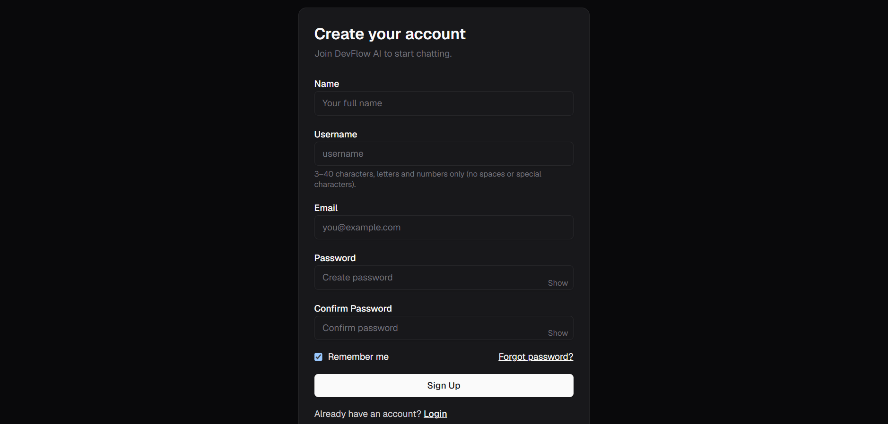
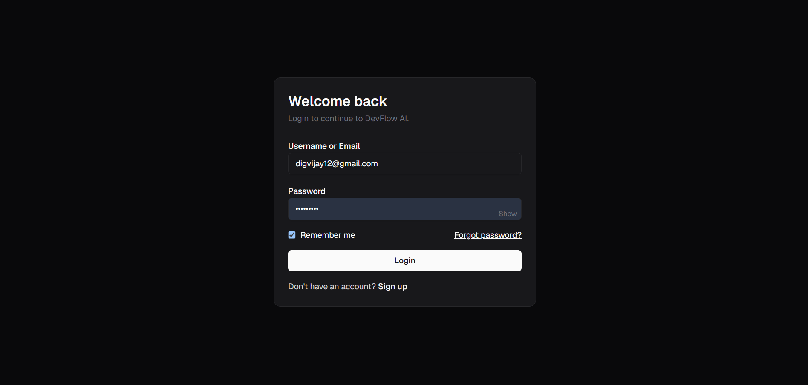
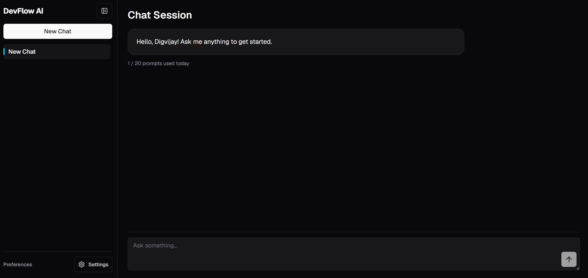
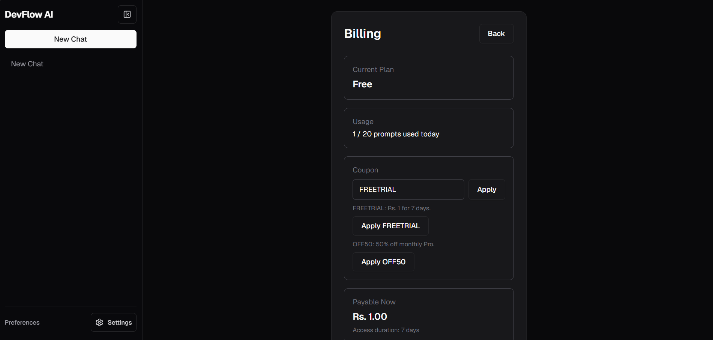
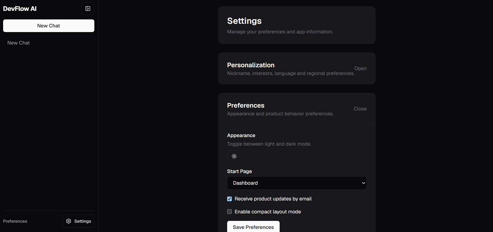

# DevFlow AI 🚀

A premium SaaS platform designed for modern developer workflows. DevFlow AI provides a robust, real-time AI chat system with account personalization, subscription management, and usage limits. Built with a focus on deep aesthetics, accessibility, and high performance.


---

## 🌐 Live Demo & Endpoints
- **Frontend (Netlify):** [https://devflow-ai-client.netlify.app](https://devflow-ai-client.netlify.app)
- **Backend API (Render):** [https://devflow-api-ubnd.onrender.com](https://devflow-api-ubnd.onrender.com)

---

## 🎬 Demo Video
Watch the complete project walkthrough to see DevFlow AI in action:
[**View Demo Video**](https://drive.google.com/file/d/1i_7GaBoV9wYduITWSZtkO-jt4Ic7SoVD/view?usp=sharing)

---

## 📸 Screenshots

<details>
<summary>Authentication (Click to expand)</summary>



</details>

<details>
<summary>Core Application (Click to expand)</summary>




</details>

---

## ⚡ Features

### 🔐 Secure Authentication & Privacy
- JWT-based authentication flow with secure password hashing.
- Complete lifecycle: Signup, Login, Forgot Password, and Reset Password with strict token expirations.
- **Account Deletion:** Users can permanently soft-delete their accounts via a secure double-confirmation dialog, instantly revoking all access while preserving essential analytics.
- **Disposable Email Prevention:** Built-in blocklist to prevent registrations from fake/temporary email providers.
- Unique username validation and session persistence.

### 🤖 AI Chat System
- Real-time conversational AI powered by Groq API.
- Dynamic markdown parsing with syntax-highlighted code blocks.
- Persistent chat history with a premium, accessible UI (inspired by Linear/Vercel).
- Auto-scroll and responsive touch-targets for mobile.

### 📊 Usage Limits & Billing
- Granular free-tier limits with backend validation to prevent abuse.
- Razorpay integration for seamless upgrades to the Pro plan.
- **Subscription Management:** Users can cancel their Pro subscription instantly via the settings dashboard, immediately reverting to the free tier limits safely.
- Real-time billing state management synchronized with the backend.

### ⚙️ Personalization
- Comprehensive settings panel for region, language, and timezone.
- Hydration-safe Dark/Light mode toggle powered by `next-themes`.
- High-contrast UI rendering optimized for accessibility.

---

## 🏛️ Architecture Overview

DevFlow AI uses a decoupled client-server architecture:

1. **Client (Next.js App Router):** Handles all presentation logic, routing, and React state. Communicates with the backend exclusively via REST APIs. Uses Tailwind CSS for utility-first, responsive design.
2. **Server (Node/Express):** Acts as the central source of truth. Manages the database connection (Mongoose/MongoDB Atlas), processes Razorpay webhooks, and proxies AI requests to Groq securely to hide API keys.
3. **Database (MongoDB):** Stores user profiles, hashed passwords, chat histories, and usage metrics.

---

## 🛠️ Tech Stack

- **Frontend:** Next.js 14, React, Tailwind CSS, Lucide Icons, Redux Toolkit
- **Backend:** Node.js, Express.js, MongoDB (Mongoose)
- **Integrations:** Groq API (AI Chat), Razorpay (Payments), Cloudinary (Image Uploads)
- **Hosting:** Netlify (Frontend), Render (Backend)

---

## 📚 Documentation

| Document | Description |
|---|---|
| [API Reference](./docs/API.md) | Complete API endpoint documentation with request/response examples |
| [Architecture](./docs/ARCHITECTURE.md) | System architecture, data flow diagrams, and design decisions |
| [Database Schema](./docs/DATABASE.md) | MongoDB schema design, collections, indexes, and relationships |
| [AI Integration](./docs/AI.md) | Groq AI integration, streaming protocol, and usage limits |
| [Authentication](./docs/AUTHENTICATION.md) | JWT auth flow, registration, password reset, and security |
| [Deployment Guide](./docs/DEPLOYMENT.md) | Production deployment on Netlify + Render with troubleshooting |
| [Payment & Billing](./docs/PAYMENT.md) | Razorpay integration, coupon system, and subscription management |
| [Environment Variables](./docs/ENVIRONMENT.md) | All configuration variables for server and client |

---

## 🚀 Local Development Setup

### 1. Clone Repository
```bash
git clone https://github.com/chauhandigvijay1/web-dev-journey.git
cd web-dev-journey/Real-world-projects/devflow-ai
```

### 2. Environment Variables
Create `.env` inside the `server/` directory:
```env
PORT=5000
MONGO_URI=your_mongodb_connection_string
JWT_SECRET=your_secret_key
CLIENT_URL=http://localhost:3000

RAZORPAY_KEY_ID=your_key
RAZORPAY_KEY_SECRET=your_secret

GROQ_API_KEY=your_groq_key
```

Create `.env.local` inside the `client/` directory:
```env
NEXT_PUBLIC_API_URL=http://localhost:5000
```

### 3. Install & Run
**Backend:**
```bash
cd server
npm install
npm run dev
```

**Frontend:**
```bash
cd client
npm install
npm run dev
```
Open `http://localhost:3000` to view the app.

### 4. Run Tests, Lint & Format
```bash
# Server
cd server
npm test          # Run Jest unit tests
npm run lint      # ESLint check
npm run format    # Prettier auto-format

# Client
cd client
npm run lint:strict   # ESLint check
npm run format        # Prettier auto-format
```

---

## 🔧 Deployment Details

### Frontend (Netlify)
- Automatically deployed from the `main` branch.
- Environment variables configured natively in the Netlify dashboard (`NEXT_PUBLIC_API_URL`).

### Backend (Render)
- Configured as a Node.js Web Service.
- Automatically spins down during inactivity (free tier) and spins up on incoming requests. Ensure `CLIENT_URL` matches the deployed Netlify URL to prevent CORS issues.

---

## 🐛 Common Troubleshooting
- **CORS Errors:** Verify that the `CLIENT_URL` in the backend `.env` exactly matches the origin of the frontend.
- **500 Errors:** Check MongoDB IP Whitelist (ensure `0.0.0.0/0` is permitted) and verify your `MONGO_URI`.

---

## 👨‍💻 Author
**Digvijay Kumar Singh**
- LinkedIn: [https://www.linkedin.com/in/digvijaykumarsingh](https://www.linkedin.com/in/digvijaykumarsingh)
- GitHub: [https://github.com/chauhandigvijay1](https://github.com/chauhandigvijay1)
- Email: [chauhandigvijay669@gmail.com](mailto:chauhandigvijay669@gmail.com)

---

*If you found this project helpful, consider giving it a star ⭐*
