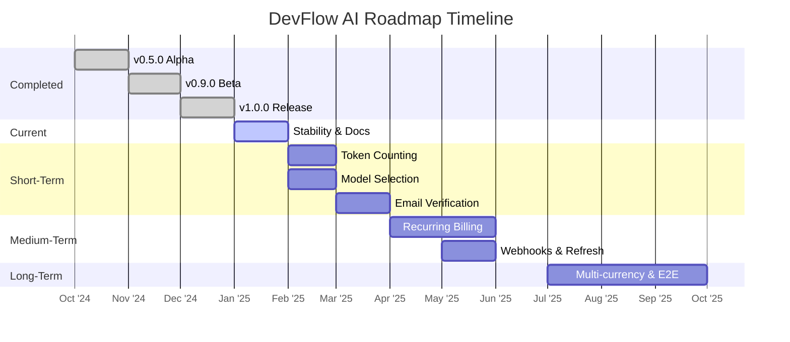

<picture align="center">
  
</picture>

# DevFlow AI Roadmap

> Strategic vision, project milestones, and feature timeline for the DevFlow AI platform.

---

## Table of Contents

- [Overview](#overview)
- [Completed Milestones](#completed-milestones)
- [Current Focus](#current-focus)
- [Short-Term (Next 3 Months)](#short-term-next-3-months)
- [Medium-Term (3-6 Months)](#medium-term-3-6-months)
- [Long-Term (6-12 Months)](#long-term-6-12-months)
- [Best Practices](#best-practices)
- [Related Documents](#related-documents)
- [Next Reading](#next-reading)

---

## Overview

DevFlow AI launched as a minimum viable product focusing on core chat, robust authentication, and seamless billing. The roadmap below outlines the planned evolution based on user feedback, architectural priorities, and expanding business requirements.

> [!NOTE]  
> Timelines and priorities are subject to change based on community feedback, emerging technologies, and business needs.

---

## Completed Milestones

### v1.0.0 — Initial Release
Our launch focused on establishing a solid foundation for real-time AI interactions.

- **AI Engine:** Powered by Groq Cloud (Llama 3.1 8B) with real-time SSE streaming for token-by-token responses.
- **UI/UX:** Responsive design (mobile, tablet, desktop) featuring a resizable sidebar, markdown rendering, syntax highlighting, and system-aware dark/light modes.
- **Authentication:** JWT-based flows (register, signup, login, logout) with password reset via the Resend API.
- **Billing & Subscriptions:** Razorpay integration for Pro subscriptions, inclusive of a flexible coupon system (`FREETRIAL`, `OFF50`, owner coupon).
- **Usage Management:** Tiered usage tracking (20 free prompts/day, 999 prompts/day for Pro users).
- **Media & Infrastructure:** Cloudinary image upload (with crop and compression), user preference syncing, error middleware (Mongoose → HTTP), and graceful shutdown (SIGINT, SIGTERM).
- **Deployment:** Netlify for the frontend and Render for the backend.

### v0.9.0 — Beta
- Initial Groq AI integration with streaming chat
- Basic auth (register, login, JWT)
- MongoDB schema design with embedded subscriptions
- Razorpay test mode payments
- Cloudinary profile image upload
- Dashboard with recent chat list
- Settings page with user preferences

### v0.5.0 — Alpha
- Project scaffolding (Next.js + Express)
- MongoDB connection and Mongoose models
- Basic UI components (Button, Input, Textarea)
- Tailwind CSS configuration
- Authentication middleware

---

## Current Focus

> [!IMPORTANT]  
> We are currently prioritizing platform hardening and developer experience over net-new features.

- **Stability Fixes:** Enhancing edge case handling in SSE streaming and automated error recovery.
- **Documentation:** A comprehensive documentation overhaul mapping to premium SaaS standards (this system).
- **Performance Optimization:** Tuning connection pooling and implementing a robust caching strategy.
- **Security Hardening:** Refining rate limiting and expanding input validation coverage across all endpoints.

---

## Short-Term (Next 3 Months)

Our immediate focus bridges the gap between usage analytics and core platform security.

| Feature | Priority | Status |
| :--- | :--- | :--- |
| **Token Counting** (finer-grained billing) | High | Planned |
| **Model Selection** (user preference) | High | Planned |
| **Email Verification** (on signup) | High | Planned |
| **Conversation Context Truncation** | Medium | Planned |
| **Pagination** (chat listing API) | Medium | Planned |
| **Message Search** (within chats) | Low | Planned |

### Key Initiatives

#### 1. Token Counting
Currently, platform usage is measured strictly by prompt count. Integrating accurate token counting will enable:
- Per-prompt token cost visibility and transparency.
- Advanced usage-based billing tiers.
- Granular monitoring of upstream Groq API costs.

#### 2. Model Selection
The AI model is currently hardcoded to `llama3-8b-8192`. Exposing model selection will empower users to:
- Balance speed versus intelligence per use case.
- Route chat queries and code explanations to optimized models.
- Prepare the platform for multi-provider integrations (e.g., OpenAI, Anthropic).

#### 3. Email Verification
While accounts are immediately active post-signup, implementing a robust verification flow will:
- Mitigate spam and abuse.
- Ensure valid contact addresses for critical password resets.
- Elevate overall platform trustworthiness.

---

## Medium-Term (3-6 Months)

Transitioning to scalable subscription management and seamless admin operations.

| Feature | Priority | Status |
| :--- | :--- | :--- |
| **Recurring Billing** (Razorpay subscriptions) | High | Planned |
| **Webhook Handling** (payment events) | High | Planned |
| **Invoice Generation & Delivery** | Medium | Planned |
| **JWT Refresh Tokens** | Medium | Planned |
| **Admin Dashboard** (user management) | Low | Planned |

### Key Initiatives

#### 1. Recurring Billing
Presently, Pro subscriptions require manual, one-time payments (30-day fixed duration). Introducing automated recurring billing will:
- Autonomously charge users, reducing manual intervention.
- Lower churn rates stemming from expired one-off subscriptions.
- Enable discounted annual billing cycles.

#### 2. Webhook Handling
Currently, the server does not asynchronously process Razorpay webhooks. Full webhook integration will:
- Autonomously handle payment failures and refunds.
- Synchronize subscription states outside of the main checkout loop.
- Action real-time events like `payment.pending` and `invoice.paid`.

---

## Long-Term (6-12 Months)

Expanding platform reach, enterprise capabilities, and developer tooling.

| Feature | Priority | Status |
| :--- | :--- | :--- |
| **Multi-currency Support** | Medium | Planned |
| **E2E Testing** (Playwright or Cypress) | Medium | Planned |
| **Team/Workspace Accounts** | Low | Considered |
| **Browser Extension** (quick access) | Low | Considered |
| **Mobile App** (React Native) | Low | Considered |
| **API Key Management** (programmatic access)| Low | Considered |
| **Custom AI Model Fine-tuning** | Low | Considered |

---

## Best Practices

> [!TIP]
> When reviewing or contributing to the roadmap, keep the following in mind:
> - **Feedback Loop:** We actively review community suggestions. If a feature under "Considered" is critical for your use case, let us know.
> - **Incremental Delivery:** We ship in small, tested increments. A "Planned" feature might be released across multiple minor versions.
> - **Architectural Alignment:** All roadmap items must align with our primary goals of low latency, high availability, and developer ergonomics.

---

## Related Documents

- [Changelog](./CHANGELOG.md) — Complete version history and release notes.
- [Architecture Overview](./docs/architecture.md) — System architecture enabling our roadmap features.

---

## Next Reading

Continue exploring the DevFlow AI platform documentation to understand past updates and core integrations.

**Next:** [Changelog](./CHANGELOG.md) — Version history and release notes.

---

  

    Built with Next.js, Express, and Groq Cloud
  

  

    © 2025 DevFlow AI. All rights reserved.
  

