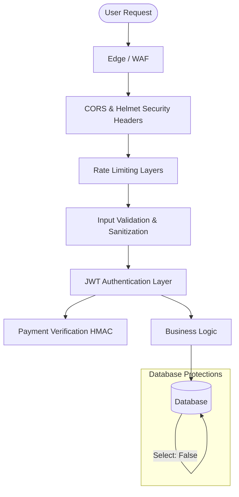

<div align="left">
  <picture>
    
  </picture>
</div>

# Security Policy

Protecting our users and their data is our highest priority. This document outlines our vulnerability reporting guidelines, security response timeline, and an overview of DevFlow AI's security architecture.

---

## Table of Contents
- [Overview](#overview)
- [Reporting a Vulnerability](#reporting-a-vulnerability)
  - [What to Include](#what-to-include)
  - [Response Timeline](#response-timeline)
- [Security Architecture & Features](#security-architecture--features)
  - [Platform Defenses](#platform-defenses)
  - [Architecture Diagram](#architecture-diagram)
- [Supported Versions](#supported-versions)
- [Best Practices](#best-practices)
- [Related Documents](#related-documents)
- [Next Reading](#next-reading)

---

## Overview

The DevFlow AI platform leverages modern security practices to ensure data integrity, reliable authentication, and resilient infrastructure. Our security model spans from edge routing down to the database layer, incorporating multiple lines of defense.

---

## Reporting a Vulnerability

If you discover a security vulnerability in DevFlow AI, we kindly ask that you report it to our security team immediately by emailing [chauhandigvijay669@gmail.com](mailto:chauhandigvijay669@gmail.com).

> [!WARNING]
> Please do **not** report security vulnerabilities through public GitHub issues, discussions, or social media. Public disclosure may put users at risk before a patch is deployed.

### What to Include

To help us triage and resolve the issue quickly, please include the following details in your report:
- **Description:** A detailed description of the vulnerability and its context.
- **Reproduction Steps:** Clear, step-by-step instructions to reproduce the issue.
- **Impact Analysis:** The potential impact or risk posed to users or the system.
- **Suggested Fixes:** Any recommendations or known mitigations (if applicable).

### Response Timeline

We are committed to resolving security incidents swiftly and transparently.

| Phase | SLA | Description |
|-------|-----|-------------|
| **Triage** | 24 hours | Acknowledgment of receipt and initial review |
| **Assessment** | 7 days | Full assessment and confirmation of the vulnerability |
| **Resolution** | 30 days | Fix deployed to production or mitigation plan shared |

---

## Security Architecture & Features

DevFlow AI implements a defense-in-depth strategy. For a comprehensive deep-dive into our platform's security, review the [Security Overview](./docs/security.md).

### Platform Defenses

- **Authentication:** Stateless authentication via JWT, paired with robust password hashing using bcrypt (12 rounds).
- **Payment Verification:** Webhook payloads are secured via HMAC-SHA256 signature validation. Features include duplicate payment detection and cryptographic one-time nonces to prevent replay attacks.
- **Rate Limiting:** Multi-tiered defense mechanisms against brute force and DDoS:
  - **Global Limits:** 300 requests per 15 minutes.
  - **Auth Routes:** 20 requests per 15 minutes.
  - **AI Endpoints:** 30 requests per minute.
- **Input Validation:** Strict payload validation via `express-validator` on all endpoints. Integration with a disposable email blocklist ensures account quality.
- **HTTP Security:** Hardened headers via Helmet (enforcing CSP, XSS protection, and anti-clickjacking) alongside strict CORS origin validation.
- **Data Protection:** Database-level safeguards include soft delete implementations, excluding sensitive fields by default (`select: false`), and utilizing SHA-256 for hashing password reset tokens.
- **Environment Security:** Rigorous environment variable validation at startup and stringent build steps to ensure zero secret leakage into client bundles.

### Architecture Diagram



---

## Supported Versions

We actively backport security fixes to supported release lines. Please ensure you are running a supported version of DevFlow AI.

| Version | Support Status | Notes |
|---------|----------------|-------|
| **1.0.x** | ✅ Supported | Actively receiving security patches and updates. |
| **< 1.0** | ❌ End of Life | No longer supported. Upgrade immediately. |

---

## Best Practices

> [!TIP]
> **Securing your integration**
> - Always rotate your webhook secrets periodically.
> - Monitor the rate limits configured in your environment to avoid unexpected throttling.
> - Keep your environment configuration strictly isolated from client-side code.

### Verifying Webhook Signatures

When integrating with the payment verification system, always ensure you compute and validate the HMAC-SHA256 signature to prevent replay and spoofing attacks.

```javascript
const crypto = require('crypto');

function verifyPaymentWebhook(payload, signature, secret) {
  const expectedSignature = crypto
    .createHmac('sha256', secret)
    .update(JSON.stringify(payload))
    .digest('hex');
    
  return crypto.timingSafeEqual(
    Buffer.from(expectedSignature),
    Buffer.from(signature)
  );
}
```

---

## Related Documents

- [Security Overview](./docs/security.md) - Deep dive into platform security mechanisms.
- [Contribution Guidelines](./CONTRIBUTING.md) - How to safely contribute code to DevFlow AI.

## Next Reading

- [Architecture Documentation](./docs/architecture.md)
- [API Reference](./docs/api-reference.md)

---

<div align="center">
  <p>
    <strong>DevFlow AI</strong><br>
    © 2025 DevFlow AI Inc. All rights reserved.
  </p>
  <p>
    <sub>Built with modern security standards | React • Node.js • PostgreSQL</sub>
  </p>
</div>
