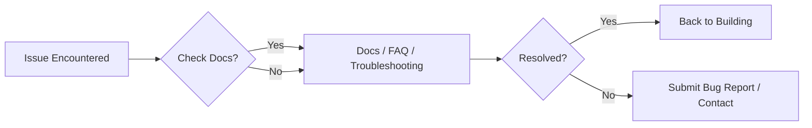

<p align="left">
  <picture>
    
  </picture>
</p>

# Support & Resources

*Find the help you need, from comprehensive documentation to direct contact channels for DevFlow AI.*

## Table of Contents

- [Overview](#overview)
- [How to Get Help](#how-to-get-help)
  - [Documentation](#documentation)
  - [Troubleshooting & FAQ](#troubleshooting--faq)
- [Submitting a Bug Report](#submitting-a-bug-report)
- [Contact Channels](#contact-channels)
- [Best Practices](#best-practices)
- [Related Documents](#related-documents)
- [Next Reading](#next-reading)

---

## Overview

Welcome to the DevFlow AI Support portal. Whether you are encountering a technical roadblock, need clarification on our architecture, or simply want to report a bug, this document outlines the fastest paths to resolution. Our support structure is designed to empower you with self-serve resources while ensuring direct lines of communication are open when you need them.



---

## How to Get Help

### Documentation

Your first step when encountering an issue should always be our official documentation. It covers everything from high-level architecture to detailed API usage and deployment strategies.

> [!TIP]
> Use the search function within your IDE or repository viewer to quickly find relevant sections within the `docs` folder.

- **Main Documentation:** [Read the Docs](./docs/README.md)

### Troubleshooting & FAQ

For the most common issues, we maintain dedicated resources that provide quick, actionable solutions.

- **Troubleshooting Guide:** [View Common Solutions](./docs/troubleshooting.md)
- **FAQ:** [View Frequently Asked Questions](./docs/faq.md)

> [!NOTE]
> Our FAQ and Troubleshooting guides are updated regularly based on community feedback and resolved issues.

---

## Submitting a Bug Report

When you encounter unexpected behavior, filing a comprehensive bug report is the best way to get it addressed. 

Please report bugs via our [GitHub Issues](https://github.com/chauhandigvijay1/devflow-AI/issues) page. 

**Standard Bug Report Format:**
```markdown
**Describe the bug**
A clear and concise description of what the bug is.

**To Reproduce**
Steps to reproduce the behavior:
1. Go to '...'
2. Click on '....'
3. Scroll down to '....'
4. See error

**Expected behavior**
A clear and concise description of what you expected to happen.
```

> [!IMPORTANT]
> Always ensure you are on the latest release before submitting a bug report, as the issue may have already been resolved.

---

## Contact Channels

For direct support, partnership inquiries, or issues that require immediate attention, you can reach out through the following channels:

| Platform | Handle / Link | Purpose |
| :--- | :--- | :--- |
| **Email** | [chauhandigvijay669@gmail.com](mailto:chauhandigvijay669@gmail.com) | Private inquiries, account issues, security reports |
| **GitHub** | [@chauhandigvijay1](https://github.com/chauhandigvijay1) | Open source collaboration, code reviews |
| **LinkedIn** | [Digvijay Kumar Singh](https://www.linkedin.com/in/digvijaykumarsingh) | Professional networking, direct messaging |

---

## Best Practices

To ensure a swift and accurate response when seeking help, please adhere to these best practices:

1. **Be Specific:** Detail the exact nature of the problem, including error messages and stack traces.
2. **Provide Context:** Explain your environment (OS, Node version, deployment platform).
3. **Reproducible Steps:** Provide minimal reproducible steps so our team can immediately see the issue.
4. **Search First:** Check closed issues and the FAQ before opening a new ticket.

---

## Related Documents

- [Documentation Hub](./docs/README.md)
- [Troubleshooting Guide](./docs/troubleshooting.md)
- [FAQ](./docs/faq.md)

---

## Next Reading

- If you haven't yet, explore our documentation or head back to the [Main Readme](./README.md) to continue your journey.

---

<p align="center">
  <sub>DevFlow AI — © 2025</sub><br/>
  <sub>Built with modern web standards and open-source love.</sub>
</p>
