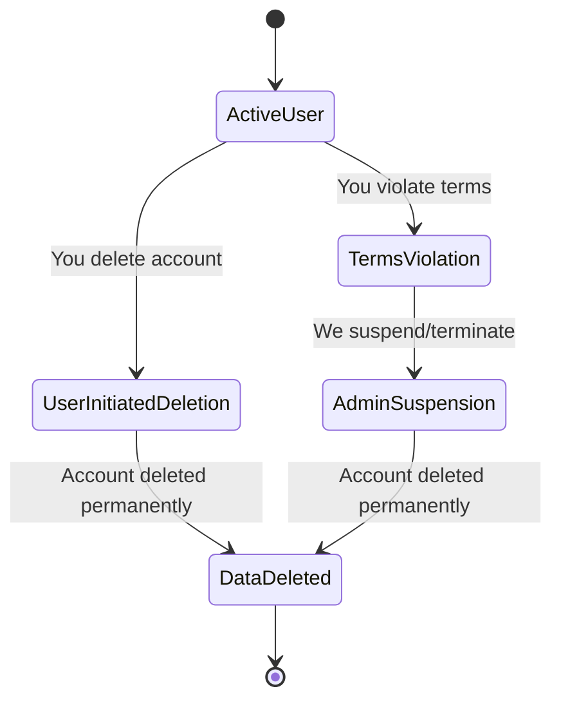

<div align="center">
  
  <h1>Terms of Service</h1>
  <p><em>The rules, guidelines, and agreements for using the DevFlow AI platform.</em></p>
</div>

> Last updated: July 2025

## Table of Contents

- [Overview](#overview)
- [Account Terms](#account-terms)
- [Subscriptions & Payments](#subscriptions--payments)
- [Acceptable Use](#acceptable-use)
- [Intellectual Property](#intellectual-property)
- [Limitation of Liability](#limitation-of-liability)
- [Termination](#termination)
- [Governing Law](#governing-law)
- [Changes to Terms](#changes-to-terms)
- [Contact](#contact)
- [Best Practices](#best-practices)
- [Related Documents](#related-documents)
- [Next Reading](#next-reading)

## Overview

These Terms of Service ("Terms") govern your use of the DevFlow AI platform. By accessing or using DevFlow AI, you agree to these Terms. Please read them carefully to understand your rights and responsibilities.

> [!IMPORTANT]
> Your continued use of DevFlow AI constitutes your acceptance of these Terms. If you do not agree, you must cease using the platform immediately.

## Account Terms

### Eligibility

To ensure a safe and compliant environment, we enforce the following eligibility criteria:
- You must be at least **13 years old** to use DevFlow AI.
- You must provide accurate, current, and complete registration information.
- One person may not maintain multiple free accounts.
- You are strictly responsible for maintaining the confidentiality of your login credentials.

### Account Responsibilities

- You are responsible for all activity under your account.
- You must notify us immediately of any unauthorized use.
- We reserve the right to suspend accounts that violate these Terms.

### Account Types

DevFlow AI offers two main account tiers tailored to different usage needs:
- **Free accounts** — Limited to 20 AI prompts per day.
- **Pro accounts** — Paid subscription with 999 AI prompts per day.

## Subscriptions & Payments

Our billing infrastructure is designed for transparency and security.

### Billing

- **Pro plan:** ₹299/month (billed monthly).
- All payments are processed securely through Razorpay.
- Prices are in Indian Rupees (INR) and include applicable taxes.
- Payments are non-refundable except as required by law.

### Subscription Management

- You may upgrade from Free to Pro at any time.
- You may cancel your Pro subscription at any time from the billing settings page.
- **Cancellation is immediate** — upon cancellation, Pro features are revoked and your account reverts to Free tier limits.
- **No prorated refunds** — if you cancel mid-cycle, you retain Pro access only for the remainder of the current billing period.

> [!NOTE]
> Below is a conceptual illustration of a subscription data payload returned by our backend systems for managing Pro limits:
> ```json
> {
>   "plan": "pro",
>   "price": 299,
>   "currency": "INR",
>   "daily_limit": 999,
>   "status": "active"
> }
> ```

### Coupons

- Coupons are promotional and may be revoked at any time.
- The owner coupon is reserved for internal testing purposes.
- Coupon abuse (e.g., creating multiple accounts to redeem the same coupon) is prohibited.

### Failed Payments

- If payment fails, Pro access is suspended until the payment succeeds.
- Repeated payment failures may result in automatic downgrade to Free tier.
- We use Razorpay's retry mechanism for failed payments.

## Acceptable Use

DevFlow AI maintains strict guidelines to ensure the platform is used constructively.

### You May NOT:

- Use DevFlow AI for any illegal purpose or in violation of any applicable law.
- Attempt to bypass rate limits or usage restrictions.
- Reverse engineer, decompile, or disassemble the platform.
- Scrape, crawl, or collect user data without authorisation.
- Use automated scripts to interact with the AI chat (e.g., bulk prompting).
- Upload malicious files, viruses, or harmful code.
- Impersonate any person or entity.
- Interfere with or disrupt the platform's operation.

> [!WARNING]
> Violating our Acceptable Use policy may result in immediate account suspension or termination without prior notice.

### AI Chat Conduct

- Do not submit prompts that generate hateful, violent, or illegal content.
- Do not attempt to jailbreak or manipulate the AI model.
- We reserve the right to review chat logs for abuse detection.

## Intellectual Property

### Our Rights

- DevFlow AI, the logo, and all platform code are owned by Digvijay Kumar Singh.
- The source code is licensed under the [MIT License](./LICENSE) for open-source use.
- The DevFlow AI name and branding may not be used without permission.

### Your Rights

- You retain ownership of your chat messages and uploaded content.
- You grant us a license to process your content to provide the service.
- You represent that your content does not infringe third-party rights.

### Third-Party IP

- The AI model (Llama 3.1 8B) is provided by Meta via Groq Cloud and is subject to Meta's acceptable use policy.
- Open-source libraries used are licensed under their respective licenses (MIT, Apache 2.0, ISC, etc.).

## Limitation of Liability

To the maximum extent permitted by law:
- DevFlow AI is provided "AS IS" without warranties of any kind.
- We are not liable for any indirect, incidental, or consequential damages.
- Our total liability is limited to the amount you paid in the 12 months preceding the claim.
- We are not responsible for downtime caused by third-party services (Groq, Razorpay, Render, Netlify, MongoDB Atlas).
- We are not responsible for data loss resulting from account deletion.

### Service Level

- The platform is provided on a best-effort basis.
- Free tier Render hosting may experience cold starts (5–10 second delays after inactivity).
- No uptime guarantee is provided for the free tier.

## Termination

Here is the lifecycle of account termination on DevFlow AI:



### By You

- You may delete your account at any time from the account settings page.
- Account deletion is permanent and irreversible.
- Billing records are retained as required by law.

### By Us

- We may suspend or terminate accounts that violate these Terms.
- We may terminate the service with 30 days notice.
- Termination does not affect any rights or obligations accrued before termination.

## Governing Law

These Terms are governed by the laws of India. Any disputes shall be resolved in the courts of New Delhi, India.

## Changes to Terms

We may modify these Terms at any time. Material changes will be communicated via email or platform notice. Continued use after changes constitutes acceptance.

## Contact

For questions about these Terms:

- **Email:** [chauhandigvijay669@gmail.com](mailto:chauhandigvijay669@gmail.com)
- **GitHub:** [@chauhandigvijay1](https://github.com/chauhandigvijay1)

## Best Practices

> [!TIP]
> To ensure a smooth experience with DevFlow AI, we recommend the following best practices:
> - Keep your billing information up-to-date to prevent unintended Pro access suspension.
> - Familiarize yourself with the daily AI prompt limits for your account tier.
> - Follow secure password and authentication hygiene to protect your login credentials.

## Related Documents

- [License](./LICENSE)
- [Privacy Policy](./PRIVACY_POLICY.md)
- [Contribution Guidelines](./CONTRIBUTING.md)

## Next Reading

> **Next:** [Privacy Policy](./PRIVACY_POLICY.md) — How we handle your data.

---

<div align="center">
  <p>
    <strong>DevFlow AI</strong><br>
    Built with React, Node.js, and Llama 3.1 8B<br>
    &copy; 2025 Digvijay Kumar Singh. All rights reserved.
  </p>
</div>
