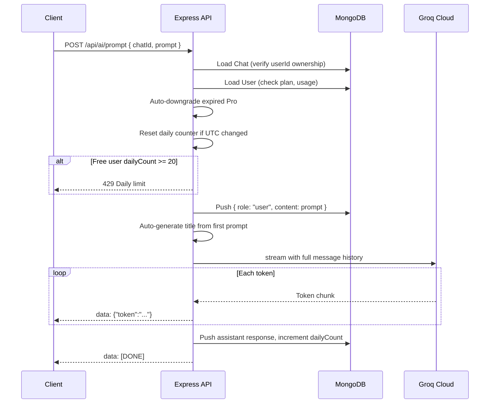
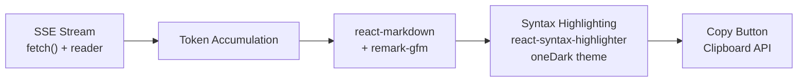

<picture>
  
</picture>

# AI Integration

*Groq Cloud LLM inference with ultra-low-latency LPU hardware, supporting streaming chat via Server-Sent Events and non-streaming code explanation.*

<br clear="all" />

---

## Table of Contents

- [Overview](#overview)
- [Configuration](#configuration)
- [Endpoints](#endpoints)
  - [Streaming Chat](#streaming-chat)
  - [Code Explanation](#code-explanation)
- [Client-Side Rendering](#client-side-rendering)
- [Rate Limiting & Abuse Prevention](#rate-limiting--abuse-prevention)
- [Usage Limits](#usage-limits)
- [Best Practices & Future Considerations](#best-practices--future-considerations)
- [Related Documents](#related-documents)
- [Next Reading](#next-reading)

---

## Overview

DevFlow AI uses **Groq Cloud** for LLM inference. Groq provides ultra-low-latency inference through custom LPU (Language Processing Unit) hardware. The integration supports both streaming (chat) and non-streaming (code explanation) modes via the `groq-sdk` npm package.

---

## Configuration

> [!IMPORTANT]
> The `GROQ_API_KEY` environment variable is required to authenticate with the Groq Cloud platform.

| Variable | Default | Description |
|---|---|---|
| `GROQ_API_KEY` | — | Groq Cloud API key (required) |
| `AI_MODEL` | `llama3-8b-8192` | Model identifier for all completions |

```javascript
const Groq = require("groq-sdk");

// Initialize the Groq client
const client = new Groq({ apiKey: env.groqApiKey });
```

---

## Endpoints

### Streaming Chat

**Endpoint:** `POST /api/ai/prompt`  
**Protocol:** Server-Sent Events (SSE) — token-by-token streaming over standard HTTP.

> [!NOTE]
> **System Prompt:** None. The AI is given the full message history with no additional instruction. The model's default behavior applies.

#### Request Flow



#### SSE Response Format

```text
data: {"token":"Hello"}
data: {"token":"!"}
data: [DONE]
```

> [!WARNING]
> **Streaming Error Handling:** If the Groq stream throws after headers are sent, a fallback error token is written, `[DONE]` is sent, and the connection closes—without passing the error to Express's error middleware.

### Code Explanation

**Endpoint:** `POST /api/ai/explain`

Non-streaming, single-turn code explanation. No chat history is maintained.

> [!NOTE]
> **System Prompt:** `You are a senior developer who explains code simply.`

**User Prompt Template:**
```text
Explain this {language}:

{code}
```

**Limits:**
- `code`: maximum 50,000 characters
- `language`: maximum 50 characters (optional)

**Response Format:**
```json
{
  "success": true,
  "data": {
    "explanation": "This function iterates through the array..."
  }
}
```

---

## Client-Side Rendering

Our frontend manages the streaming data and elegantly renders it using modern React tools.



1. **SSE Consumption:** Uses `fetch()` with a manual `ReadableStream` reader (avoiding the `EventSource` abstraction for better control).
2. **Markdown Parsing:** Powered by `react-markdown` v10 with `remark-gfm` to support GitHub Flavored Markdown (GFM).
3. **Syntax Highlighting:** Integrated `react-syntax-highlighter` v16 utilizing Prism's `oneDark` theme.
4. **Copy-to-Clipboard:** Each message block includes a seamless copy button leveraging the Clipboard API.

---

## Rate Limiting & Abuse Prevention

To ensure stability and fair usage, DevFlow AI employs robust rate limiting across multiple layers.

| Layer | Limit | Scope |
|---|---|---|
| Global API | 300 requests / 15 minutes | Per IP address |
| Login / Forgot Password | 20 requests / 15 minutes | Per IP address |
| AI Endpoints | 30 requests / minute | Per IP address |
| Free Tier Usage | 20 prompts / day | Per user |
| Prompt Payload | 8,000 characters max | Per request |
| Code Payload | 50,000 characters max | Per request |

### Additional Safeguards

- **Input Validation:** All inputs are strictly validated via `express-validator` before ever reaching Groq.
- **Timeouts:** The AI controller implements an `AbortController` with a 60-second timeout for streaming operations.
- **Client Disconnects:** The server instantly aborts the stream if the client disconnects (`req.on("close")`).
- **Component Lifecycle:** The client can proactively abort in-flight requests upon component unmount.

---

## Usage Limits

Access to the AI generation is scoped by the user's subscription plan.

| Plan | Daily Prompt Limit |
|---|---|
| Free | 20 |
| Pro | 999 (effectively unlimited) |

> [!TIP]
> The daily counter resets when the UTC date changes (`isSameUtcDate` comparison). This limit check happens **before** initiating the Groq API call to avoid unnecessary billing costs.

---

## Best Practices & Future Considerations

While the current implementation is highly optimized, there are several areas scoped for future enhancement:

- **Token Counting:** Currently not implemented. Adding this could enable finer-grained billing and usage metrics.
- **Model Selection:** The model (`llama3-8b-8192`) is currently hardcoded. Exposing this as a user preference could provide personalized experiences.
- **Context Truncation:** The full message history is sent with every chat request. In the future, implementing sliding windows or context summarization will prevent long conversations from exceeding the model's context window.

---

## Related Documents

- [Architecture Overview](./architecture.md)
- [Backend Architecture](./backend.md)
- [API Reference](./api.md)

---

## Next Reading

> **Next:** [Authentication](./authentication.md) — Explore the JWT-based auth flow, registration, login, password reset, and our core security considerations.

---

<p align="center">
  <sub>&copy; 2026 DevFlow AI. Built with Next.js, Express, MongoDB, and Groq AI.</sub>
</p>
