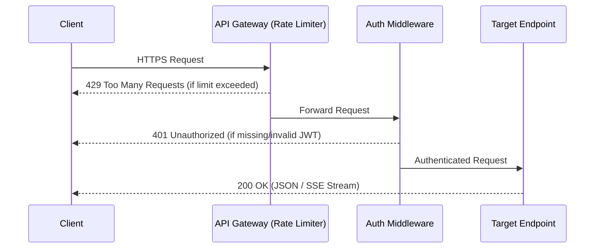

<div align="center">
  <picture>
    
  </picture>
</div>

# API Reference

Complete REST API documentation for all 24 endpoints across the DevFlow AI platform (10 Auth, 4 Chat, 2 AI, 5 Payment, 2 Upload, 1 Health). 

Base URL (Production): `https://devflow-api-ubnd.onrender.com/api`  
Base URL (Development): `http://localhost:5000/api`

---

## Table of Contents

- [Overview](#overview)
- [Standard Response Envelope](#standard-response-envelope)
- [Authentication Endpoints](#authentication-endpoints)
- [Chat Endpoints](#chat-endpoints)
- [AI Endpoints](#ai-endpoints)
- [Payment Endpoints](#payment-endpoints)
- [Upload Endpoints](#upload-endpoints)
- [Health Check](#health-check)
- [Error Codes](#error-codes)
- [Rate Limiting](#rate-limiting)
- [Best Practices](#best-practices)
- [Related Documents](#related-documents)

---

## Overview

All endpoints consume and return JSON payloads unless otherwise specified. Protected endpoints require a valid JWT via the `Authorization` header.

```http
Authorization: Bearer <your_jwt_token>
```

> [!TIP]
> Obtain a token from `POST /api/auth/login` or `POST /api/auth/signup`. Tokens automatically expire after **7 days** by default.

### Architecture Flow



---

## Standard Response Envelope

DevFlow AI APIs utilize a unified, predictable response envelope for all standard HTTP responses (excluding SSE streams).

```json
{
  "success": true,
  "data": {},
  "message": ""
}
```

### Properties

| Field | Type | Description |
|---|---|---|
| `success` | `boolean` | `true` for successful requests, `false` for errors. |
| `data` | `object` \| `array` | Response payload (present on success). |
| `message` | `string` | Human-readable context message (present on success or error). |
| `stack` | `string` | Error stack trace (available in **non-production** environments only). |

> [!NOTE]
> Errors leverage standard HTTP status codes combined with `success: false`.

---

## Authentication Endpoints

Base path: `/api/auth`

### `POST /register`
Quick signup without requiring a username.

**Request Body**
```json
{
  "name": "John Doe",
  "email": "john@example.com",
  "password": "MyStr0ngPass"
}
```

**Validation Rules**
| Field | Requirement |
|---|---|
| `name` | Required, minimum 2 characters. |
| `email` | Required, valid email format (disposable domains blocked). |
| `password` | Required, minimum 8 characters, containing uppercase, lowercase, and digit. |

**Response (201 Created)**
```json
{
  "success": true,
  "data": {
    "token": "eyJhbGciOiJIUzI1NiIs...",
    "user": {
      "_id": "664f1a2b3c4d5e6f7a8b9c0d",
      "name": "John Doe",
      "username": "",
      "email": "john@example.com",
      "role": "user",
      "subscription": { "plan": "free", "status": "inactive", "expiresAt": null },
      "usage": { "dailyCount": 0, "lastReset": "2025-01-01T00:00:00.000Z" },
      "phone": "",
      "profileImage": ""
    }
  }
}
```
*Errors:* `409 Conflict` (Email already registered).

---

### `POST /signup`
Full user signup providing a custom username.

**Request Body**
```json
{
  "name": "John Doe",
  "username": "johndoe",
  "email": "john@example.com",
  "password": "MyStr0ngPass"
}
```

**Validation Rules**
| Field | Requirement |
|---|---|
| `name` | Required, minimum 2 characters. |
| `username` | Required, 3–40 characters, alphanumeric only (no spaces/special chars). |
| `email` | Required, valid email format (disposable domains blocked). |
| `password` | Required, minimum 8 characters, containing uppercase, lowercase, and digit. |

> [!IMPORTANT]
> Unlike `/register`, the `/signup` endpoint returns the `token` and `user` object at the **top level** of the response payload (not wrapped in a `data` object).

**Response (201 Created)**
```json
{
  "success": true,
  "token": "eyJhbGciOiJIUzI1NiIs...",
  "user": {
    "_id": "...",
    "name": "John Doe",
    "username": "johndoe",
    "email": "john@example.com",
    "role": "user",
    "plan": "free",
    "status": "inactive",
    "settings": {},
    "avatar": null,
    "createdAt": "..."
  }
}
```
*Errors:* `409 Conflict` (Email already exists, Username already taken).

---

### `POST /login`
Authenticate a user with either their email or username.

**Request Body**
```json
{ 
  "identifier": "johndoe", 
  "password": "MyStr0ngPass" 
}
```
*(Alternatively, use the `email` field directly)*
```json
{ 
  "email": "john@example.com", 
  "password": "MyStr0ngPass" 
}
```

**Validation Rules:** At least one of `identifier` or `email` is required. `password` is required.

**Response (200 OK)**
```json
{
  "success": true,
  "data": {
    "token": "eyJhbGciOiJIUzI1NiIs...",
    "user": { /* user object */ }
  }
}
```
*Errors:* `401 Unauthorized` (Invalid credentials).

---

### `GET /me`
Retrieve the currently authenticated user's profile.

**Headers:** `Authorization: Bearer <token>`

**Response (200 OK)**
```json
{
  "success": true,
  "data": {
    "_id": "...",
    "name": "John Doe",
    "username": "johndoe",
    "email": "john@example.com",
    "role": "user",
    "subscription": { "plan": "free", "status": "inactive", "expiresAt": null },
    "usage": { "dailyCount": 0, "lastReset": "..." },
    "phone": "",
    "profileImage": ""
  }
}
```

---

### `PUT /update`
Update the authenticated user's profile information. All fields are optional.

**Headers:** `Authorization: Bearer <token>`

**Request Body**
```json
{
  "name": "John Updated",
  "username": "johnnew",
  "contact": "+1234567890",
  "phone": "+1234567890",
  "avatar": "https://res.cloudinary.com/...",
  "profileImage": "https://res.cloudinary.com/..."
}
```

> [!NOTE]
> `phone` maps to `contact` in the database. `profileImage` maps to `avatar`. Changing `username` evaluates uniqueness across all users.

*Errors:* `409 Conflict` (Username already taken).

---

### `POST /forgot-password`
Generate a password reset token and dispatch an email to the user.

**Request Body**
```json
{ 
  "email": "john@example.com" 
}
```

**Response (200 OK)**
```json
{
  "success": true,
  "message": "Reset instructions generated.",
  "data": { "expiresInMinutes": 15 }
}
```

> [!WARNING]
> The reset token is delivered via the **Resend** email API. If `RESEND_API_KEY` is not configured, the token is simply logged to the server console. The API never returns the raw token in the response.

---

### `POST /reset-password`
Reset the password utilizing a valid token.

**Request Body**
```json
{
  "token": "a1b2c3d4e5f6...",
  "password": "MyNewStr0ngPass1"
}
```

**Validation Rules:**
- `token`: Required.
- `password`: Same strength rules as registration (8+ characters, mixed case, digit).

**Response (200 OK)**
```json
{ 
  "success": true, 
  "message": "Password reset successful." 
}
```
*Errors:* `400 Bad Request` (Reset token is invalid or expired).

---

### `DELETE /me`
Soft-delete the authenticated user's account.

**Headers:** `Authorization: Bearer <token>`

**Response (200 OK)**
```json
{ 
  "success": true, 
  "message": "Account deleted successfully." 
}
```

**Behavior Details:**
- Updates user with `isDeleted: true` and logs `deletedAt` to current timestamp.
- Suffixes email and username with `_deleted_{timestamp}` to liberate them for future reuse.
- Instant authentication block (the `protect` middleware immediately rejects soft-deleted profiles).

---

### `GET /settings`
Retrieve the authenticated user's preferences.

**Headers:** `Authorization: Bearer <token>`

**Response (200 OK)**
```json
{
  "success": true,
  "data": {
    "nickname": "Johnny",
    "interests": "AI, React, Node.js",
    "region": "Asia",
    "language": "English",
    "country": "India",
    "timezone": "UTC+5:30",
    "startPage": "Dashboard",
    "emailUpdates": true,
    "compactMode": false
  }
}
```
*(If no preferences are set, `data` returns `{}`)*

---

### `PUT /settings`
Update user preferences. All provided fields are purely optional.

**Headers:** `Authorization: Bearer <token>`  
**Request Body:** Follows the same keys as the `GET` response payload.

**Allowed Configurable Fields:**  
`nickname`, `interests`, `region`, `language`, `country`, `timezone`, `startPage`, `emailUpdates`, `compactMode`

---

## Chat Endpoints

Base path: `/api/chats`  
*All endpoints in this segment require authentication.*

### `POST /`
Initialize a new chat session.

**Request Body** (Both optional, default title: `"New Chat"`)
```json
{ 
  "title": "My Chat Topic", 
  "message": "Optional first message" 
}
```

**Response (201 Created)**
```json
{
  "success": true,
  "data": {
    "_id": "664f...",
    "userId": "664f...",
    "title": "My Chat Topic",
    "messages": [],
    "createdAt": "...",
    "updatedAt": "..."
  }
}
```

### `GET /`
List all chat sessions for the authenticated user, ordered by most recent first.

**Response (200 OK)**
```json
{
  "success": true,
  "data": [
    { 
      "_id": "...", 
      "userId": "...", 
      "title": "Chat Title", 
      "messages": [], 
      "createdAt": "...", 
      "updatedAt": "..." 
    }
  ]
}
```

### `GET /:id`
Retrieve a single chat object.

**Validation:** `:id` must be a valid MongoDB ObjectId.  
*Errors:* `404 Not Found` (Chat not found).

### `DELETE /:id`
Delete a chat session entirely.

**Validation:** `:id` must be a valid MongoDB ObjectId.  
**Response (200 OK)**
```json
{ "success": true, "message": "Chat deleted successfully" }
```

---

## AI Endpoints

Base path: `/api/ai`  
*All endpoints require authentication.*

### `POST /prompt`
Trigger an AI generation pipeline, receiving a Server-Sent Events (SSE) stream.

**Request Body**
```json
{ 
  "chatId": "664f...", 
  "prompt": "Explain closures in JavaScript" 
}
```

**Validation Rules:**
- `chatId`: Required, valid MongoDB ObjectId.
- `prompt`: Required, string, max 8,000 characters.

**Response Format (SSE)**
```text
data: {"token":"Closures"}
data: {"token":" in"}
data: {"token":" JavaScript"}
data: {"token":" are..."}
data: [DONE]
```

**Required Client Headers:**
| Header | Expected Value |
|---|---|
| `Content-Type` | `text/event-stream` |
| `Cache-Control` | `no-cache` |
| `Connection` | `keep-alive` |

**Plan Limits (Daily Counters based on UTC):**
| Subscription Plan | Daily Limit |
|---|---|
| **Free** | 20 prompts/day |
| **Pro** | 999 prompts/day (effectively unlimited) |

**Pre-Streaming Errors:**
| Code | Message |
|---|---|
| `400` | Prompt required. |
| `401` | User not found. |
| `404` | Chat not found. |
| `429` | Daily limit reached. Upgrade to Pro. |

> [!WARNING]
> If a runtime error triggers after SSE stream headers have already dispatched, a fallback token containing the error is transmitted, ending with `[DONE]`, closing the stream. The Express error handler is intentionally bypassed once streaming initiates.

### `POST /explain`
Single-turn, non-streaming prompt specifically purposed for code explanation.

**Request Body**
```json
{ 
  "code": "const x = () => { return 42; }", 
  "language": "javascript" 
}
```

**Validation Rules:**
- `code`: Required, max 50,000 characters.
- `language`: Optional, max 50 characters.

**Response (200 OK)**
```json
{
  "success": true,
  "data": {
    "explanation": "This code defines an arrow function `x` that returns the number 42..."
  }
}
```

---

## Payment Endpoints

Base path: `/api/payments`  
*All endpoints require authentication.*

### `POST /create-order`
Initialize a Razorpay order entity for a Pro subscription checkout flow.

**Request Body** (Optional)
```json
{ "couponCode": "OFF50" }
```

**Response (200 OK) — Paid checkout:**
```json
{
  "success": true,
  "data": {
    "orderId": "order_Ov1b2c3d4e5f6",
    "amount": 29900,
    "currency": "INR",
    "keyId": "rzp_test_..."
  }
}
```

**Response (200 OK) — Free checkout** (if a 100% discount owner coupon is applied):
```json
{
  "success": true,
  "data": {
    "orderId": "free_checkout",
    "amount": 0,
    "currency": "INR",
    "isFree": true
  }
}
```

*Errors:* `503 Service Unavailable` (Payment gateway not configured).

### `POST /verify`
Finalize and verify a Razorpay payment, automatically granting the Pro subscription.

**Request Body**
```json
{
  "razorpay_order_id": "order_Ov1b2c3d4e5f6",
  "razorpay_payment_id": "pay_Ov1b2c3d4e5f6",
  "razorpay_signature": "e5f6a7b8c9d0e1f2a3b4c5d6e7f8a9b0c1d2e3f4",
  "couponCode": "OFF50"
}
```

> [!NOTE]
> The backend computes `HMAC_SHA256(order_id + "|" + payment_id, RAZORPAY_KEY_SECRET)` and matches it strictly against the submitted `razorpay_signature` for security compliance.

**Response (200 OK)**
```json
{ "success": true, "message": "Payment successful" }
```

**Error Responses:**
| Code | Reason |
|---|---|
| `400` | Verification payload incomplete, Invalid signature, Invalid/expired free checkout session, or Coupon already redeemed. |

### `POST /apply-coupon`
Retrieve metadata mapping for a coupon code.

**Request Body**
```json
{ "couponCode": "OFF50" }
```

**Response (200 OK)**
```json
{
  "success": true,
  "data": {
    "code": "OFF50",
    "amount": 14950,
    "durationDays": 30,
    "isSecret": false
  }
}
```
*Errors:* `400 Bad Request` (Invalid code, or already redeemed).

### `POST /cancel`
Immediate cancellation of an active Pro subscription, reverting limits to the free tier instantaneously.

**Response (200 OK)**
```json
{ "success": true, "message": "Subscription cancelled successfully." }
```
*Errors:* `400 Bad Request` (No active subscription to cancel).

### `GET /status`
Obtain detailed snapshot of billing configuration, daily AI usage, and general subscription health.

> [!TIP]
> **Side-Effect Insight**: Querying this endpoint performs silent background maintenance, auto-downgrading expired Pro plans and zeroing daily rate limits on UTC rollover.

**Response (200 OK)**
```json
{
  "success": true,
  "data": {
    "plan": "free",
    "status": "inactive",
    "expiresAt": null,
    "usage": {
      "dailyCount": 5,
      "limit": 20,
      "remaining": 15,
      "lastReset": "2025-01-01T00:00:00.000Z"
    },
    "pricing": {
      "regularMonthly": 29900,
      "currency": "INR"
    },
    "expiredOfferPrompt": {
      "show": false,
      "message": "Your Pro access has expired. Upgrade to continue."
    }
  }
}
```

---

## Upload Endpoints

Base path: `/api/uploads`  
*All endpoints require authentication. Storage backed natively by **Cloudinary**.*

### `POST /`
Upload arbitrary file types (Capped at 5 MB).

**Request:** Form Data (`multipart/form-data`) referencing the field `file`.

**Response (200 OK)**
```json
{
  "success": true,
  "data": {
    "url": "https://res.cloudinary.com/...",
    "publicId": "devflow-ai/abc123"
  }
}
```

### `POST /profile`
Upload user profile avatars. Heavily scoped to image MIME variants.

**Request:** Form Data (`multipart/form-data`) referencing the field `file`.

> [!TIP]
> Processed images inherently resize to `512x512` leveraging Cloudinary's dynamic quality detection and format alignment pipelines.

**Response (200 OK)**
```json
{
  "success": true,
  "url": "https://res.cloudinary.com/..."
}
```
*Errors:* `400 Bad Request` (Non-image payloads, or missing file).

---

## Health Check

### `GET /api/health`
Verify the status of the DevFlow API cluster.

**Response (200 OK)**
```json
{ "success": true, "message": "DevFlow AI API running" }
```

---

## Error Codes

The API utilizes conventional HTTP status codes paired with clear messaging structures.

| Status | Codename | Implication |
|---|---|---|
| `200` | **OK** | Operation executed cleanly. |
| `201` | **Created** | Resource generation succeeded. |
| `400` | **Bad Request** | Malformed input, logic mismatch, or invalid coupon logic. |
| `401` | **Unauthorized** | Faulty, expired, or non-existent JWT. |
| `403` | **Forbidden** | Valid auth, but insufficient operational permissions. |
| `404` | **Not Found** | Target data/resource identifier does not exist. |
| `409` | **Conflict** | Collision in constraint boundaries (i.e. Duplicate Email). |
| `422` | **Unprocessable** | Granular payload validation blocked by `express-validator`. |
| `429` | **Too Many Requests** | Limit breached (IP velocity bounds or AI Plan caps). |
| `500` | **Server Error** | Unhandled core system exception. |
| `503` | **Service Unavailable**| Outages across dependencies (e.g. Gateway down). |

---

## Rate Limiting

We enforce robust rate limiting arrays to preserve ecosystem stability, evaluated at the IP address boundary using standard Express structures.

| Boundary Scope | Imposed Limit | Affected Routing Paths |
|---|---|---|
| **Global API** | 300 requests / 15 mins | All system endpoints |
| **Login Protocol** | 20 requests / 15 mins | `POST /api/auth/login` |
| **Recovery** | 20 requests / 15 mins | `POST /api/auth/forgot-password` |
| **AI Prompt Engine**| 30 requests / 1 min | `POST /api/ai/prompt` |
| **AI Explain Layer**| 30 requests / 1 min | `POST /api/ai/explain` |
| **Free Tier Usage** | 20 requests / day (per User) | Counter verified during streaming lifecycle |

---

## Best Practices

> [!TIP]
> 1. **Handle SSE Appropriately:** Build resilient stream parsers as backend limits abruptly close connections (`[DONE]`) to handle daily caps safely.
> 2. **Cache User Preferences:** Aggressively memoize `/api/auth/settings` outputs within your frontend clients to optimize bandwidth metrics.
> 3. **Throttle Retries:** Always consume the standard `429` block structure by gracefully slowing redundant retry layers.

---

## Related Documents

- [Architecture Overview](./architecture.md) — System architecture, data flows, design decisions
- [Backend Architecture](./backend.md) — Express middleware, controllers, error handling
- [AI Integration](./ai.md) — Groq streaming, SSE protocol, usage limits
- [Authentication](./authentication.md) — JWT flow, registration, password reset, security

## Next Reading

> **Next:** [AI Integration](./ai.md) — Groq Cloud, SSE streaming protocol, usage limits, and prompt validation.

---

<div align="center">
  <sub>Built with Next.js, Express, MongoDB, and Groq AI</sub>
  <br />
  <sub>&copy; DevFlow AI — Documentation</sub>
</div>
