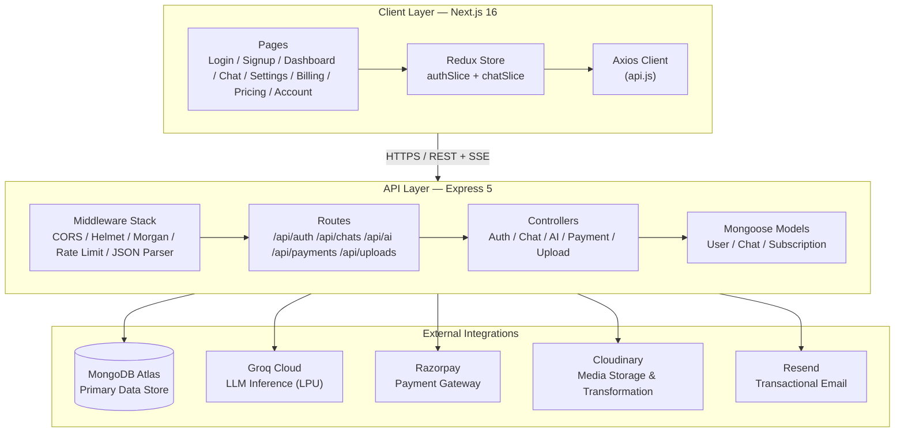
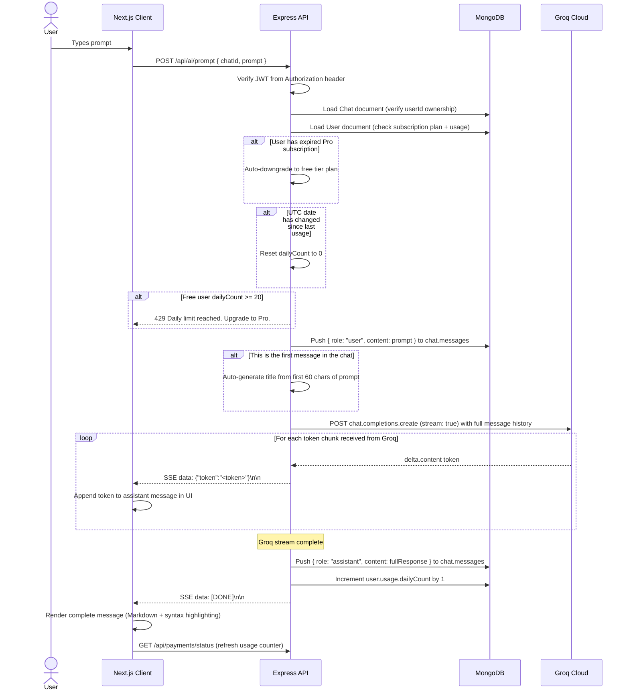
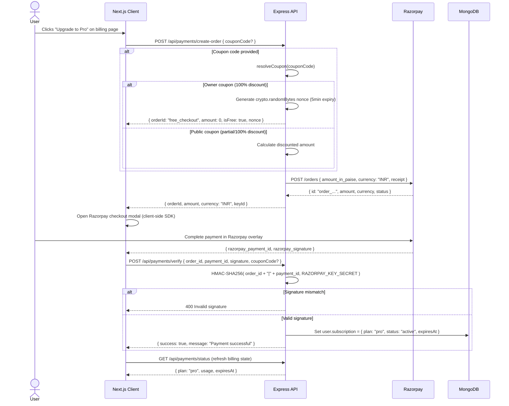

  

# DevFlow AI System Architecture

A decoupled, full-stack SaaS application providing AI-powered chat for developers. Built on the MERN stack with Groq AI inference, Razorpay payments, and Cloudinary media storage.

---

## Table of Contents

- [Overview](#overview)
- [Architecture Overview](#architecture-overview)
- [Technology Stack](#technology-stack)
- [Key Design Decisions](#key-design-decisions)
- [Data Flows](#data-flows)
  - [AI Chat Request Lifecycle](#ai-chat-request-lifecycle)
  - [Payment & Subscription Lifecycle](#payment--subscription-lifecycle)
- [Hosting Topology](#hosting-topology)
- [CORS Configuration](#cors-configuration)
- [Best Practices](#best-practices)
- [Related Documents](#related-documents)
- [Next Reading](#next-reading)

---

## Overview

DevFlow AI follows a **standard client-server model** with a RESTful API gateway, a MongoDB document store, and integrations with four robust external services. The application establishes a clean separation of concerns: the frontend is built with Next.js 16 (App Router) and the backend runs on Express 5.

> [!NOTE]
> **Architecture Highlights**
> - **Decoupled layers:** Frontend and backend are independently deployable.
> - **Stateless API:** JWT-based authentication requires no server-side session store.
> - **Embedded documents:** MongoDB subdocuments optimize for primary access patterns.
> - **Streaming-first:** AI responses are delivered via Server-Sent Events (SSE) for a real-time UX.

---

## Architecture Overview

---

## Technology Stack

| Layer | Technology | Purpose |
|---|---|---|
| **Frontend Framework** | Next.js 16 (App Router) | SSR, routing, SEO, PWA support |
| **UI Library** | React 19 | Component-based UI rendering |
| **Styling** | Tailwind CSS v4 + shadcn/ui | Utility-first CSS, pre-built components |
| **State Management** | Redux Toolkit 2.11 | Auth + chat state across pages |
| **HTTP Client** | Axios 1.15 | API requests with interceptors |
| **Backend Framework** | Express 5 | REST API, middleware orchestration |
| **ODM** | Mongoose 8 | MongoDB schema modeling, validation |
| **Auth** | jsonwebtoken + bcryptjs | JWT signing, password hashing (12 rounds) |
| **AI SDK** | groq-sdk 0.21 | Groq Cloud LLM client (stream + non-stream) |
| **Payment SDK** | razorpay 2.9 | Order creation, payment verification |
| **Email SDK** | resend 4.0 | Transactional email delivery |
| **Media SDK** | cloudinary 2.7 | Image upload, transformation, optimization |
| **Database** | MongoDB Atlas 7+ | Document store, auto-scaling |
| **AI Inference** | Groq Cloud | Llama 3.1 8B via LPU hardware |
| **Hosting** | Netlify (frontend) + Render (backend) | Production deployment |

---

## Key Design Decisions

### No TypeScript

The project intentionally uses **plain JavaScript** — CommonJS on the server, ES Modules + JSX on the client. This reduces build complexity and keeps the barrier to contribution low, at the cost of compile-time type safety.

> [!NOTE]
> This trades static type checking for faster development velocity. The project relies strictly on ESLint and thorough testing for code quality.

### Embedded Messages in Chat Documents

Messages are stored as **embedded subdocuments** within the Chat model rather than in a separate collection.

- **Primary access pattern:** "Load all messages for a single chat" — perfectly optimized by embedding.
- **Avoids JOIN-like lookups** that MongoDB doesn't natively support out of the box.
- **16 MB document limit** is highly acceptable: ~500 bytes/message yields a capacity of ~30,000+ messages per chat.

### Server-Sent Events (SSE) for AI Streaming

The AI prompt endpoint uses **SSE** instead of WebSockets or polling:

- **SSE advantages:** Simpler implementation, works seamlessly over standard HTTP, automatic reconnection, and excellent for unidirectional streaming.
- **No EventSource abstraction:** The client uses `fetch()` with a manual `ReadableStream` reader for fine-grained control.
- **Abort support:** Both client and server can gracefully abort in-flight streams.

### JWT-Based Stateless Sessions

Authentication state is entirely contained in a JWT stored securely in `localStorage`:

- **No server-side session store** — eliminates the need for Redis or database-backed sessions.
- **No token revocation** — a compromised JWT is valid until expiry (7 days by default).
- **No refresh tokens** — token rotation strictly requires re-authentication.

> [!WARNING]
> While this greatly simplifies the architecture, it means token revocation requires a blocklist, which is not currently implemented out of the box.

### Flat Subscription Model

Subscription state is **embedded in the User document** (as a nested object) rather than in a separate relational collection:

- Avoids an expensive join on every authenticated request that checks plan status.
- Enables atomic upgrades within a single document write.
- A legacy `subscriptions` collection exists structurally but is not referenced by standard business logic.

### Settings Synced to Server

User preferences are stored in the User document's `settings` field (Maps):

- Client reads from the server on page load → seamlessly falls back to `localStorage`.
- Changes sync directly to the server via `PUT /api/auth/settings`.
- Ensures user preferences persist fluidly across distinct devices and sessions.

### Email via Resend

Password reset emails are routed securely through the Resend API:

- If `RESEND_API_KEY` is not configured, the reset token simply logs to the console for local debugging.
- The API aggressively isolates the raw token, never returning it in standard responses.
- Employs an HTML email template with premium branded styling.

---

## Data Flows

### AI Chat Request Lifecycle

The following sequence diagram elegantly illustrates the complete AI chat request lifecycle from initial user input to the final rendered response:

**Step-by-step breakdown:**

| # | Action | Location |
|---|---|---|
| 1 | User types prompt and submits | ChatWindow component |
| 2 | Client validates free tier limit client-side | ChatWindow |
| 3 | `POST /api/ai/prompt` sent with `chatId` + `prompt` | api.js (Axios) |
| 4 | JWT verified from `Authorization: Bearer` header | authMiddleware |
| 5 | Request body validated (chatId ObjectId, prompt ≤ 8,000 chars) | validateRequest |
| 6 | Chat document loaded, ownership verified | aiController |
| 7 | User document loaded, subscription/usage checked | aiController |
| 8 | Expired Pro auto-downgraded, daily counter reset if needed | aiController |
| 9 | User message pushed to chat history | aiController |
| 10 | Chat title auto-generated (first message only) | aiController |
| 11 | Groq streaming API called with full message history | aiController |
| 12 | SSE headers set on response | aiController |
| 13 | Each Groq token forwarded via `data: {"token":"..."}\n\n` | aiController |
| 14 | On stream end: assistant message saved, daily count incremented | aiController |
| 15 | Client renders final message with Markdown + code highlighting | ChatWindow |

### Payment & Subscription Lifecycle

---

## Hosting Topology

| Component | Provider | Tier | URL |
|---|---|---|---|
| Frontend | Netlify | Pro (Next.js plugin) | `https://devflow-ai-client.netlify.app` |
| Backend API | Render | Free | `https://devflow-api-ubnd.onrender.com` |
| Database | MongoDB Atlas | Free (M0) | — |
| AI Inference | Groq Cloud | Pay-as-you-go | — |
| Payments | Razorpay | Test/Live | — |
| Media Storage | Cloudinary | Free | — |
| Email | Resend | Free (100 emails/day) | — |

> [!IMPORTANT]
> Render's free tier gracefully spins down after 15 minutes of inactivity. The first request after an idle period takes 5–10 seconds (cold start). Consider upgrading to Render's paid tier for optimal, zero-downtime production deployments.

---

## CORS Configuration

The server dynamically validates origins against a robust, configurable allowlist to maximize security:

| Allowed Origin | Source |
|---|---|
| `https://devflow-ai-client.netlify.app` | Hardcoded fallback |
| `http://localhost:3000` | Hardcoded fallback (Next.js dev) |
| `http://localhost:5173` | Hardcoded fallback (Vite dev) |
| Any URL in `CLIENT_URL` | Environment variable |
| Any URL in `CLIENT_URLS` | Environment variable (comma-separated) |

**Configuration details:**
- Trailing slashes are strictly normalized prior to origin comparison.
- Credentials (cookies, authorization headers) are fully enabled.
- Standard HTTP methods explicitly permitted: `GET`, `POST`, `PUT`, `PATCH`, `DELETE`, `OPTIONS`.
- Allowed headers restricted to: `Content-Type`, `Authorization`.

---

## Best Practices

> [!TIP]
> **Recommended Operational Guidelines**
> - **Environment parity**: Ensure your local and staging environments seamlessly mirror the production topology for confident testing.
> - **Monitoring latency**: Proactively track SSE connection drop rates and Groq API latency to ensure a flawlessly smooth streaming experience for your users.
> - **MongoDB scaling**: As chat history grows, vigilantly monitor the 16MB document limit on Chat MongoDB documents. Consider archiving strategies as documents approach this absolute ceiling.
> - **Production security**: Enforce HTTPS in production at all times to definitively protect JWTs transmitted within Authorization headers.

---

## Related Documents

- [Frontend Architecture](./frontend.md) — Next.js components, state management, SSE streaming
- [Backend Architecture](./backend.md) — Express middleware, controllers, error handling
- [Database Schema](./database.md) — MongoDB collections, indexes, design rationale
- [API Reference](./api.md) — Complete REST API with request/response schemas

---

## Next Reading

> **Next:** [Frontend Architecture](./frontend.md)  
> Explore the Next.js 16 application structure, components, state management, and SSE streaming client implementation.

---

  &copy; 2026 DevFlow AI. All rights reserved. 
  Built with Next.js, Express, MongoDB, and Groq AI

