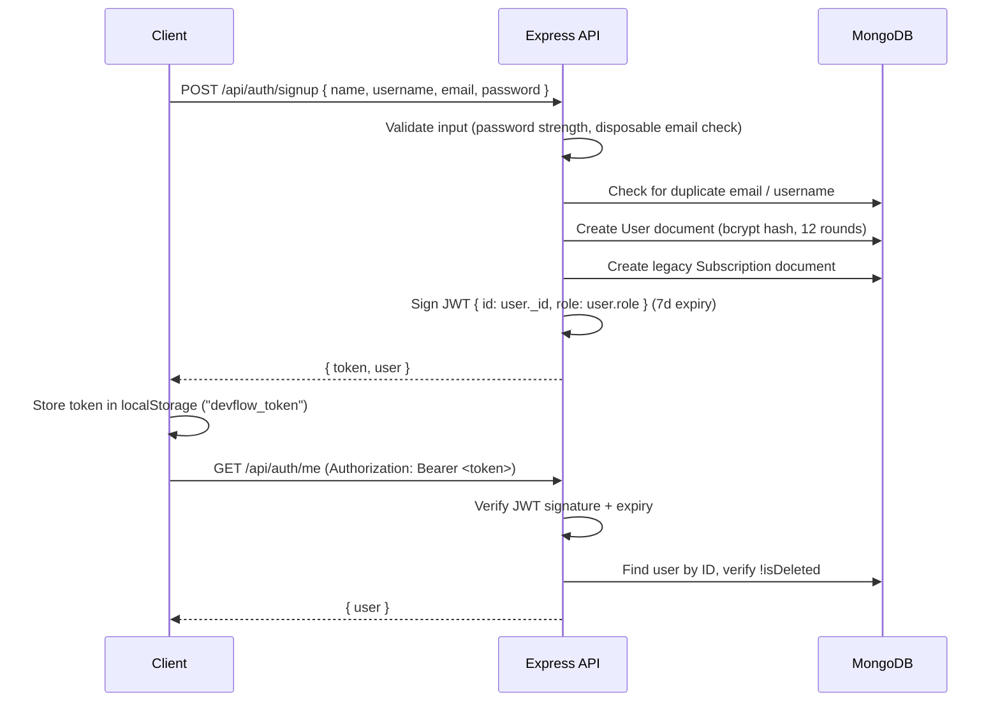
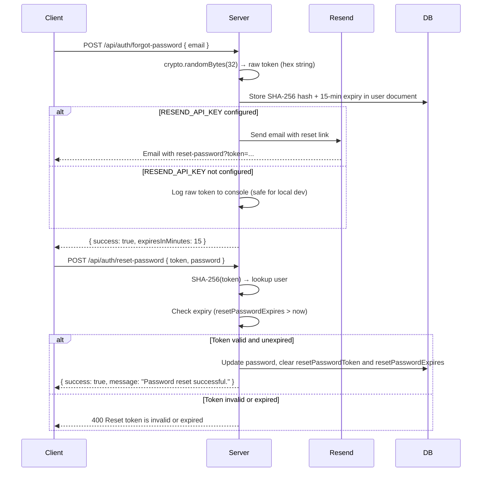

<div align="left">
  
</div>

# Authentication & Authorization

> JWT-based stateless authentication with bcrypt password hashing (12 rounds), disposable email blocking, strong password policy, and soft account deletion.

---

## Table of Contents

- [Overview](#overview)
- [Auth Flow Diagram](#auth-flow-diagram)
- [Registration](#registration)
- [Login](#login)
- [Token Details](#token-details)
- [Auth Middleware](#auth-middleware)
- [Password Reset Flow](#password-reset-flow)
- [Account Deletion](#account-deletion)
- [Client-Side Implementation](#client-side-implementation)
- [Security Considerations](#security-considerations)
- [Best Practices](#best-practices)
- [Related Documents](#related-documents)
- [Next Reading](#next-reading)

---

## Overview

DevFlow AI relies on a robust **JWT-based stateless authentication** system. By eschewing a server-side session store, the architecture scales effortlessly and eliminates the need for database session management. All authentication state is securely contained within a JSON Web Token (JWT) on the client side.

> [!NOTE]  
> - **Stateless Architecture**: Operates without Redis or database sessions.
> - **Self-Contained Payloads**: The JWT securely carries the user ID and role.
> - **Configurable Expiry**: Tokens default to a 7-day lifespan.
> - **Built-in Throttling**: Login and forgot-password endpoints are rigorously rate-limited to prevent brute-force attacks.

Passwords are cryptographically secured using `bcrypt` with 12 salt rounds, while password reset tokens are safely stored as SHA-256 hashes to mitigate exposure.

---

## Auth Flow Diagram

The following sequence details the complete user authentication lifecycle, from initial registration to secure resource access.



---

## Registration

DevFlow AI supports two distinct registration pipelines, tailored to your application's onboarding strategy.

| Endpoint | Required Fields | Use Case |
| :--- | :--- | :--- |
| `POST /api/auth/register` | `name`, `email`, `password` | Fast, frictionless onboarding without requiring a username. |
| `POST /api/auth/signup` | `name`, `username`, `email`, `password` | Comprehensive registration for users claiming custom handles. |

### Validation Rules

Data integrity is strictly enforced at the API boundary to guarantee secure, high-quality user accounts.

| Field | `/register` | `/signup` | Enforcement Rule |
| :--- | :--- | :--- | :--- |
| `name` | Required | Required | Minimum 2 characters. |
| `username` | — | Required | 3–40 characters, alphanumeric only. |
| `email` | Required | Required | Valid email format. Disposable domains are blocked. |
| `password` | Required | Required | Minimum 8 characters. Must contain uppercase, lowercase, and a digit. |

> [!WARNING]  
> Domains such as `mailinator.com`, `10minutemail.com`, and similar temporary or disposable email providers are automatically blocked at registration to prevent abuse.

### Common Registration Flow

Regardless of the endpoint used, the system processes registration identically:

1. **Input Validation**: Evaluates password strength, email format, and checks against the disposable email registry.
2. **Duplicate Check**: Ensures email and username uniqueness globally.
3. **Password Hashing**: Applies `bcrypt` with 12 salt rounds via a Mongoose pre-save hook.
4. **Document Creation**: Provisions the `User` document, assigning the default `free` tier.
5. **Legacy Record**: Generates a `Subscription` document (retained for backward compatibility).
6. **JWT Signing**: Issues a token containing `{ id: user._id, role: user.role }` valid for 7 days.
7. **Response**: Dispatches the `{ token, user }` payload to the client.

---

## Login

The `POST /api/auth/login` endpoint provides flexible authentication, accepting either a standard `email` or a unified `identifier` (which dynamically resolves to either an email or username).

**Server-Side Verification Logic:**
```javascript
// Retrieve user from database (authController.js)
const user = await User.findOne({
  $or: [{ email: identifier }, { username: identifier }],
  isDeleted: { $ne: true }
}).select("+password");

// Cryptographic password comparison
const isMatch = await bcrypt.compare(password, user.password);
if (!isMatch) throw new AppError("Invalid credentials", 401);

// Generate signed authentication token
const token = jwt.sign({ id: user._id, role: user.role }, env.jwtSecret, {
  expiresIn: env.jwtExpiresIn
});
```

> [!IMPORTANT]  
> To protect against credential stuffing, the login endpoint enforces a strict rate limit of **20 requests per 15 minutes** per IP address.

---

## Token Details

The system leverages standard JSON Web Tokens for authorization.

| Property | Value / Details |
| :--- | :--- |
| **Algorithm** | HS256 (HMAC with SHA-256) |
| **Payload** | `{ id: ObjectId, role: String, iat: Number, exp: Number }` |
| **Secret** | Secured via the `JWT_SECRET` environment variable |
| **Expiry** | Regulated by `JWT_EXPIRES_IN` (defaults to `7d`) |
| **Client Storage** | Maintained in `localStorage` under the key `devflow_token` |
| **Transmission** | Passed in headers as `Authorization: Bearer <token>` |

---

## Auth Middleware

Access control is centrally managed through dedicated Express middleware functions, ensuring robust perimeter security.

### `protect` — JWT Verification

This middleware guards all restricted endpoints. It prevents unauthorized access and validates token integrity on every request.

```javascript
const protect = asyncHandler(async (req, _res, next) => {
  const authHeader = req.headers.authorization || "";
  const token = authHeader.startsWith("Bearer ")
    ? authHeader.split(" ")[1]
    : null;

  if (!token) throw new AppError("Unauthorized", 401);

  const decoded = jwt.verify(token, env.jwtSecret);
  const user = await User.findById(decoded.id);

  if (!user || user.isDeleted) throw new AppError("User not found", 401);

  req.user = user;
  next();
});
```

**Verification Sequence:**
1. Validates the presence and format of the `Bearer <token>` header.
2. Cryptographically verifies the JWT signature and expiration.
3. Confirms the associated user still exists in the database.
4. Rejects the request if the user has a soft-delete status (`isDeleted: true`).

### `authorize(roles)` — Role-Based Access Control

Fine-grained permissions are enforced using the `authorize` middleware, which wraps the `protect` function.

```javascript
const authorize = (...roles) => (req, _res, next) => {
  if (!roles.includes(req.user.role)) {
    return next(new AppError("Forbidden", 403));
  }
  return next();
};
```

> [!NOTE]  
> The system currently supports two principal roles: `"user"` and `"admin"`.

### Public Routes

The following endpoints bypass authentication to facilitate onboarding, account recovery, and system checks:

```http
POST /api/auth/login
POST /api/auth/register
POST /api/auth/signup
POST /api/auth/forgot-password
POST /api/auth/reset-password
GET  /api/health
```

---

## Password Reset Flow

The password reset mechanism is designed to prevent token leakage and unauthorized account recovery.



**Security Measures:**
- The raw token is **never returned** in the API response.
- Tokens are stored strictly as **SHA-256 hashes**.
- All reset links are guarded by a strict **15-minute expiry**.
- Tokens are **single-use** and actively destroyed upon successful password reset.
- Graceful degradation: The system falls back to console logging if `RESEND_API_KEY` is omitted, accelerating local development.

**Resend Integration:**
When configured, Resend dispatches a branded HTML email featuring the project logo, a secure reset link, and an explicit expiry notice.

---

## Account Deletion

To preserve referential integrity, `DELETE /api/auth/me` executes a non-destructive **soft delete**.

```javascript
// Implementation snippet (authController.js):
user.isDeleted = true;
user.deletedAt = new Date();
user.email = `${user.email}_deleted_${Date.now()}`;
user.username = `${user.username}_deleted_${Date.now()}`;
await user.save({ validateBeforeSave: false });
```

**Post-Deletion Lifecycle:**
1. The `isDeleted` flag is flipped to `true`, and the `deletedAt` timestamp is recorded.
2. `email` and `username` fields are suffixed with a unique timestamp (`_deleted_{timestamp}`), freeing the original credentials for future registration.
3. The `protect` middleware instantly revokes access by evaluating the `isDeleted` flag.
4. Historical data, such as chat histories, remain structurally intact.

> [!TIP]  
> Although the JWT remains mathematically valid until expiration, the `protect` middleware explicitly checks the database for `isDeleted`, ensuring access is completely severed immediately upon deletion.

---

## Client-Side Implementation

The React/Next.js frontend seamlessly manages authentication state via Axios interceptors and Redux.

### Token Storage & Axios Interceptors

```javascript
// 1. Persistence on successful authentication (authSlice.js)
localStorage.setItem("devflow_token", action.payload.token);

// 2. Request Interceptor: Injects token into headers (api.js)
api.interceptors.request.use((config) => {
  const token = localStorage.getItem("devflow_token");
  if (token) config.headers.Authorization = `Bearer ${token}`;
  return config;
});

// 3. Response Interceptor: Catches unauthorized access (api.js)
api.interceptors.response.use(
  (response) => response,
  (error) => {
    const status = error?.response?.status;
    const msg = error?.response?.data?.message?.toLowerCase() || "";
    const isAuthFailure = status === 401 || msg.includes("jwt expired");
    
    if (isAuthFailure) {
      localStorage.removeItem("devflow_token");
      window.location.href = "/login";
    }
    return Promise.reject(error);
  }
);
```

### Protected Routes

A custom `ProtectedRoute` higher-order component prevents unauthorized access to sensitive application views.

| Route | Component | Description |
| :--- | :--- | :--- |
| `/dashboard` | `Dashboard` | Primary user hub and overview. |
| `/chat/[id]` | `Chat Window` | Active chat session view. |
| `/settings` | `Settings` | General user preferences. |
| `/settings/billing` | `Billing` | Payment and subscription management. |
| `/pricing` | `Pricing` | Upgrade paths and plans. |
| `/account` | `Account` | Core profile and security settings. |

```javascript
export function ProtectedRoute({ children }) {
  const token = localStorage.getItem("devflow_token");
  if (!token) router.replace("/login");
  return token ? children : null;
}
```

### Redux Auth State (`authSlice`)

| Action | Description |
| :--- | :--- |
| `setCredentials` | Ingests `{ token, user }` into the Redux store and commits the token to `localStorage`. |
| `logout` | Purges Redux state and permanently removes `devflow_token` from `localStorage`. |
| `hydrateAuth` | Restores authentication state from `localStorage` into Redux upon application initialization. |

---

## Security Considerations

Our implementation adheres to strict security standards while prioritizing usability.

### Current Strengths

| Security Layer | Protection Strategy |
| :--- | :--- |
| **Password Storage** | Utilizes `bcrypt` with 12 salt rounds. Excluded via `select: false` by default. |
| **JWT Signing** | Authenticated via HMAC-SHA256 and a highly secure, configurable secret. |
| **Registration** | Proactive disposable email domain blocklist mitigates bot accounts. |
| **Password Policy** | Enforces 8+ characters, including uppercase, lowercase, and numeric constraints. |
| **Account Deletion** | Employs soft deletion to maintain referential integrity across related data. |
| **Password Reset** | Uses SHA-256 hashed, single-use tokens expiring strictly within 15 minutes. |
| **Rate Limiting** | Throttles critical endpoints (Login/Reset) to 20 requests per 15 minutes per IP. |

### Known Limitations

| Limitation | Impact | Recommended Mitigation |
| :--- | :--- | :--- |
| **No Token Revocation** | A compromised JWT remains valid for up to 7 days. | Reduce token expiry and dynamically rotate cryptographic secrets. |
| **No Refresh Tokens** | Rotation mandates explicit re-authentication by the user. | Implement a secure refresh token rotation strategy. |
| **No Email Verification** | Accounts instantly gain active status post-registration. | Introduce an email verification flow prior to unlocking core functionality. |
| **No MFA/2FA** | Relies entirely on single-factor authentication. | Add Time-based One-Time Password (TOTP) support. |
| **No HTTPS Enforcement** | Relies on the host infrastructure (e.g., Render, Netlify). | Enforce strict HTTPS redirects at the load balancer level. |

---

## Best Practices

To maintain a secure and reliable authentication architecture, adhere to the following best practices:

- **Environment Separation**: Always utilize distinct `JWT_SECRET` keys for Development, Staging, and Production environments.
- **Constant Rotation**: Periodically rotate the JWT secret. Be aware this will gracefully sign out all currently active users.
- **Client Sanitization**: Never inject sensitive user information into the JWT payload, as it can be easily decoded on the client side. Only encode unprivileged identifiers (e.g., `id`, `role`).
- **Transport Security**: Never transmit authentication tokens over unsecured HTTP connections. Rely on TLS/SSL for all API traffic.

---

## Related Documents

- [Architecture Overview](./architecture.md) — System architecture and design decisions
- [Security Overview](./security.md) — Comprehensive security analysis and best practices
- [API Reference](./api.md) — Complete REST API documentation
- [Environment Variables](./environment.md) — Environment configuration reference

## Next Reading

> [!TIP]  
> **Next:** Continue to the [Security Overview](./security.md) for a comprehensive look into system-wide security analysis, advanced rate limiting, and infrastructure protection.

---

<div align="center">
  <p>
    <sub>Built with Next.js, Express, MongoDB, and Groq AI</sub>
    <br />
    <sub>&copy; DevFlow AI — Documentation</sub>
  </p>
</div>
