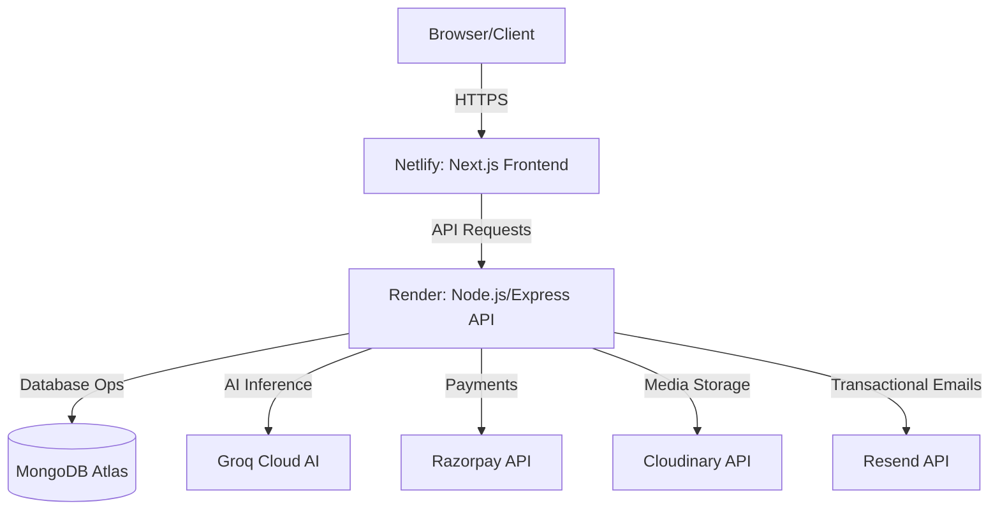

<picture>
  
</picture>

# Deployment Guide

> Deploy the frontend to Netlify and backend to Render with production environment configuration.

## Table of Contents

- [Overview](#overview)
- [Production URLs](#production-urls)
- [Deployment Architecture](#deployment-architecture)
- [Prerequisites](#prerequisites)
- [Backend Deployment (Render)](#backend-deployment-render)
- [Frontend Deployment (Netlify)](#frontend-deployment-netlify)
- [Local Development](#local-development)
- [CI/CD](#cicd)
- [Verifying a Deployment](#verifying-a-deployment)
- [Troubleshooting](#troubleshooting)
- [Related Documents](#related-documents)
- [Next Reading](#next-reading)

---

## Overview

DevFlow AI is deployed across two premium platforms for maximum performance and reliability: **Netlify** serves the Next.js frontend and **Render** hosts the Express API. The database runs on MongoDB Atlas (free tier) and all external services (Groq, Razorpay, Cloudinary, Resend) are configured securely via environment variables.

---

## Production URLs

| Component | URL |
|---|---|
| **Frontend** | `https://devflow-ai-client.netlify.app` |
| **Backend API** | `https://devflow-api-ubnd.onrender.com` |
| **Health Check** | `https://devflow-api-ubnd.onrender.com/api/health` |

---

## Deployment Architecture



---

## Prerequisites

Ensure you have active accounts and credentials for the following services:

- **MongoDB Atlas** cluster (free tier works for development and low traffic)
- **Groq Cloud** account with an API key
- **Razorpay** merchant account (test mode for development)
- **Cloudinary** account
- **Netlify** account (for frontend)
- **Render** account (for backend)

---

## Backend Deployment (Render)

### Create a New Web Service

Configure your new web service on Render with the following settings:

| Setting | Value |
|---|---|
| **Type** | Node.js Web Service |
| **Build Command** | `cd server && npm.cmd install` |
| **Start Command** | `cd server && npm.cmd start` |

### Environment Variables

Configure these variables within the Render dashboard:

| Variable | Required | Description |
|---|---|---|
| `NODE_ENV` | Yes | `production` |
| `PORT` | Yes | `5000` |
| `MONGO_URI` | Yes | MongoDB Atlas connection string |
| `JWT_SECRET` | Yes | Strong random string (min 32 chars) |
| `JWT_EXPIRES_IN` | No | Default: `7d` |
| `CLIENT_URL` | Yes | `https://devflow-ai-client.netlify.app` |
| `GROQ_API_KEY` | Yes | Groq Cloud API key |
| `AI_MODEL` | No | Default: `llama3-8b-8192` |
| `RAZORPAY_KEY_ID` | Yes | Razorpay key ID |
| `RAZORPAY_KEY_SECRET` | Yes | Razorpay key secret |
| `CLOUDINARY_CLOUD_NAME` | Yes | Cloudinary cloud name |
| `CLOUDINARY_API_KEY` | Yes | Cloudinary API key |
| `CLOUDINARY_API_SECRET` | Yes | Cloudinary API secret |
| `OWNER_COUPON` | No | Secret coupon for 100% discount |
| `OWNER_COUPON_DURATION` | No | Days for owner coupon (default: `30`) |
| `RESEND_API_KEY` | No | Resend API key (falls back to console log if omitted) |
| `EMAIL_FROM` | No | Sender address for password reset emails |

> [!NOTE]
> **Free tier cold starts:** Render spins down free web services after 15 minutes of inactivity. The first request after a period of inactivity may take 5–10 seconds.

> [!IMPORTANT]
> **MongoDB IP whitelist:** You must add `0.0.0.0/0` to your Atlas IP whitelist, or restrict it directly to Render's IP range for a secure connection.

> [!WARNING]
> **CORS:** Ensure your `CLIENT_URL` exactly matches your Netlify frontend URL.

---

## Frontend Deployment (Netlify)

### Connect Repository

Your `netlify.toml` file is pre-configured and ready for deployment:

```toml
[build]
  command = "npm.cmd run build"
  publish = ".next"

[[plugins]]
  package = "@netlify/plugin-nextjs"
```

### Build Settings

When setting up your site on Netlify, use these configurations:

| Setting | Value |
|---|---|
| **Base directory** | `client/` |
| **Build command** | `npm.cmd run build` |
| **Publish directory** | `.next` |
| **Node version** | `20` (Set in Netlify dashboard: Site settings → Build & deploy → Environment → Node version) |

### Environment Variables

Configure these variables within the Netlify dashboard:

| Variable | Required | Description |
|---|---|---|
| `NEXT_PUBLIC_API_URL` | Yes | Render API URL |
| `NEXT_PUBLIC_RAZORPAY_KEY_ID` | Yes | Razorpay publishable key ID |

> [!CAUTION]
> `NEXT_PUBLIC_RAZORPAY_KEY_ID` must be the **Key ID** (starts with `rzp_test_` or `rzp_live_`), and **NOT** the Key Secret.

---

## Local Development

### Backend

To get your backend running locally, execute the following commands:

```bash
cd server
copy .env.example .env
npm.cmd install
npm.cmd run dev            # API runs on http://localhost:5000
```

### Frontend

To launch your frontend development server:

```bash
cd client
copy .env.local.example .env.local
npm.cmd install
npm.cmd run dev            # Frontend runs on http://localhost:3000
```

### Required Local Environment

> [!TIP]
> Use these example configurations to set up your local development environment quickly.

**server/.env:**
```env
NODE_ENV=development
PORT=5000
MONGO_URI=mongodb+srv://<user>:<pass>@cluster0.xxxxx.mongodb.net/devflow?retryWrites=true&w=majority
JWT_SECRET=your_strong_jwt_secret
JWT_EXPIRES_IN=7d
CLIENT_URL=http://localhost:3000
GROQ_API_KEY=gsk_your_groq_key
AI_MODEL=llama3-8b-8192
RAZORPAY_KEY_ID=rzp_test_xxxxxxxxxxxx
RAZORPAY_KEY_SECRET=xxxxxxxxxxxxxxxxxxxxxxxx
CLOUDINARY_CLOUD_NAME=your_cloud_name
CLOUDINARY_API_KEY=xxxxxxxxxxxx
CLOUDINARY_API_SECRET=xxxxxxxxxxxxxxxxxxxxxxxx
```

**client/.env.local:**
```env
NEXT_PUBLIC_API_URL=http://localhost:5000
NEXT_PUBLIC_RAZORPAY_KEY_ID=rzp_test_xxxxxxxxxxxx
```

---

## CI/CD

- **Netlify:** Automatically deploys whenever changes are pushed to the `main` branch. 
- **Render:** Requires manual configuration in the Render dashboard to enable auto-deploy from GitHub.

---

## Verifying a Deployment

After a successful deployment, verify the platform health by checking the following:

1. Check the backend health endpoint: `GET /api/health`
2. Visit the frontend URL and confirm that login and signup functionality works.
3. Test the Razorpay checkout flow in test mode.
4. Verify that AI chat responses stream correctly.

---

## Troubleshooting

| Issue | Solution |
|---|---|
| **CORS errors** | Ensure `CLIENT_URL` in the backend `.env` matches the frontend origin exactly. |
| **MongoDB connection fails** | Add `0.0.0.0/0` to your Atlas IP whitelist. |
| **Razorpay checkout fails** | Verify `NEXT_PUBLIC_RAZORPAY_KEY_ID` is the Key ID, not the secret. |
| **500 errors in production** | Check that `NODE_ENV=production` is set and all required environment variables are present. |
| **Render cold starts** | The free tier spins down after 15 minutes of inactivity — the first request will take 5–10s. |
| **Build failures** | Run a fresh `npm.cmd install` (delete `node_modules` and `package-lock.json`) and verify Node >= 18. |

---

## Related Documents

- [Environment Variables](./environment.md)
- [Architecture Overview](./architecture.md)
- [Troubleshooting Guide](./troubleshooting.md)

---

## Next Reading

> [!TIP]
> **Next:** [Environment Variables](./environment.md) — Complete reference for all server and client environment variables.

---

<p align="center">
  &copy; 2024 DevFlow AI. Built with Next.js, Express, MongoDB, and Groq AI.<br>
  <i>Empowering developers through intelligent workflows.</i>
</p>
