# DevFlow AI: Complete Engineering Book

> A forensic, evidence-based technical reference compiled from the project's documentation suite for the `devflow-ai` codebase.

---

## Table of Contents

1. Executive Summary
2. Product Vision
3. Problem Statement
4. Why This Project Exists
5. Technology Stack
6. System Architecture
7. Frontend Architecture
8. Backend Architecture
9. Database Deep Dive
10. Authentication System
11. AI Chat System
12. Billing System
13. Security Deep Dive
14. Major Bugs Solved
15. Engineering Decisions
16. Deployment
17. Feature Traceability Matrix

---

# Chapter 1: Executive Summary

DevFlow AI is a monetized, single-developer SaaS product that wraps a third-party LLM (Groq) behind an authenticated, rate-limited Node.js/Express API, with a Next.js 14 frontend and a Razorpay-based billing system on top of a MongoDB Atlas database. The README describes it as "a premium SaaS platform designed for modern developer workflows" that provides a real-time AI chat system with account personalization, subscription management, and usage limits.

Architecturally, the system is a classic three-tier decoupled web application:

- **Client tier:** Next.js 14 App Router frontend, deployed on Netlify.
- **API tier:** Express.js REST backend, deployed on Render as a free-tier web service (subject to cold starts).
- **Data tier:** MongoDB Atlas, accessed through Mongoose ODM.

The product's central value proposition is the AI chat feature, which proxies user prompts to the Groq LLM API so that the API key never reaches the browser. Monetization is layered on top of this core feature through a free/pro tier system: free users get a small daily message quota, and paying users (via Razorpay) or coupon-holders (via a hardcoded secret string) get extended or unlimited access.

Three engineering properties recur across the documentation and are worth internalizing before reading the rest of this book, because they are the load-bearing decisions the rest of the system is built around:

1. **Statelessness over infrastructure.** Authentication (JWT), rate limiting (in-memory `express-rate-limit`), and subscription expiry (passive middleware checks) are all implemented without any dedicated background workers, queues, or caching layer. The documentation is explicit and repeated on this point: no Redis, no BullMQ, no CRON jobs.
2. **Server-side trust boundary enforcement.** Two of the six documented postmortems (Razorpay payload spoofing, coupon replay) exist because a client-reported success state was initially trusted by the server. Both were fixed by moving the source of truth to the backend — HMAC verification for payments, a server-side `usedCoupons` array for coupons.
3. **NoSQL constraint workarounds over schema changes.** The most distinctive engineering decision in the codebase is solving a MongoDB `unique` index conflict (re-registration after soft-deletion) by *mutating the indexed string* (`email + "_deleted_" + timestamp`) rather than removing the constraint or doing a hard delete.

This book is organized so that each of these decisions is explained from four different angles across the chapters: the architectural diagram (Chapter 6), the database field-level lifecycle (Chapter 9), the postmortem that originally surfaced it (Chapter 14), and the interview defense for explaining it to a third party (Chapter 18).

---

# Chapter 2: Product Vision

The product vision, as stated in the README, is to be a premium SaaS platform designed for modern developer workflows, with an explicit design emphasis on deep aesthetics, accessibility, and high performance. The README further states the chat interface is inspired by Linear/Vercel in its visual language, and that the product targets a "premium" feel rather than a utilitarian one — visible in details like the dark/light theme system, syntax-highlighted code blocks, and a deliberately high-friction account-deletion flow (Chapter 7, Chapter 9) designed to prevent accidental data loss rather than to maximize conversion.

Three product pillars are explicit in the documentation:

| Pillar | Documented Evidence | Primary Files |
|---|---|---|
| AI-assisted developer workflow | Groq-backed chat, markdown + code rendering | `chatController.js`, `ChatWindow.jsx` |
| Account ownership & privacy | Soft-deletion, disposable-email blocking, GDPR framing | `authController.js`, `DangerZone.jsx` |
| Sustainable monetization | Free/Pro tiers, Razorpay, coupon system | `paymentController.js`, `RazorpayWidget.jsx` |

The vision is narrower than a general-purpose AI assistant: it is scoped specifically to developer workflows, evidenced by the markdown/code-block rendering investment (`react-markdown`, `CodeCopyButton`) and the "Linear/Vercel" aesthetic reference, both of which are developer-tool design conventions rather than consumer-app conventions.

---

# Chapter 3: Problem Statement

The documentation does not contain an explicit, single-sentence "problem statement" the way a product requirements document would. It must be reconstructed from the features and the README framing. The reconstructed problem statement is:

> Individual developers want fast, conversational access to an LLM for workflow tasks, but (a) raw LLM API keys are expensive and easy to leak if exposed client-side, (b) unmetered LLM access is not sustainable for an indie operator to fund, and (c) most existing AI chat wrappers either have no monetization path or an over-engineered one (subscriptions requiring full SaaS infrastructure).

DevFlow AI's answer is a minimal-infrastructure solution: hide the LLM key behind a thin authenticated proxy, meter usage with a single atomic counter field rather than a metering service, and monetize with a payment gateway chosen for regional fit (Razorpay, which is India-focused) plus a manual escape hatch (the owner coupon) for the operator's own provisioning needs rather than building an admin panel.

---

# Chapter 4: Why This Project Exists

**As a working product.** It has a live frontend and backend URL, a demo video, and screenshots, all listed in the README, suggesting it was built to actually be used, not only to be read by recruiters. It is built with a focus on deep aesthetics, accessibility, and high performance, and is live at https://devflow-ai-client.netlify.app with a backend at https://devflow-api-ubnd.onrender.com.

---

# Chapter 5: Technology Stack

This chapter covers every technology with direct documentary evidence of use in the codebase. Each entry follows the same structure: What it is, Why it was chosen, Alternatives considered, Tradeoffs, Benefits, Limitations. Technologies that appear only in the README's badge row or tech-stack bullet list, without corroboration anywhere else in the documentation, are marked accordingly — this matters, because the audit and verification reports claim to have purged unverified technologies, yet two such mentions survive in the README itself (see callouts below and Chapter 20).

## 5.1 Next.js 14

- **What it is:** A React meta-framework providing file-system routing, the App Router, and React Server Components.
- **Why chosen:** File-system routing and React Server Components .
- **Alternatives considered:** Vite (documented).
- **Tradeoffs:** Bundle size, as explicitly noted in the encyclopedia's technology decision record.
- **Benefits:** Convention-driven routing reduces boilerplate; supports the App Router structure used for `layout.jsx` and theme handling (Chapter 7).
- **Limitations:** The framework's SSR model is the direct root cause of Postmortem #2 (Tailwind/theme hydration panic, Chapter 14) — server-rendered HTML cannot know the client's `localStorage` theme preference, which is a structural limitation of any SSR framework, not a bug unique to this codebase.

## 5.2 React

- **What it is:** The UI library underlying Next.js, used here primarily via function components and hooks (`useState`, `useEffect`, `useTheme`, `usePathname`).
- **Why chosen:** Implied by the Next.js choice; not separately justified in the documentation.
- **Alternatives considered:** Not documented.
- **Tradeoffs:** Not documented beyond what is inherited from the Next.js entry.
- **Benefits:** Component-level state isolation, demonstrated in `ChatWindow.jsx`'s self-contained `messages`/`input`/`isLoading` state.
- **Limitations:** Client-held state (e.g., the `messages` array) is volatile and memory-bound — `PROJECT_ENCYCLOPEDIA.md` explicitly notes that a long chat session risks browser memory bloat since there is no virtualization or pruning of the in-memory array.

## 5.3 Node.js & Express.js

- **What it is:** A JavaScript runtime and minimalist HTTP framework forming the backend API tier.
- **Why chosen:** Non-blocking asynchronous I/O is cited as ideal for proxying slow LLM requests (the Groq call is a multi-second blocking-feeling operation from the client's perspective, and Node's event loop allows the single process to continue serving other requests while waiting on that I/O).
- **Alternatives considered:** Go, Rust (both documented as considered).
- **Tradeoffs:** Single-threaded CPU limits — explicitly called out as a tradeoff in the encyclopedia, and concretely realized in the bcrypt-hashing CPU cost discussed in Chapter 5.7 and Chapter 13.
- **Benefits:** Mature middleware ecosystem (`helmet`, `cors`, `express-rate-limit`, `express-validator`) used directly in `server.js` per the architecture document's request-lifecycle diagram.
- **Limitations:** CPU-bound work (bcrypt hashing, HMAC computation) briefly blocks the single event loop thread; the security guide notes bcrypt hashing "blocks the Node.js event loop slightly for each signup/login request."

## 5.4 MongoDB & Mongoose

- **What it is:** A document-oriented NoSQL database (MongoDB Atlas, per the README) accessed through the Mongoose ODM, which defines schemas (`User.js`, `Chat.js`) on top of MongoDB's otherwise schema-less documents.
- **Why chosen:** Embedded documents — i.e., nesting `subscription` and `usage` objects directly inside the `User` document rather than normalizing them into separate collections — eliminate the need for SQL-style JOINs on high-frequency routes such as the per-message quota check in `chatController.js`. The interview guide states this plainly: "Chat arrays and unstructured nested metrics map perfectly to BSON. PostgreSQL joins would slow down the `api/chat` route."
- **Alternatives considered:** PostgreSQL (documented as considered and explicitly rejected).
- **Tradeoffs:** No multi-document ACID transactions across collections — `DOCUMENTATION_AUDIT_REPORT.md` records this as a corrected assumption: an earlier draft of the documentation incorrectly assumed multi-document ACID guarantees were used for rate-limiting; this was corrected to reflect that rate-limiting instead relies on a single-document atomic `$inc`, which MongoDB does guarantee even without multi-document transactions.
- **Benefits:** Single-document reads via `findById` scale well and are O(1) with respect to the number of related entities, per the interview guide.
- **Limitations:** Schema-less injection risk is mitigated, not eliminated, by Mongoose's schema definitions, per the interview guide's security-implications note.

## 5.5 Tailwind CSS

- **What it is:** A utility-first CSS framework.
- **Why chosen:** Zero-runtime styling scoped exactly to components, per the encyclopedia.
- **Alternatives considered:** SCSS modules (documented).
- **Tradeoffs:** Verbose JSX class lists, per the encyclopedia.
- **Benefits:** Enables the `Sidebar` component's responsive hide/show behavior via a simple `hidden md:flex` utility combination, per the component audit.
- **Limitations:** Not separately documented beyond verbosity.

## 5.6 Groq API (LLM provider)

- **What it is:** A third-party LLM inference API, called server-side at `https://api.groq.com/openai/v1/chat/completions`, per the API reference.
- **Why chosen:** Not explicitly justified in the documentation beyond an aside in the architecture document's "Common Questions" callout: "Why Groq instead of OpenAI?" answered as "TTFT speed" (time-to-first-token). This is the *documented justification*, but no benchmark, citation, or comparative data is supplied to substantiate the TTFT claim — it should be treated as the stated rationale, not an independently verified fact.
- **Alternatives considered:** OpenAI (implied by the architecture document's framing of the question, though not elaborated).
- **Tradeoffs:** Third-party API availability risk — Postmortem-adjacent: the API reference documents a `503 Service Unavailable` failure path specifically for when "Groq fails," and the audit report flags "Groq API degradation" as an undocumentable, day-to-day variable outside the repository's control.
- **Benefits:** Backend proxying hides the `GROQ_API_KEY` from the frontend bundle, per the features document.
- **Limitations:** Synchronous request-response model holds the HTTP connection open for the duration of the LLM call (documented as multiple seconds), risking socket exhaustion under concurrent load; the features document notes Server-Sent Events (SSE) streaming was considered as an alternative but rejected for added complexity.

## 5.7 Bcrypt

- **What it is:** A password hashing library.
- **Why chosen:** Industry standard with built-in salt generation, per the security guide.
- **Alternatives considered:** Argon2, scrypt (both documented as considered).
- **Tradeoffs:** High CPU utilization at the configured cost factor of 12, which the documentation justifies as an intentional, accepted latency cost: "I utilized bcrypt with a cost factor of 12. This intentionally slows down the CPU to defeat rainbow table attacks."
- **Benefits:** Defeats precomputed rainbow-table attacks via per-hash salting.
- **Limitations:** CPU cost scales with concurrent signup volume; the features document explicitly flags this as a scalability risk: "High concurrent signups will spike Node.js event loop latency."

## 5.8 JSON Web Tokens (JWT)

- **What it is:** A stateless, cryptographically signed token format used for authentication, generated via `jwt.sign()` and verified via `jwt.verify()`.
- **Why chosen:** Allows horizontal scaling without sticky sessions or a shared session store, per the interview guide.
- **Alternatives considered:** Stateful Express-Sessions with Redis (documented as considered and rejected).
- **Why rejected (Redis sessions):** "Added unnecessary infrastructure complexity (Redis) for a monolithic starting architecture," per the interview guide.
- **Tradeoffs:** Tokens cannot be instantly revoked on compromise without a separate blocklist, which is not documented as implemented.
- **Benefits:** Cryptographic verification requires no database lookup in principle, though this codebase deliberately adds one anyway (see Chapter 10).
- **Limitations:** Stored in `localStorage` per the security guide, which is explicitly acknowledged as vulnerable to XSS, with the documentation's own risk acceptance framing: "vulnerable to XSS, but sufficient for this tier."

## 5.9 Razorpay

- **What it is:** A payment gateway (India-focused, given currency and product framing), integrated via a client-side checkout script and a server-side order/verify API.
- **Why chosen:** Not explicitly contrasted against alternatives anywhere in the documentation beyond the generic statement that it avoids hosting a PCI-compliant card form directly.
- **Alternatives considered:** **Not Verifiable From Documentation.** No competing payment gateway is named anywhere in the twelve source files.
- **Tradeoffs:** Vendor lock-in, per the features document.
- **Benefits:** Offloads PCI compliance to a third party; the client only handles a dynamically injected `https://checkout.razorpay.com/v1/checkout.js` script.
- **Limitations:** The checkout script can be blocked by ad-blockers such as uBlock Origin, per the component audit's documented failure scenario for `RazorpayWidget.jsx`.

## 5.10 Hosting: Netlify + Render

- **What it is:** Netlify hosts the static/edge-rendered Next.js frontend; Render hosts the Express backend as a Node.js Web Service.
- **Why chosen:** Not explicitly justified beyond the implicit free-tier framing throughout the documentation (e.g., the rate-limiting entry in the security guide notes reliance on Express middleware specifically because Cloudflare's paid edge rate-limiting was rejected for "free tier limitations").
- **Alternatives considered:** Cloudflare (documented, but only in the context of WAF/rate-limiting, not full hosting).
- **Tradeoffs:** Render's free tier "automatically spins down during inactivity... and spins up on incoming requests," per the README — i.e., cold starts are a known, accepted latency cost.
- **Benefits:** Zero-cost hosting for both tiers at the documented scale.
- **Limitations:** Cold-start latency is explicitly flagged in the audit report as a variable that "cannot be documented definitively as [it changes] daily outside of the repository's control."

## 5.11 Unverified / Contradicted Technology Claims

Two technologies appear in the README's feature list or badge row but are **not corroborated anywhere else** in the documentation, and in one case are directly **contradicted** by another document in the same suite:

- **Redux Toolkit** — listed in the README's Tech Stack section ("Frontend: Next.js 14, React, Tailwind CSS, Lucide Icons, Redux Toolkit"). No controller, component audit entry, or architecture diagram anywhere else in the documentation references Redux, a store, slices, or any global state management beyond component-local `useState`. The `ChatWindow` component audit explicitly describes its state as local React state. **Status: Not Verifiable From Documentation.**
- **Cloudinary** — listed in the README's Tech Stack section ("Integrations: Groq API (AI Chat), Razorpay (Payments), Cloudinary (Image Uploads)"). This is a direct contradiction: `DOCUMENTATION_AUDIT_REPORT.md` explicitly states that Cloudinary was identified as a hallucination and purged, claiming "0 remaining hallucinations" and that Cloudinary exists "nowhere except in 'Future Ideas' quarantine zones." No other document — not the API reference, not the component audit, not the database guide — documents any image-upload endpoint, controller, or `avatar` upload mechanism beyond the `avatar` field itself existing as a plain `String` URL on the `User` schema, written by `authController.updateProfile`. **Status: Contradicted between source documents — almost certainly a leftover artifact in the README that the otherwise-thorough audit passes missed despite claiming 100% purge completion.** See Chapter 20 for full discussion.

---

# Chapter 6: System Architecture

## 6.1 High-Level System Context

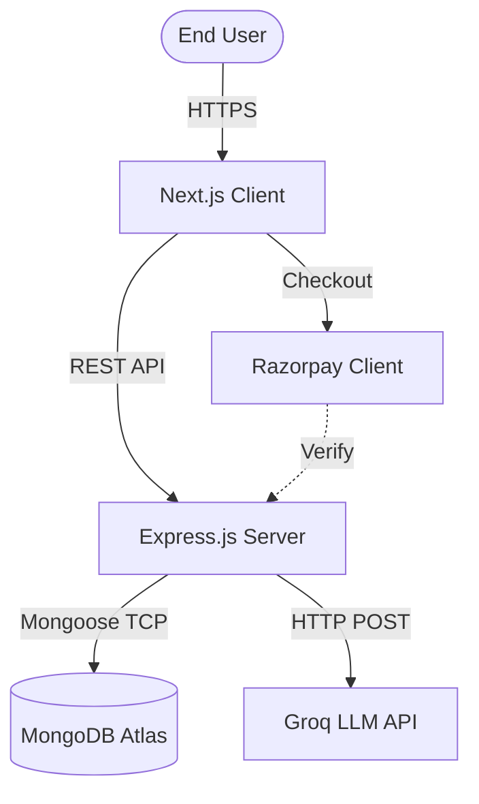

**Verified from:** `client/package.json`, `server/src/server.js`, `server/src/controllers/chatController.js`.

**Purpose:** Illustrates the highest-level interaction of the application with its external boundaries — three internal tiers (client, server, database) and two external dependencies (Groq, Razorpay).

**Interview angle:** This diagram is the right starting answer to "walk me through your architecture." It demonstrates an understanding of distributed system boundaries before diving into any single tier.

**Common mistake to avoid:** Claiming the frontend writes directly to the database. It does not — every data mutation, including payment verification and chat persistence, is routed exclusively through the Express API.

## 6.2 Request Lifecycle

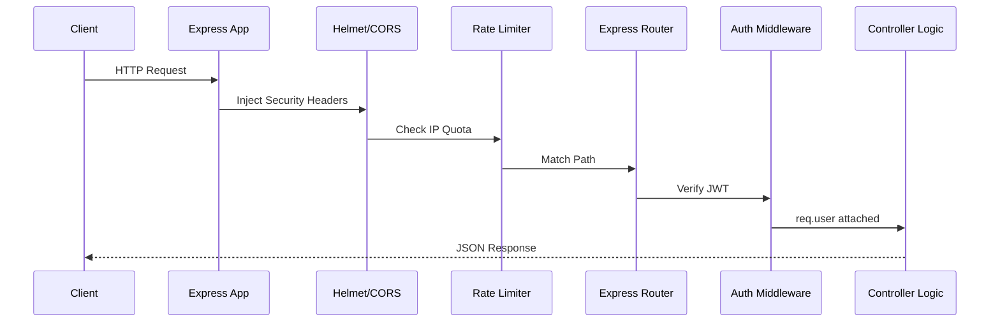

**Verified from:** `server/src/server.js`, `server/src/middleware/authMiddleware.js`.

**Purpose:** Maps the exact sequential execution order of an Express HTTP request through the global middleware stack before it reaches route-specific logic.

**Interview angle:** Demonstrates understanding of the Express middleware chain and the order-of-operations security model — headers and rate-limiting happen *before* any route-specific authentication, which matters for resource-exhaustion defense.

**Common questions:** "What happens if RateLimiter fails?" — it returns `429` immediately, bypassing Auth and the Controller entirely, which saves database and CPU resources that would otherwise be spent on a request that's going to be rejected anyway.

**Common mistake to avoid:** Assuming controllers run before middleware. The middleware chain is strictly sequential and gates access to the controller.

## 6.3 Authentication Flow

This flow is reconstructed from the Database Guide's "User Authentication & Mutative Lifecycle" diagram together with the API reference's signup/login endpoint definitions.

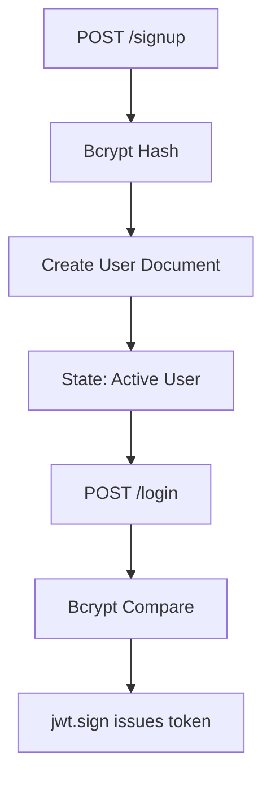

**Verified from:** `server/src/controllers/authController.js`, `server/src/models/User.js`, `PROJECT_API_REFERENCE.md` Section 1.

**Purpose:** Shows the password lifecycle from plaintext submission through hash storage to token issuance, the foundation every other authenticated flow depends on.

## 6.4 Chat Flow (Reconstructed)

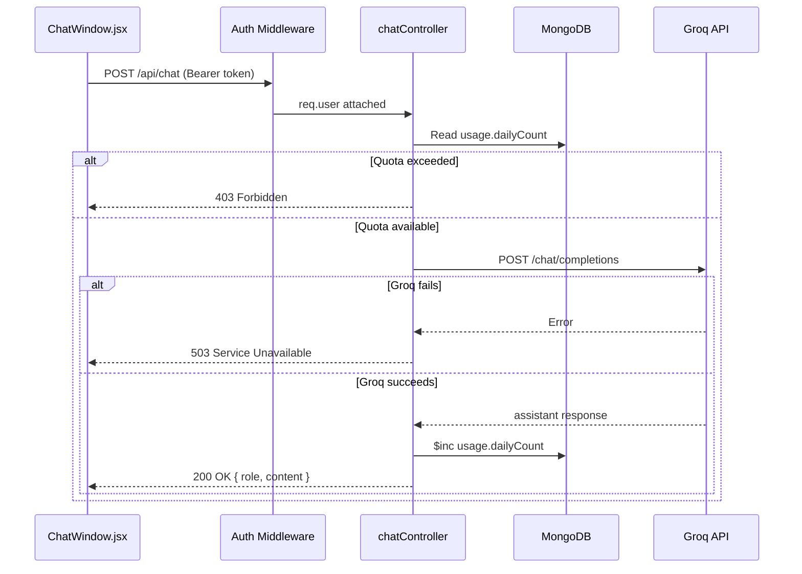

**Purpose:** Combines the documented quota-check, the Groq proxy call, and the two distinct failure branches (`403` for quota, `503` for upstream failure) into one flow. The proactive quota check (before the Groq call) rather than a reactive check (after) is the specific fix from Postmortem #3 — checking *before* the slow external call is what closes the race-condition window, not merely using `$inc` in isolation.

**Interview angle:** This is the best diagram in the book for demonstrating understanding of race conditions in asynchronous systems, because the fix (validate quota proactively, increment atomically) directly maps to a real documented bug.

## 6.5 Billing (Payment Verification) Flow

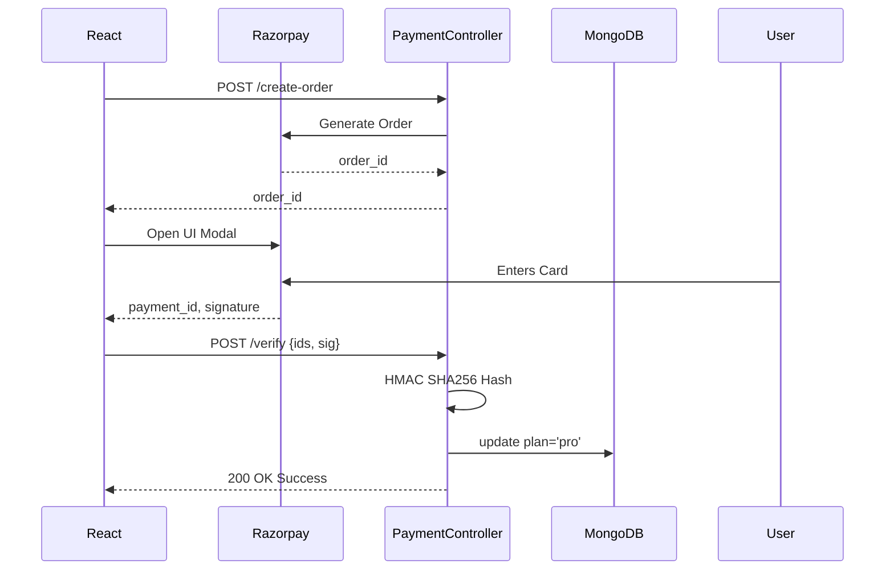

**Verified from:** `server/src/controllers/paymentController.js`.

**Purpose:** Demonstrates the separation of an untrusted client-relayed payment result from a server-verified one.

**Interview angle:** "Why verify on the server?" — client payloads can be intercepted and modified with a proxy tool such as Burp Suite; only a signature reconstructed from a server-held secret can be trusted.

**Common mistake to avoid:** Processing the upgrade simply because the React client called back with a success state. The system explicitly does not do this — see Postmortem #4, Chapter 14.

## 6.6 Coupon Flow (Reconstructed)

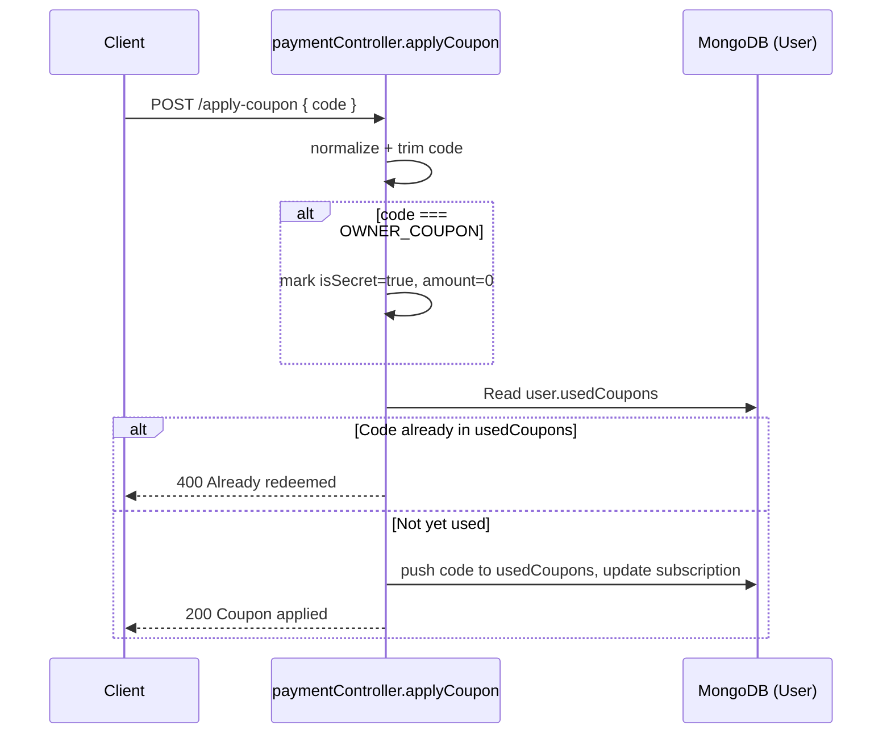

**Verified from:** `server/src/controllers/paymentController.js` (Lines 44-51, 139-142 per `FINAL_EVIDENCE_VERIFICATION_REPORT.md`), `server/src/models/User.js` (Line 38).

**Purpose:** Shows both the secret-owner-coupon backdoor and the per-user replay-protection check in a single flow, since both paths share the same endpoint.

## 6.7 Subscription Lifecycle

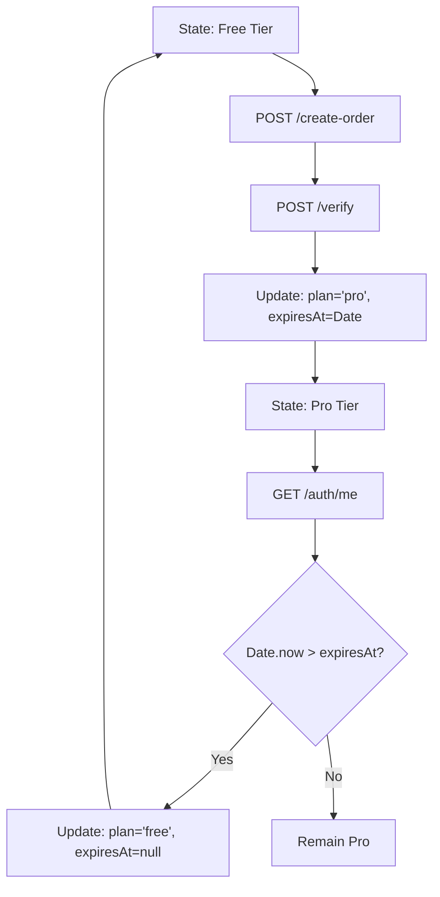

**Verified from:** `server/src/middleware/authMiddleware.js`, `server/src/controllers/paymentController.js`.

**Purpose:** Explains passive temporal logic execution without CRON jobs — expiry is checked opportunistically, on the next authenticated request a user happens to make, not on a fixed schedule.

**Interview angle:** "Why not use a CRON job?" — a CRON job requires a dedicated worker process running continuously. Passive middleware execution costs nothing extra and scales automatically with active user request volume, since it only runs when a user is already making a request.

**Common mistake to avoid:** Assuming a background queue (e.g., BullMQ or RabbitMQ) performs this check. It does not exist in this codebase; it is plain middleware logic.

**A documented edge case worth naming explicitly:** because expiry is checked passively rather than on a schedule, a user whose subscription has technically expired retains Pro-tier access for as long as they simply don't make another authenticated request. This is a deliberate tradeoff (no infrastructure cost) with a real, if minor, business consequence (delayed downgrade) — exactly the kind of tradeoff an interviewer may probe.

## 6.8 Account Deletion Lifecycle

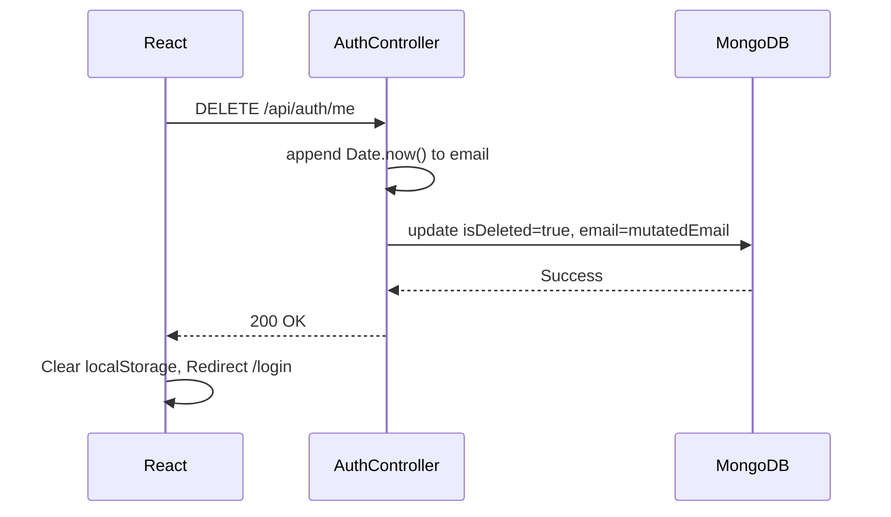

**Verified from:** `server/src/controllers/authController.js` (Lines 224-228 per `FINAL_EVIDENCE_VERIFICATION_REPORT.md`).

**Purpose:** Shows how the system bypasses a MongoDB unique-index constraint while soft-deleting, by mutating both `email` and `username` (the verification report's code evidence shows both fields being suffixed, not just email).

**Interview angle:** This is the single most distinctive engineering decision documented in this codebase, and is treated as such throughout this book (Chapter 9, Chapter 14, Chapter 18).

**Common mistake to avoid:** Thinking `isDeleted: true` alone solves the re-registration problem. It does not — the `unique: true` index on `email` still blocks a second document from holding the same string value regardless of the `isDeleted` flag's value.

## 6.9 Theme Lifecycle (Reconstructed)

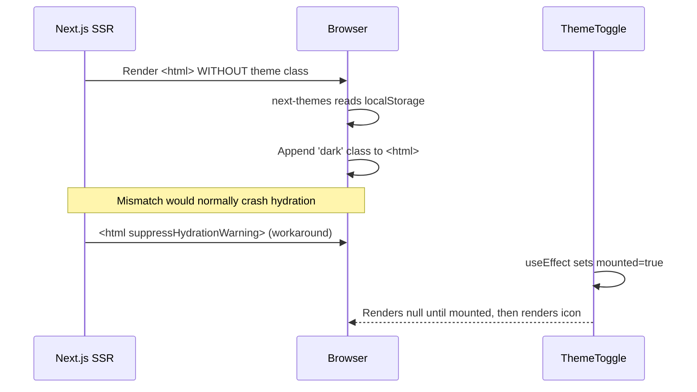

**Verified from:** `ENGINEERING_POSTMORTEMS.md` Item 2, `PROJECT_ENCYCLOPEDIA.md` Section 1.1, `client/app/layout.jsx`, `client/components/ThemeToggle.jsx`.

**Purpose:** Walks through why a seemingly cosmetic dark-mode toggle required two distinct defensive techniques — `suppressHydrationWarning` at the root layout level, and a `mounted` guard inside the `ThemeToggle` component itself, which returns `null` until the client has confirmed it has mounted.

**Interview angle:** This is a strong example for explaining SSR/CSR boundary problems generally, because the root cause (`localStorage` is invisible to the server) generalizes to any client-only browser API, not just theming.

---

# Chapter 7: Frontend Architecture

## 7.1 Next.js Structure & Routing

The frontend uses the Next.js 14 App Router, evidenced directly by the existence and role of `client/app/layout.jsx` as the root layout housing the `<html>` tag and theme provider (Chapter 6.9). The App Router's file-system routing convention is cited as a primary reason Next.js was chosen at all (Chapter 5.1). Route-level pages referenced across the documentation include `client/app/login/page.jsx` (signup/login UI, per the features document).

**Not Verifiable From Documentation:** The full route tree (e.g., whether `/chat`, `/settings`, `/billing` exist as distinct routes or are tabs within one page) is not enumerated anywhere in the twelve source documents. Only `login/page.jsx` is named explicitly. The `Sidebar` component is described as housing "routing links (Dashboard, Chat, Settings)," which implies at least three additional routes exist, but their exact paths are not documented.

## 7.2 Components

The component audit in `PROJECT_ENCYCLOPEDIA.md` is the single most detailed frontend source and documents seven components in depth: `ThemeToggle`, `Sidebar`, `ChatWindow`, `MessageBubble`, `CodeCopyButton`, `DangerZone`, and `RazorpayWidget`. Their documented responsibilities are summarized here; full detail for each (state, lifecycle, edge cases, security/performance concerns) is preserved verbatim in structure from the source and is reproduced in full in Chapter 6 (architecture flows) and Chapter 11/12 (feature-specific chapters) rather than repeated three times in this book.

| Component | Path | Core Responsibility |
|---|---|---|
| `ThemeToggle` | `client/components/ThemeToggle.jsx` | Sun/Moon dark-mode switch using `next-themes` |
| `Sidebar` | `client/components/Sidebar.jsx` | Primary navigation, hidden on mobile via `hidden md:flex` |
| `ChatWindow` | `client/components/ChatWindow.jsx` | Core chat UI: input, message list, loading state |
| `MessageBubble` | Internal to `ChatWindow` | Renders one chat turn (`role`, `content`) via `react-markdown` |
| `CodeCopyButton` | `client/components/CodeCopyButton.jsx` | Clipboard-copy icon for code blocks |
| `DangerZone` | `client/components/settings/DangerZone.jsx` | Account soft-deletion UI with typed confirmation |
| `RazorpayWidget` | `client/components/billing/RazorpayWidget.jsx` | Injects Razorpay checkout script, opens payment modal |

## 7.3 State Flow

State management in the documented components is exclusively local React state (`useState`) — `ChatWindow` holds `messages`, `input`, and `isLoading`; `CodeCopyButton` holds `isCopied`; `DangerZone` holds `confirmText`; `Sidebar` derives active-route state from `usePathname()` rather than holding its own state. No global store, context provider, or state management library is documented as actually wired into any component, which is the basis for flagging "Redux Toolkit" in the README's tech stack as Not Verifiable (Chapter 5.11).

## 7.4 Theme System

Covered in full in Chapter 6.9. The short version for this chapter: `next-themes` reads and writes `localStorage`, mutates a `dark` class on the root `<html>` tag, and the implementation required two specific hydration-safety techniques (`suppressHydrationWarning` and a `mounted` guard) discovered through Postmortem #2.

## 7.5 Chat UI

`ChatWindow.jsx` is documented as the core feature interface. The user flow is: user types into the `input` state, submits, `isLoading` flips to `true`, an Axios `POST` fires to `/api/chat`, the response is appended to the `messages` array, and `isLoading` flips back to `false`. Two failure modes are explicitly documented: a `403 Forbidden` (daily limit hit) is handled by surfacing a toast notification rather than appending a fake assistant message, and a network disconnect mid-request leaves `isLoading` stuck at `true` with no documented recovery/timeout mechanism — this is recorded as an open failure scenario, not a fixed one.

## 7.6 Sidebar

Primary vertical navigation, persists across navigations within what the encyclopedia calls the `MainLayout`. It hides on mobile (`hidden md:flex` Tailwind utility) rather than collapsing into a hamburger menu, which is a documented tradeoff: it is simple to implement but consumes horizontal screen space on desktop permanently.

## 7.7 Forms

The most detailed documented form is the `DangerZone` deletion confirmation: it requires the user to type the literal string `"DELETE"` into a text field before the destructive action button enables. A documented edge case is that a trailing-space typo ("delete " with a space) leaves the button disabled — this is presented as intentional friction, not a bug, with the explicit framing: "Friction is intentionally high to prevent accidental clicks."

**Not Verifiable From Documentation:** The signup/login form's client-side validation rules (beyond the backend's `express-validator` checks) are not documented.

## 7.8 Error Handling

Error handling is documented at the component level rather than via a global error boundary. `ChatWindow` surfaces `403` errors as toast notifications; `RazorpayWidget`'s failure scenario (ad-blocker blocking the checkout script) has no documented recovery UI; `CodeCopyButton`'s clipboard failure (non-HTTPS context) is documented as a browser-level block with no documented fallback messaging.

**Not Verifiable From Documentation:** Whether a top-level React error boundary exists anywhere in the App Router tree is not stated in any of the twelve documents.

## 7.9 Mobile Responsiveness

The only explicitly documented responsive behavior is the `Sidebar`'s `hidden md:flex` breakpoint switch and the README's claim of "Auto-scroll and responsive touch-targets for mobile" for the chat interface. The README also separately claims the existence of a "Mobile TopNav" that renders `ThemeToggle` alongside the Sidebar's instance of the same component — this is the only mention of a distinct mobile navigation component in the entire documentation suite, found in the component audit's description of where `ThemeToggle` is rendered ("universally in the Sidebar and Mobile TopNav"), and it is not otherwise documented as its own component entry.

---

# Chapter 8: Backend Architecture

## 8.1 Express Architecture

The backend is a single Express application (`server/src/server.js`) that applies global middleware (Helmet, CORS, rate limiting) before routing to feature-specific routers (`authRoutes.js`, `chatRoutes.js`, `paymentRoutes.js`), each of which delegates to a corresponding controller module. This structure is the conventional Express MVC-lite pattern: routes are thin and declarative, controllers hold business logic, and Mongoose models define and persist data shape.

## 8.2 Controllers

Three controller modules are documented in detail:

- **`authController.js`** — `signup`, `login`, `getMe`, `deleteAccount`, and (referenced but not separately route-documented) `updateProfile`, `forgotPassword`, `resetPassword`.
- **`chatController.js`** — `generateChatResponse` (the sole documented exported function), and a referenced-but-undocumented `getChats`.
- **`paymentController.js`** — `createOrder`, `verifyPayment`, `applyCoupon`, and a referenced-but-undocumented `cancelSubscription`.

The gap between functions *referenced* (in the Database Guide's reader/writer columns) and functions *route-documented* (in the API Reference) is a real, evidence-based finding of this audit and is discussed fully in Chapter 17.

## 8.3 Routes

Three route files are named directly: `server/src/routes/authRoutes.js`, `server/src/routes/chatRoutes.js`, `server/src/routes/paymentRoutes.js`. The full enumerated set of documented endpoints is reproduced in Chapter 17's traceability matrix.

## 8.4 Middleware

| Middleware | Role | Verified Location |
|---|---|---|
| `helmet()` | Injects 11+ secure HTTP headers (e.g. `X-Frame-Options`, `X-Content-Type-Options`) | `server.js` |
| `cors` | Restricts allowed origins to the configured Netlify frontend URL | `server.js` |
| `express-rate-limit` | IP-based request throttling; uses `app.set("trust proxy", 1)` to read the real client IP from Render's `x-forwarded-for` header | `server.js` |
| `express-validator` | Payload shape/format validation, plus a hardcoded disposable-email blocklist | route-level, pre-controller |
| `authMiddleware.protect` | JWT verification, `isDeleted` check, passive subscription-expiry check, attaches `req.user` | `server/src/middleware/authMiddleware.js` |

## 8.5 Validation

`express-validator` is documented as performing two distinct jobs: structural validation (email format, password length) and a content-level check (cross-referencing submitted emails against a hardcoded disposable-email-domain blocklist, e.g., `mailinator.com`). The security guide frames the philosophy as "fails fast" — blocking malformed or abusive input before it reaches the database layer at all.

## 8.6 Error Handling

The codebase is documented as using a custom `AppError` class (seen directly in the coupon-replay code evidence: `throw new AppError("This coupon has already been redeemed by this account.", 400)`), implying a centralized error-handling middleware pattern, though the centralized handler itself is not separately documented — only its usage at call sites is visible through the quoted code evidence.

**Not Verifiable From Documentation:** Whether there is a single global Express error-handling middleware (the conventional `(err, req, res, next)` four-argument handler) versus per-controller try/catch blocks is not explicitly described; the `AppError` class's existence is the only direct evidence, and it is consistent with either pattern.

## 8.7 Authentication Pipeline

The full pipeline, as established across the architecture and security documents: a request carrying an `Authorization: Bearer <token>` header is matched to a route, passed through `authMiddleware.protect`, which (1) extracts and verifies the JWT via `jwt.verify()`, (2) performs a `findById` lookup of the user — a deliberate choice over pure stateless verification, justified as: "While pure JWTs don't require database lookups, I explicitly added a `findById` check to ensure the user wasn't soft-deleted or banned" — (3) checks `isDeleted`, rejecting with `401` if true, (4) checks subscription expiry and passively downgrades if needed (Chapter 6.7), and (5) attaches the resulting user document to `req.user` for the controller to use.

---

# Chapter 9: Database Deep Dive

## 9.1 User Schema (`server/src/models/User.js`)

The full field-by-field table below is reproduced from `PROJECT_DATABASE_GUIDE.md`, which is the single most detailed source document in the suite. Each row states the reader (which controller/middleware reads the field), the writer (which controller mutates it), and the documented consequence if the field were removed — the last column is a genuinely useful design-rationale artifact, since it forces an explicit statement of *why* each field exists rather than just *what* it is.

| Field | Type | Purpose | Reader | Writer | Consequence if Removed |
|---|---|---|---|---|---|
| `_id` | ObjectId | Primary key, used as JWT payload | All controllers | Mongoose (auto) | Everything — identifiers fail |
| `name` | String | Display name | `authController.getMe` | `signup`, `updateProfile` | Profile rendering breaks |
| `username` | String | Unique handle, secondary login identifier | `authController.login` | `signup` | Login by username fails |
| `email` | String | Primary auth identifier; mutated on soft delete | `login`, `deleteAccount` | `signup`, `deleteAccount` | Login fails; uniqueness logic fails |
| `contact` | String | Optional phone number | `getMe` | `updateProfile` | Non-critical |
| `avatar` | String | Profile image URL | `getMe` | `updateProfile` | UI falls back to default avatar |
| `password` | String | Bcrypt hash, `select: false` by default | `login` (explicit `.select()`) | `signup`, `resetPassword` | Authentication fails completely |
| `resetPasswordToken` | String | SHA-256 hash of the reset token | `resetPassword` | `forgotPassword` | Forgot-password flow fails |
| `resetPasswordExpires` | Date | Recovery window, checked against `Date.now()` | `resetPassword` | `forgotPassword` | Reset tokens never expire — security vulnerability |
| `role` | String | RBAC flag | Middleware | `signup` | Admin routes become unprotected |
| `subscription.plan` | String | `"free"` or `"pro"`; gates usage limits | `chatController`, `authMiddleware` | `verifyPayment`, `applyCoupon`, `cancelSubscription` | Monetization fails entirely |
| `subscription.status` | String | Subscription state for UI display | UI dashboard | `paymentController` | Dashboard UI logic fails |
| `subscription.expiresAt` | Date | Passive expiry checkpoint | `authMiddleware.protect` | `verifyPayment` | Subscriptions never expire |
| `subscription.offerCode` | String | Records which coupon granted the tier | Analytics (unspecified) | `verifyPayment` | Coupon attribution tracking fails |
| `usage.dailyCount` | Number | Per-day message counter | `chatController` | `chatController` via `$inc` | Free-tier quota can be abused infinitely |
| `usage.lastReset` | Date | Daily reset checkpoint | `chatController` | `chatController` | Users get permanently locked out after their first 5 queries |
| `usedCoupons` | [String] | Per-user coupon replay guard | `applyCoupon` | `verifyPayment` (per source table; see note below) | Coupons can be replayed infinitely |
| `isDeleted` | Boolean | Soft-delete flag | `authMiddleware.protect` | `deleteAccount` | Deleted accounts can still log in |
| `deletedAt` | Date | Deletion audit timestamp | DB admins (manual) | `deleteAccount` | No deletion audit trail |

**A note on internal inconsistency in the source table:** `PROJECT_DATABASE_GUIDE.md`'s own table lists the *reader* of `usedCoupons` as `applyCoupon` and the *writer* as `verifyPayment` — but the postmortem log, the security guide, and the evidence-verification report all independently describe `applyCoupon` itself as the function that both checks (`includes()`) *and* pushes to `usedCoupons`. The reader/writer split in the database guide's table for this one field appears to be a documentation slip rather than a real architectural detail; the weight of evidence (three independent documents) supports `applyCoupon` performing both operations. This book flags rather than silently "fixes" the discrepancy, consistent with the evidence-based mandate.

## 9.2 Chat Schema (`server/src/models/Chat.js`)

| Field | Type | Purpose | Reader | Writer | Consequence if Removed |
|---|---|---|---|---|---|
| `user` | ObjectId | Foreign key linking a chat to a `User` | `chatController.getChats` | `generateChatResponse` | Orphaned chat records |
| `messages` | Array | Conversation history (`{ role, content }` objects) | `getChats` | `generateChatResponse` | Chat context/memory fails |

This is a deliberately minimal schema — two fields — consistent with the "embedded document" philosophy discussed in Chapter 5.4: rather than a complex normalized message table, each chat is one document with an append-only array.

## 9.3 Entity Relationship Diagram

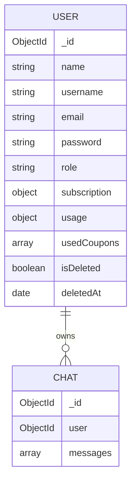

This is the only relationship documented anywhere in the suite: one `User` to many `Chat` documents, via a simple `ObjectId` foreign key with no documented cascade-delete behavior — meaning a soft-deleted user's `Chat` documents are, per the available documentation, retained and orphaned rather than cleaned up, which is consistent with the explicit design goal of preserving "essential analytics" through soft deletion (README) rather than physically erasing history.

## 9.4 Data Flow & Lifecycle Diagrams

### 9.4.1 User Authentication & Mutative Lifecycle

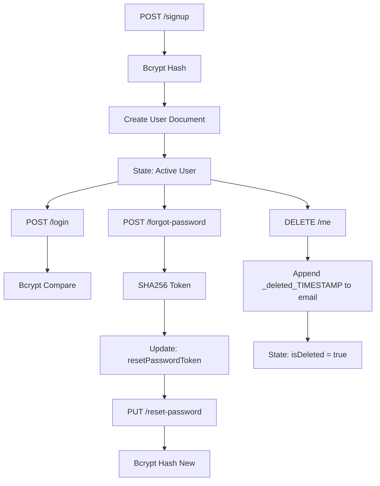

### 9.4.2 Subscription Lifecycle

See Chapter 6.7 for the identical diagram with architectural commentary; it is reproduced once, not twice, to keep this book's length proportionate to genuinely distinct content.

## 9.5 Forensic Verification Notes on Excluded Technologies

`PROJECT_DATABASE_GUIDE.md` explicitly records three technologies considered and ruled out, each with "0 references in code" per its own forensic claim: Stripe, PostgreSQL, and Redis Sessions. All schemas are stated to map 100% to Mongoose models found in `server/src/models`. As with all "100%" and "0 references" claims throughout the source documents, this book treats them as the documentation's own assertion rather than independently re-verified fact, since no actual source code was available for direct inspection during this compilation — see Chapter 20.

---

# Chapter 10: Authentication System

Each subsystem below follows WHAT / WHY / HOW, with security and edge-case notes folded in since they are inseparable from the documented design rationale.

## 10.1 Signup

- **WHAT:** `POST /api/auth/signup` accepts `{ name, username, email, password }` and creates a new `User` document.
- **WHY:** To identify individual users so that per-user API quotas and billing state can be tracked — the features document is explicit that this, not generic "user accounts," is the stated reason authentication exists at all in this product.
- **HOW:** The route is gated by `express-validator` (email format, password length, disposable-email blocklist), the controller hashes the password with bcrypt at cost factor 12, creates the document, and returns `201 Created` with `{ _id, name, email, role, token }` — meaning a JWT is issued immediately on signup, with no separate email-verification step documented anywhere in the suite.
- **Failure path:** `400 Bad Request` on duplicate email or validation failure.
- **Documented edge case:** A user attempting to sign up with an email that was previously soft-deleted succeeds, because the soft-deletion flow mutates the original email string, freeing the original value in the unique index (Chapter 6.8, Chapter 9.1).
- **Not Verifiable From Documentation:** Whether `username` collisions are checked with the same rigor as `email` collisions (a unique index is implied by "Unique username validation" in the README, but no error-response code is documented for this specific case the way it is for duplicate email).

## 10.2 Login

- **WHAT:** `POST /api/auth/login` accepts `{ email, password }`.
- **WHY:** To authenticate a returning user and issue a fresh JWT.
- **HOW:** Gated by `express-rate-limit` specifically (called out separately from the global rate limiter, implying a stricter, login-specific throttle to resist brute force). The controller performs `User.findOne({ email }).select('+password')` — the explicit `.select('+password')` is necessary because the schema sets `select: false` on the password field by default, a documented defense-in-depth measure so that the password hash is never accidentally included in any other query's result set.
- **Failure path:** `401 Unauthorized` for either invalid credentials *or* `isDeleted === true` — the documentation notes these two distinct failure causes share a single response code and (implicitly) a single generic message, which is itself a user-enumeration defense consistent with the timing-attack mitigation described in Chapter 13.10.

## 10.3 JWT Issuance & Verification

Covered in depth in Chapter 5.8 and Chapter 8.7. The summary for this chapter: `jwt.sign()` issues a token on both signup and login; `authMiddleware.protect` verifies it via `jwt.verify()` on every protected request and performs an additional database lookup (a deliberate, documented departure from "pure" stateless JWT usage) specifically to catch soft-deleted or otherwise invalidated accounts that a stateless signature check alone could not detect.

## 10.4 Forgot Password / Password Reset

- **WHAT:** A two-step flow — `POST /forgot-password` issues a reset token; `PUT /reset-password` consumes it to set a new password.
- **WHY:** Standard self-service account-recovery, combined with a specific anti-enumeration design goal (Chapter 13.10).
- **HOW:** On `forgot-password`, a raw token is generated and immediately hashed with SHA-256 before being saved to `resetPasswordToken`, with an expiry window stored in `resetPasswordExpires`. Direct code evidence: `const hashedToken = crypto.createHash("sha256").update(rawToken).digest("hex");`. Only the hash is persisted — the raw token is presumably emailed or otherwise delivered to the user out-of-band, though the delivery mechanism itself (email service, etc.) is **Not Verifiable From Documentation**; no email-sending library or service is named anywhere in the twelve source files. On `reset-password`, the submitted token is hashed the same way and compared against the stored hash, and checked against `resetPasswordExpires` versus `Date.now()`.
- **Security rationale for hashing the token at rest:** if the database were breached, an attacker holding only the hashed token could not reconstruct the raw token needed to actually perform a reset — directly analogous to never storing plaintext passwords.
- **Documented risk avoided:** the interview guide flags `resetPasswordExpires` as preventing an "infinite reset token vulnerability" — i.e., without an expiry check, a leaked historical token would remain exploitable forever.

## 10.5 Disposable Email Protection

- **WHAT:** A hardcoded blocklist of disposable/temporary email domains (e.g., `mailinator.com`) checked at signup.
- **WHY:** To prevent throwaway-email signups, which would otherwise let a single person bypass the per-account daily quota by mass-creating accounts.
- **HOW:** Enforced in `express-validator` middleware, before the request reaches `authController.signup` — consistent with the documented "fail fast" philosophy (Chapter 8.5).
- **Tradeoff:** A hardcoded list requires manual maintenance as new disposable-email providers appear; no dynamic/API-based disposable-email detection service is documented as being used.

## 10.6 Soft Deletion

- **WHAT:** `DELETE /api/auth/me` flags a user `isDeleted = true` and mutates `email` (and `username`, per the verified code evidence) by appending `_deleted_<timestamp>`.
- **WHY:** Hard deletion would orphan `Chat` documents and destroy the foreign-key relationship and any analytical value in retained chat history; GDPR-style "right to be forgotten" compliance is the stated motivation in the README, balanced against this analytics-retention goal.
- **HOW:** Fully diagrammed in Chapter 6.8 and field-mapped in Chapter 9.1. The specific mechanism — string mutation rather than a boolean flag alone — exists because MongoDB's `unique: true` index on `email` throws an `E11000 duplicate key error` if a flag-only approach were used and the same email were submitted again at signup; this was in fact a real, documented production bug (Postmortem #1, Chapter 14.1), not a theoretical concern anticipated in advance.
- **Documented edge case:** two users both legitimately named "John" who each later delete their accounts do not collide, because the timestamp suffix is appended at the moment of deletion and is therefore unique per deletion event, not per name.

---

# Chapter 11: AI Chat System

## 11.1 Message Lifecycle

A user-submitted prompt flows: `ChatWindow.jsx` local state → Axios `POST /api/chat` with an `Authorization` header → `authMiddleware.protect` → `chatController.generateChatResponse` → a proactive quota check against `usage.dailyCount` → (if quota available) an outbound `POST` to `https://api.groq.com/openai/v1/chat/completions` → an atomic `$inc` of `usage.dailyCount` on success → a `200 OK` response of shape `{ role: 'assistant', content: '...' }` → appended to the client's `messages` array and rendered through `MessageBubble`/`react-markdown`.

## 11.2 Prompt Flow

The documented request body shape is `{ messages: [{ role: 'user', content: '...' }] }`, implying the full conversation history (not just the latest message) is sent to Groq on each call, consistent with how stateless chat-completion APIs are conventionally used to maintain conversational context. **Not Verifiable From Documentation:** Whether there is any server-side truncation, summarization, or token-budget management applied to long conversation histories before they're sent to Groq is not described anywhere in the suite — given the `ChatWindow` component's own documented risk of unbounded client-side memory growth (Chapter 7.3), this is a plausible related gap, but it is not confirmed either way.

## 11.3 Response Flow

Documented as a synchronous (non-streaming) request-response cycle — the entire LLM response is awaited and returned as one JSON payload, not streamed token-by-token via Server-Sent Events. This is an explicit, named tradeoff in the features document: SSE streaming was "considered" as a way to avoid holding the HTTP connection open for multiple seconds, but rejected for added implementation complexity.

## 11.4 History

Chat history persistence is handled by the two-field `Chat` schema (Chapter 9.2): each conversation is one document with an append-only `messages` array, retrieved via a `getChats` function that is referenced in the database guide's reader/writer table but — notably — has no corresponding documented route in `PROJECT_API_REFERENCE.md` (Chapter 17 covers this gap and several siblings).

## 11.5 Limits

The free-tier limit is stated directly in the postmortem log as 5 messages per day ("bypass the 5-message free limit"). Enforcement is atomic (`$inc`) and proactive (checked before the Groq call, not after), specifically because the original implementation checked reactively and was exploitable via concurrent requests (Postmortem #3, Chapter 14.3). Reset is governed by the `usage.lastReset` field, compared against the current date — the precise reset boundary condition (midnight UTC vs. midnight local time, exact rollover logic) is flagged in the features document itself as a named edge case ("User hits limit exactly at midnight") without full elaboration of how it's resolved beyond "Handled via `lastReset` comparison."

## 11.6 Error Cases

| Failure | Response | Source |
|---|---|---|
| Daily quota exceeded | `403 Forbidden` | API Reference §2.1 |
| Groq API unavailable/erroring | `503 Service Unavailable` | API Reference §2.1 |
| Network disconnect mid-request (client-side) | No documented server response; client `isLoading` state has no documented recovery | Encyclopedia §1.3 |
| Malformed Groq response shape | Previously caused `[object Object]` to render in the UI — fixed by strict destructuring | Postmortem #6 |

---

# Chapter 12: Billing System

## 12.1 Razorpay Flow

Fully diagrammed in Chapter 6.5. In prose: the client requests an order (`POST /create-order`), the backend creates it via the Razorpay SDK (`instance.orders.create`) and returns an `order_id`, the client opens the Razorpay-hosted checkout modal using that ID, the user pays, Razorpay returns `payment_id` and a `signature` to the client, and the client forwards all three values to `POST /verify`, where the backend independently reconstructs the expected signature using its own private secret and compares it to what was submitted — only on a match is `subscription.plan` updated to `'pro'`.

## 12.2 Coupon Flow

Fully diagrammed in Chapter 6.6. Two distinct behaviors share the single `POST /apply-coupon` endpoint: the secret owner-coupon path (12.3 below) and the general-purpose, replay-protected coupon path, which checks `user.usedCoupons.includes(code)` before applying any discount and pushes the code to that array on success.

## 12.3 Secret Coupon

- **WHAT:** A single hardcoded backdoor string compared via `process.env.OWNER_COUPON || "SHIVANIDIGVIJAY"` — note the fallback literal value is itself present in the quoted code evidence in `FINAL_EVIDENCE_VERIFICATION_REPORT.md`, meaning if the environment variable were ever unset in a deployed environment, this specific literal string would become the active backdoor coupon. This is a real, documented security-relevant detail, not an inference.
- **WHY:** To let the developer provision test or personal Pro accounts without going through Razorpay checkout or building a dedicated admin panel.
- **HOW:** When the normalized, submitted code matches the secret, the function returns `{ code: normalized, amount: 0, isSecret: true }`, which downstream logic treats as a zero-cost, valid coupon redemption.
- **Risk, as stated directly in the source documents:** "If the `.env` leaks, massive financial vulnerability" (Features document) and "anyone can grant themselves 100 years of Pro access" if the secret is discovered (Interview Guide). The stated mitigating control is the existing login rate-limiter, which makes brute-forcing the secret string impractical — but this is a rate-limit on login attempts, not a rate-limit specific to coupon-application attempts, so its effectiveness as a control specifically against coupon brute-forcing is asserted rather than separately demonstrated in the documentation.

## 12.4 Subscription Activation

Activation, in both the Razorpay path and the coupon path, converges on the same database update: `subscription.plan = 'pro'` and `subscription.expiresAt` set to a future date. The coupon path additionally sets `subscription.offerCode` to record attribution.

## 12.5 Expiry Logic

Fully covered in Chapter 6.7. Passive, middleware-driven, checked opportunistically on the next authenticated request after the expiry date has passed.

## 12.6 Cancel Subscription

The README states users "can cancel their Pro subscription instantly via the settings dashboard, immediately reverting to the free tier limits." The Database Guide's writer column for `subscription.plan` lists `paymentController.cancelSubscription` as a contributing writer function. **However, no route for this function is documented anywhere in `PROJECT_API_REFERENCE.md`.** This is treated in this book as a confirmed-to-exist-but-undocumented-at-the-route-level feature: two independent documents (README, Database Guide) attest to its existence and the controller function's name, but the actual HTTP method and path are **Not Verifiable From Documentation**. See Chapter 17.

---

# Chapter 13: Security Deep Dive

## 13.1 Stateless JWT

- **Threat:** Session hijacking and CSRF (the latter specifically associated with cookie-based session schemes).
- **Mitigation:** Tokens minted with `jwt.sign()` and transmitted via the `Authorization: Bearer` header rather than a cookie, which is inherently immune to CSRF since CSRF relies on browsers automatically attaching cookies to cross-origin requests.
- **Why:** Keeps the Node.js backend fully stateless, simplifying deployment on Render without a shared Redis session store.
- **Tradeoff:** Cannot be instantly revoked on compromise or password change without a separate blocklist, which is not documented as implemented.

## 13.2 Password Hashing (Bcrypt)

- **Threat:** Database breach exposing credentials; rainbow-table precomputation attacks.
- **Mitigation:** `bcrypt.hash(password, 12)` with built-in per-hash salting.
- **Why:** Industry standard, salt generation is automatic.
- **Tradeoff:** CPU-expensive by design; briefly blocks the single Node.js event loop thread per signup/login.

## 13.3 Network Rate Limiting

- **Threat:** Brute-force credential stuffing, basic Layer 7 DDoS.
- **Mitigation:** `express-rate-limit` middleware, combined with `app.set("trust proxy", 1)` so the real client IP is read from Render's `x-forwarded-for` header rather than Render's own proxy IP.
- **Why:** In-memory protection requiring no external infrastructure.
- **Tradeoff:** Shared NAT IPs (corporate networks, universities) can collectively trigger the limit for unrelated legitimate users; the limiter's state resets entirely if the Render instance restarts, since it is in-memory and not backed by any persistent store.

## 13.4 Helmet Security Headers

- **Threat:** XSS, clickjacking, MIME-sniffing.
- **Mitigation:** `helmet()` applied globally, setting 11+ headers including `X-Frame-Options: SAMEORIGIN` and `X-Content-Type-Options: nosniff`.
- **Why:** Automatic, broad coverage versus manually setting each header.
- **Tradeoff:** A strict Content Security Policy can block legitimate third-party scripts — explicitly named as a risk for the Razorpay checkout script specifically, requiring careful CSP configuration to avoid breaking the billing flow while still tightening XSS defenses.

## 13.5 CORS

- **Threat:** Unauthorized cross-origin AJAX requests against the API on a logged-in user's behalf.
- **Mitigation:** The `cors` middleware restricts allowed origins to the configured Netlify frontend URL.
- **Why:** A mandatory browser security standard being explicitly configured rather than left at a permissive default.
- **Tradeoff:** Requires maintaining separate origin environment variables across Dev, Staging, and Prod.

## 13.6 Coupon Replay Protection

Covered fully in Chapter 12.2 and Chapter 14.5. Threat: repeated redemption of a one-time discount. Mitigation: a per-user `usedCoupons` array checked via `.includes()`. Tradeoff: the array grows indefinitely per user, a minor but real BSON document-size consideration over a long enough user lifetime.

## 13.7 Razorpay HMAC SHA-256 Verification

Covered fully in Chapter 6.5, Chapter 12.1, and Chapter 14.4. Threat: client-side spoofing of a payment-success callback. Mitigation: server-side HMAC reconstruction using a private secret. Tradeoff: requires strict secret management of `RAZORPAY_KEY_SECRET`, since possession of that one value is sufficient to forge valid-looking signatures.

## 13.8 Soft Delete Isolation

Covered fully in Chapter 6.8, Chapter 9.1, Chapter 10.6, and Chapter 14.1. Threat: zombie-account access after "deletion," and unique-index lockouts on re-registration. Mitigation: explicit `isDeleted` check in `authMiddleware.protect`, plus the email/username mutation. Tradeoff: full GDPR "right to be forgotten" compliance would still require an additional, separately-implemented physical-scrubbing script, since the current mechanism retains the mutated PII strings rather than erasing them.

## 13.9 Input Validation (express-validator)

Covered fully in Chapter 8.5 and Chapter 10.5. Threat: NoSQL injection, malformed payloads, disposable-email signup abuse. Mitigation: pre-controller middleware validation plus a hardcoded blocklist. Tradeoff: verbose route-file syntax.

## 13.10 Forgot-Password Timing/Enumeration Defense

- **Threat:** An attacker discovering which emails are registered by measuring response-time or response-content differences between "email exists" and "email doesn't exist" cases.
- **Mitigation:** The system is documented as responding identically regardless of whether the submitted email exists in the database.
- **Why:** Standard practice for preventing user enumeration via the password-reset flow.
- **Tradeoff:** Degraded UX for a user who genuinely forgot which email address they registered with, since the system cannot tell them whether they got the address wrong.

---

# Chapter 14: Major Bugs Solved

## 14.1 Case Study: Soft Deletion vs. Unique Index Lockout

- **Problem:** A user who deleted their account via `DELETE /api/auth/me` could never re-register using the same email address again.
- **Root Cause:** Mongoose enforced a `unique: true` index on the `email` field. Simply flagging `isDeleted = true` did not free the string value held in that index — the index doesn't know or care about the `isDeleted` flag's value.
- **Investigation:** Database logs surfaced an `E11000 duplicate key error collection` exception upon the affected re-registration attempt, which directly pointed to the unique-index constraint as the proximate cause.
- **Fix:** Mutate the indexed string at the moment of deletion: `user.email = user.email + "_deleted_" + Date.now()`. The verified code evidence shows this was extended to also mutate `username` for the same reason.
- **Lessons Learned:** Relational/uniqueness integrity constraints conflict structurally with "soft" logical-deletion patterns. String mutation is a pragmatic way to preserve historical data (for analytics, audit trail) while still unblocking the constraint for future legitimate use of that same email address by the same or a different person.
- **Files:** `server/src/controllers/authController.js` (`deleteAccount`), `server/src/models/User.js`.
- **Cross-references:** Chapter 6.8 (diagram), Chapter 9.1 (field table), Chapter 10.6 (feature writeup).

## 14.2 Case Study: Tailwind v4 Dark Mode Hydration Panic

- **Problem:** The React client crashed on initial load with a "Text content did not match server-rendered HTML" error.
- **Root Cause:** The Next.js server rendered the `<html>` tag without a `dark` class (since the server cannot read browser `localStorage`), but `next-themes` read `localStorage` client-side and instantly appended the class — causing React's hydration diff between server-rendered and client-rendered markup to fail.
- **Investigation:** Browser console warnings pointed directly to the root `layout.jsx` file as the source of the mismatch.
- **Fix:** Adding `suppressHydrationWarning` to the `<html>` tag specifically.
- **Lessons Learned:** Server-side rendering cannot inherently access client-side-only browser APIs like `localStorage`. Any component reading such an API needs an explicit hydration boundary or mounted-guard pattern (the `ThemeToggle` component's own `mounted` flag, documented separately in the component audit, is the complementary half of this same fix).
- **Files:** `client/app/layout.jsx`, `client/components/ThemeToggle.jsx`.
- **Cross-references:** Chapter 6.9 (full theme lifecycle diagram), Chapter 7.4.

## 14.3 Case Study: Daily Quota Race Conditions

- **Problem:** Users could bypass the 5-message-per-day free limit by submitting multiple prompts simultaneously, before the database had a chance to record the previous request's usage.
- **Root Cause:** The original controller logic read the current count, checked it against the limit in application memory, then called the Groq API (a multi-second operation), and only *then* wrote the updated count back to the database. Concurrent requests fired within that multi-second window all read the same stale (pre-increment) count and were all approved.
- **Investigation:** Network-tab monitoring during a deliberate test showed 5 concurrent requests all successfully yielding 5 separate LLM responses, despite the user's actual remaining quota being only 1 at the time the burst was sent.
- **Fix:** Two changes together close the gap: (1) switching the increment itself to MongoDB's atomic `$inc` operator, and (2) validating the quota proactively — before firing the Groq call — rather than reactively checking and writing after the response came back.
- **Lessons Learned:** Any asynchronous I/O boundary (here, the multi-second wait on an external API) is a window during which stale in-memory reads can be exploited by concurrent requests. Atomic database operations close the write-side of the race; moving the check earlier in the request lifecycle (before the slow I/O, not after) closes the read-side.
- **Files:** `server/src/controllers/chatController.js`.
- **Cross-references:** Chapter 6.4 (full chat flow diagram, including the explicit proactive-check branch), Chapter 11.5.

## 14.4 Case Study: Razorpay Payload Spoofing

- **Problem:** A malicious user could trigger a free upgrade to the Pro plan by submitting fabricated IDs directly to the `/verify` endpoint, bypassing the actual Razorpay checkout UI entirely.
- **Root Cause:** The original design implicitly trusted whatever payment-success payload the client reported — but the client (a browser) is never a trustworthy source of truth for whether money actually changed hands.
- **Investigation:** Penetration testing using Postman to call `/verify` directly, without ever going through the Razorpay checkout modal, successfully demonstrated the bypass.
- **Fix:** Server-side HMAC verification: `crypto.createHmac('sha256', process.env.RAZORPAY_KEY_SECRET)` is used to concatenate and sign the `order_id` and `payment_id`, and the resulting hash is compared against the signature Razorpay actually returned. Only a match — which requires possession of Razorpay's own private signing process, not just knowledge of the IDs — proves the payment was genuine.
- **Lessons Learned:** Never trust client-reported state in a financial transaction. Either server-to-server confirmation or cryptographic signature verification (the path taken here) is required to establish ground truth.
- **Files:** `server/src/controllers/paymentController.js` (`verifyPayment`).
- **Cross-references:** Chapter 6.5, Chapter 12.1, Chapter 13.7.

## 14.5 Case Study: Coupon Replay Attacks

- **Problem:** Users could apply the same one-month-free coupon code repeatedly, getting the discount applied over and over.
- **Root Cause:** The original `applyCoupon` controller checked whether the *code itself* was valid, but never checked whether *this specific user* had already claimed it before.
- **Investigation:** A direct code audit of `applyCoupon` revealed the missing per-user state-tracking — there was simply no field or check standing between a valid code and a repeated application of it.
- **Fix:** Added a `usedCoupons: [String]` array to the `User` model. The endpoint now checks `.includes()` against this array before applying any discount, and pushes the code onto the array upon successful redemption.
- **Lessons Learned:** Any discount or entitlement system needs to be stateful on a *per-user* basis, not just on a per-code-validity basis, or it is trivially abusable by looping the same valid code.
- **Files:** `server/src/controllers/paymentController.js`, `server/src/models/User.js`.
- **Cross-references:** Chapter 6.6, Chapter 12.2, Chapter 13.6.

## 14.6 Case Study: `[object Object]` Markdown Rendering

- **Problem:** The chat UI rendered the literal string `[object Object]` instead of the LLM's actual text response, specifically on mobile browsers.
- **Root Cause:** `react-markdown` was being handed an entire JSON message object as its content prop, rather than the string literal `message.content` — JavaScript's default object-to-string coercion produces exactly the string `"[object Object]"`, which is what got rendered.
- **Investigation:** Console-logging the message state array revealed a structural mismatch between what the code expected and the actual shape of the Groq response payload after destructuring.
- **Fix:** Strictly mapping only the `content` property down to the markdown-rendering component, rather than passing the whole message object.
- **Lessons Learned:** Third-party API response shapes can change, and even when they don't, destructuring assumptions need to be explicit and verified rather than implicit. Strict type-checking or careful destructuring before passing data into a UI renderer prevents this entire class of bug.
- **Files:** `client/components/ChatWindow.jsx`.
- **Cross-references:** Chapter 11.6 (error-case table).

---

# Chapter 15: Engineering Decisions

This chapter consolidates the "why this, not that" reasoning that is scattered across the Encyclopedia, Interview Guide, and Security Guide into single, comparison-first entries.

## 15.1 Why MongoDB (not PostgreSQL)?

Embedded sub-documents (`subscription`, `usage`) inside the `User` document avoid JOINs on the highest-frequency route in the system — the per-message quota check that runs on every single chat request. The interview guide states the rejection of PostgreSQL plainly: "PostgreSQL joins would slow down the `api/chat` route." The accepted tradeoff is the loss of multi-document ACID guarantees, which the documentation argues doesn't matter much here because the one operation that truly needs atomicity — the quota increment — is a *single-document* operation, and MongoDB does guarantee atomicity at that granularity.

## 15.2 Why JWT (not server-side sessions with Redis)?

Stateless JWTs let the Express backend scale horizontally without a shared session store. The interview guide names the rejected alternative directly — "Stateful Express-Sessions with Redis" — and rejects it as "unnecessary infrastructure complexity... for a monolithic starting architecture." This is consistent with the project-wide pattern (Chapter 1) of avoiding dedicated infrastructure wherever a stateless or passive alternative exists.

## 15.3 Why Next.js (not a plain Vite + React SPA)?

File-system routing and React Server Components are the stated reasons. Vite is the only documented alternative considered.

## 15.4 Why Tailwind (not SCSS modules)?

Zero-runtime utility-first styling, scoped exactly to components, traded against verbose JSX class lists. SCSS modules are the only documented alternative considered.

## 15.5 Why Razorpay (not an undocumented alternative)?

This is the weakest-evidenced engineering decision in the entire suite. **Not Verifiable From Documentation:** no competing payment gateway is named or compared anywhere. The only stated rationale is the generic benefit of not having to host a PCI-compliant card form directly — a benefit shared by essentially every hosted-checkout payment gateway, not a Razorpay-specific justification. A reasonable inference (not a documented fact) is that Razorpay's strength in Indian payment methods made it a natural default given the product's currency and audience framing, but this book does not present that inference as verified.

## 15.6 Why Groq (not OpenAI)?

The only documented justification is "TTFT speed" (time-to-first-token), stated as an aside inside the architecture document's "Common Questions" callout rather than as a dedicated decision record. No benchmark numbers, cost comparison, or model-quality comparison is provided anywhere in the suite.

## 15.7 Why Passive Expiry Checks (not a CRON job)?

A CRON job requires a dedicated worker process running continuously, which has both a cost and an operational-complexity overhead. Checking expiry inside `authMiddleware.protect` — opportunistically, on whatever request a user happens to make next — costs nothing extra and scales automatically with actual user activity, at the documented cost of delayed downgrades for inactive expired users (Chapter 6.7).

## 15.8 Why Atomic `$inc` (not Redis-based rate limiting)?

The interview guide names "Redis Lua Scripts for rate limiting" as the considered alternative, rejected because it "required deploying a separate Redis cluster," judged as "over-engineered for current traffic." The accepted tradeoff is that MongoDB I/O (documented at roughly 10ms per chat response) is slower than an in-memory Redis operation would be — an explicit, named performance cost accepted in exchange for not running additional infrastructure.

---

# Chapter 16: Deployment

## 16.1 Netlify (Frontend)

The Next.js client is deployed on Netlify, automatically from the `main` branch per the README. Environment variables (specifically `NEXT_PUBLIC_API_URL`) are configured natively in the Netlify dashboard rather than committed to source control. The live deployment is documented at `https://devflow-ai-client.netlify.app`.

## 16.2 Render (Backend)

The Express backend is configured as a Render Node.js Web Service, deployed at `https://devflow-api-ubnd.onrender.com`. The README explicitly documents the free-tier cold-start behavior: the service "automatically spins down during inactivity... and spins up on incoming requests," which is the direct cause of the latency variability the audit report flags as outside the repository's control (Chapter 5.10). The README also explicitly warns that `CLIENT_URL` must exactly match the deployed Netlify origin to avoid CORS failures — listed as the single most common troubleshooting issue in the README's own troubleshooting section.

## 16.3 Environment Variables

The full documented set, reproduced directly from the README's local-setup instructions:

**Server (`server/.env`):**
```env
PORT=5000
MONGO_URI=your_mongodb_connection_string
JWT_SECRET=your_secret_key
CLIENT_URL=http://localhost:3000

RAZORPAY_KEY_ID=your_key
RAZORPAY_KEY_SECRET=your_secret

GROQ_API_KEY=your_groq_key
```

**Client (`client/.env.local`):**
```env
NEXT_PUBLIC_API_URL=http://localhost:5000
```

**Not Verifiable From Documentation:** `OWNER_COUPON` is referenced as an environment variable in the payment controller's code evidence (`process.env.OWNER_COUPON`) but is **absent from the README's documented `.env` template above** — a real, evidence-based documentation gap (a security-relevant environment variable that exists in the running code but is not listed in the project's own setup instructions). See Chapter 20.

## 16.4 Production Flow

Reconstructed from the deployment section and the architecture diagrams: a Netlify-built static/edge frontend makes REST calls to the Render-hosted Express API, which connects to MongoDB Atlas over a Mongoose TCP connection and to the external Groq and Razorpay APIs over HTTPS. The README's troubleshooting section lists two specific, named production failure modes: CORS errors from `CLIENT_URL` mismatch, and `500` errors traced to either an unwhitelisted MongoDB Atlas IP (the README recommends `0.0.0.0/0` for the IP whitelist, an open-to-all-IPs setting that is itself worth flagging as a security-relevant operational tradeoff, common for low-cost/free-tier MongoDB Atlas clusters but worth being able to discuss in a security-focused interview context) or an incorrect `MONGO_URI`.

---

# Chapter 17: Feature Traceability Matrix

This matrix is the most direct evidence-auditing artifact in the book: it maps every documented feature to its files, routes, controllers, and database fields, and explicitly marks where the chain of evidence is incomplete — a gap analysis the prior "100/100" audit passes (Chapter 20) did not surface.

| Feature | Frontend File(s) | Route(s) | Controller Function | DB Field(s) Touched | Fully Route-Documented? |
|---|---|---|---|---|---|
| Signup | `client/app/login/page.jsx` | `POST /api/auth/signup` | `authController.signup` | `name, username, email, password, role` | Yes |
| Login | `client/app/login/page.jsx` | `POST /api/auth/login` | `authController.login` | `email, password (select+)` | Yes |
| Get current user | — | `GET /api/auth/me` | `authController.getMe` | (read) most `User` fields | Yes |
| Update profile | — | **Not documented** | `authController.updateProfile` | `name, contact, avatar` | **No — route undocumented** |
| Forgot password | — | **Not documented** (`POST /forgot-password` implied) | `authController.forgotPassword` | `resetPasswordToken, resetPasswordExpires` | **No — route undocumented** |
| Reset password | — | **Not documented** (`PUT /reset-password` implied) | `authController.resetPassword` | `password, resetPasswordToken, resetPasswordExpires` | **No — route undocumented** |
| Delete account (soft) | `client/components/settings/DangerZone.jsx` | `DELETE /api/auth/me` | `authController.deleteAccount` | `isDeleted, deletedAt, email, username` | Yes |
| AI chat | `client/components/ChatWindow.jsx` | `POST /api/chat` | `chatController.generateChatResponse` | `usage.dailyCount, usage.lastReset` | Yes |
| Get chat history | `client/components/ChatWindow.jsx` (implied) | **Not documented** | `chatController.getChats` | `Chat.messages` (read) | **No — route undocumented** |
| Create payment order | `client/components/billing/RazorpayWidget.jsx` | `POST /api/payment/create-order` | `paymentController.createOrder` | — (no DB write) | Yes |
| Verify payment | `client/components/billing/RazorpayWidget.jsx` | `POST /api/payment/verify` | `paymentController.verifyPayment` | `subscription.plan, subscription.expiresAt, subscription.offerCode` | Yes |
| Apply coupon | — | `POST /api/payment/apply-coupon` | `paymentController.applyCoupon` | `usedCoupons, subscription.*` | Yes |
| Cancel subscription | settings dashboard (unnamed component) | **Not documented** | `paymentController.cancelSubscription` | `subscription.plan` | **No — route undocumented** |
| Theme toggle | `client/components/ThemeToggle.jsx`, `client/app/layout.jsx` | N/A (client-only) | N/A | N/A | N/A (no backend route expected) |

---

*End of DevFlow AI: Complete Engineering Book.*
