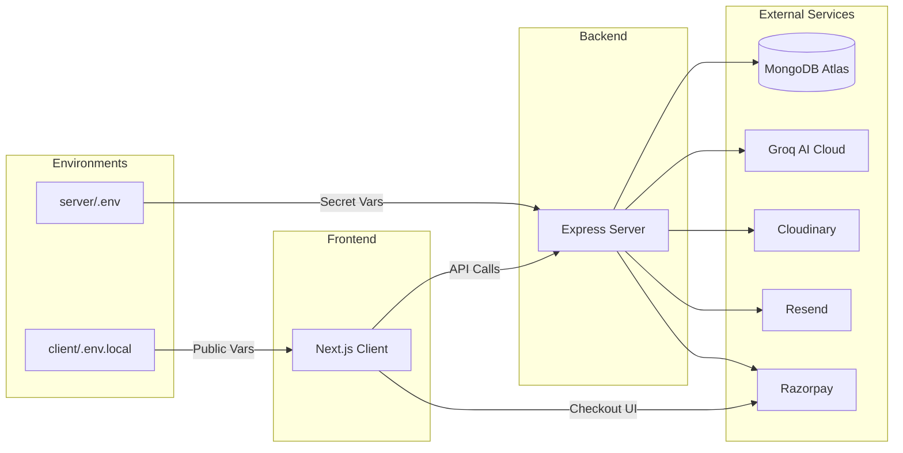

<div align="left">
  
</div>

# Environment Configuration

> Complete reference for all server and client environment variables, configuration files, and security warnings to securely configure and run DevFlow AI.

## Table of Contents

- [Overview](#overview)
- [Architecture & Configuration Flow](#architecture--configuration-flow)
- [Server Environment Variables](#server-environment-variables)
  - [Required Variables](#required-variables)
  - [Server Configuration](#server-configuration)
  - [CORS Configuration](#cors-configuration)
  - [AI Integration](#ai-integration)
  - [Razorpay (Payments)](#razorpay-payments)
  - [Cloudinary (Media Uploads)](#cloudinary-media-uploads)
  - [Resend (Email)](#resend-email)
- [Client Environment Variables](#client-environment-variables)
- [Configuration Files](#configuration-files)
- [Available Scripts](#available-scripts)
- [Best Practices](#best-practices)
- [Security Warnings](#security-warnings)
- [Related Documents](#related-documents)
- [Next Reading](#next-reading)

---

## Overview

DevFlow AI uses environment-specific configuration for both the server (Express) and client (Next.js). The server enforces strict validation at startup—it **throws an error** if any required variable is missing. This fail-fast design ensures the system only runs when critically secure and properly connected to dependencies.

---

## Architecture & Configuration Flow



---

## Server Environment Variables

**Location:** `server/.env`

### Required Variables

> [!IMPORTANT]
> The backend server strictly enforces these variables. It will terminate at startup if any of these are missing or improperly formatted.

| Variable | Default | Description |
|---|---|---|
| `MONGO_URI` | — | MongoDB Atlas connection string (`mongodb+srv://...`). |
| `JWT_SECRET` | — | Cryptographic secret key for signing JWTs (min 32 chars recommended). |
| `GROQ_API_KEY` | — | Groq Cloud API key for lightning-fast AI inference. |

### Server Configuration

| Variable | Default | Description |
|---|---|---|
| `NODE_ENV` | `development` | Controls environment behavior. In `production`, stack traces are hidden from API responses. |
| `PORT` | `5000` | Local HTTP server port. |
| `JWT_EXPIRES_IN` | `7d` | Lifespan of JSON Web Tokens before requiring re-authentication. |

### CORS Configuration

> [!NOTE]
> Fallback origins (always allowed): `https://devflow-ai-client.netlify.app`, `http://localhost:3000`, and `http://localhost:5173`.

| Variable | Default | Description |
|---|---|---|
| `CLIENT_URL` | — | The primary frontend URL connecting to the API. |
| `CLIENT_URLS` | — | Comma-separated list of additional allowed CORS origins. |

### AI Integration

| Variable | Default | Description |
|---|---|---|
| `GROQ_API_KEY` | — | Groq Cloud API key used to authenticate inference requests. |
| `AI_MODEL` | `llama3-8b-8192` | Identifier for the preferred Groq AI model. |

### Razorpay (Payments)

| Variable | Default | Description |
|---|---|---|
| `RAZORPAY_KEY_ID` | `""` | Merchant key ID (test or live credentials). |
| `RAZORPAY_KEY_SECRET` | `""` | Highly sensitive merchant key secret. |
| `RAZORPAY_WEBHOOK_SECRET` | `""` | Optional webhook secret for verifying incoming Razorpay events. |
| `OWNER_COUPON` | — | Secret administrative coupon code granting a 100% discount. |
| `OWNER_COUPON_DURATION` | `30` | Subscription duration (in days) when applying the owner coupon. |

### Cloudinary (Media Uploads)

> [!TIP]
> Backward-compatible aliases exist (`CLOUDINARY_NAME`, `CLOUDINARY_KEY`, `CLOUDINARY_SECRET`), but using the primary names below is standard practice.

| Variable | Default | Alias |
|---|---|---|
| `CLOUDINARY_CLOUD_NAME` | `""` | `CLOUDINARY_NAME` |
| `CLOUDINARY_API_KEY` | `""` | `CLOUDINARY_KEY` |
| `CLOUDINARY_API_SECRET`| `""` | `CLOUDINARY_SECRET` |

### Resend (Email)

| Variable | Default | Description |
|---|---|---|
| `RESEND_API_KEY` | `""` | Resend API key for delivering transactional emails like password resets. |
| `EMAIL_FROM` | `""` | Verified sender address (e.g., `noreply@yourdomain.com`). |

> [!NOTE]
> If `RESEND_API_KEY` is left unconfigured during development, password reset links will be safely logged to the server console instead of being delivered.

---

## Client Environment Variables

**Location:** `client/.env.local`

| Variable | Required | Description |
|---|---|---|
| `NEXT_PUBLIC_API_URL` | Yes | Backend API base URL consumed by Next.js edge and client. |
| `NEXT_PUBLIC_RAZORPAY_KEY_ID` | Yes | Razorpay publishable key ID for initializing client SDKs. |

> [!WARNING]  
> `NEXT_PUBLIC_RAZORPAY_KEY_ID` must strictly be the Razorpay Key ID (begins with `rzp_test_` or `rzp_live_`), **NOT** the Key Secret. Exposing the Key Secret to the frontend compromises your payment gateway.

---

## Configuration Files

The ecosystem relies on structured configuration files to manage tools, deployment, and local development.

| File | Purpose | Environment |
|---|---|---|
| `server/.eslintrc.json` | ESLint configuration for the Node.js API server. | Backend |
| `server/.prettierrc` | Prettier styling constraints for standardizing code formatting. | Backend |
| `server/jest.config.js` | Test runner configuration for unit and integration suites. | Backend |
| `server/.env.example` | Template environment file detailing expected keys (contains no actual secrets). | Backend |
| `client/.eslintrc.json` | ESLint rules tailored for Next.js and React client components. | Frontend |
| `client/.prettierrc` | Prettier rules unified for frontend components. | Frontend |
| `client/.env.local.example` | Reference file for public and private client environment keys. | Frontend |
| `client/next.config.mjs` | Core Next.js compilation, routing, and optimization config. | Frontend |
| `client/postcss.config.mjs` | PostCSS pipeline configured for Tailwind CSS v4. | Frontend |
| `client/netlify.toml` | CI/CD parameters and redirect rules for Netlify deployments. | Frontend |
| `client/components.json` | Manifest for shadcn/ui components integration. | Frontend |
| `client/jsconfig.json` | TypeScript/JavaScript alias definitions (`@/*` mapping). | Frontend |
| `.gitignore` | Defines excluded directories globally (e.g., `node_modules`, `.env`, `.next`, `coverage`). | Global |

---

## Available Scripts

Scripts are mapped in the `package.json` files for both frontend and backend directories.

### Server Commands (`/server`)

```bash
# Example: Start development server
npm run dev
```

| Script | Command | Description |
|---|---|---|
| `dev` | `nodemon src/server.js` | Dev server with automatic hot reloading. |
| `start` | `node src/server.js` | Executes the production server instance. |
| `test` | `node --experimental-vm-modules jest --forceExit` | Runs the Jest test suite with experimental ESM support. |
| `lint` | `eslint src/` | Analyzes source files for syntax and stylistic errors. |
| `lint:fix` | `eslint src/ --fix` | Automatically patches linting violations where possible. |
| `format` | `prettier --write "src/**/*.js"` | Normalizes code formatting across the repository. |

### Client Commands (`/client`)

```bash
# Example: Build Next.js application
npm run build
```

| Script | Command | Description |
|---|---|---|
| `dev` | `next dev --webpack` | Spins up the Next.js development server. |
| `build` | `next build` | Generates highly optimized static and server-rendered production assets. |
| `start` | `next start` | Starts a Node Node.js process to serve the built Next.js application. |
| `lint` | `next lint` | Leverages Next.js's integrated ESLint engine. |
| `lint:strict` | `eslint app/ components/ lib/ store/` | Executes strict linting manually on critical source directories. |
| `format` | `prettier --write "app/**/*.tsx" "components/**/*.tsx"` | Normalizes formatting for client-side components and scripts. |

---

## Best Practices

> [!TIP]
> - **Use Password Managers:** Always store and share credentials utilizing a secure team password vault (e.g., 1Password, Bitwarden) rather than direct messages.
> - **Keep `.env.example` Updated:** Whenever a new feature requires an environment variable, ensure it is added to `.env.example` to ease developer onboarding.
> - **Continuous Rotation:** Make a habit of rotating cryptographic keys and API tokens regularly.

---

## Security Warnings

> [!CAUTION]
> 1. **Never commit `.env` or `.env.local`** to version control. These files contain live production credentials.
> 2. **Rotate all secrets immediately** if accidentally exposed in the git history or CI/CD logs.
> 3. **Never expose** `RAZORPAY_KEY_SECRET`, `JWT_SECRET`, `CLOUDINARY_API_SECRET`, or `MONGO_URI` to the client payload or client-side configuration.
> 4. Use **strong, randomly generated cryptograms** for `JWT_SECRET` (minimum 32 characters, combining casing, numbers, and symbols).
> 5. Set **`NODE_ENV=production`** on production servers to prevent sensitive stack traces from leaking to users during exception handling.

---

## Related Documents

- [Deployment Guide](./deployment.md)
- [Security Overview](./security.md)
- [API Reference](./api.md)

## Next Reading

> **Next:** [Security Overview](./security.md) — Dive into authentication security, payment verification, rate limiting, and other best practices.

---

<div align="center">
  <p>
    <sub>Built with Next.js, Express, MongoDB, and Groq AI</sub>
    <br/>
    <sub>© DevFlow AI — Documentation</sub>
  </p>
</div>
