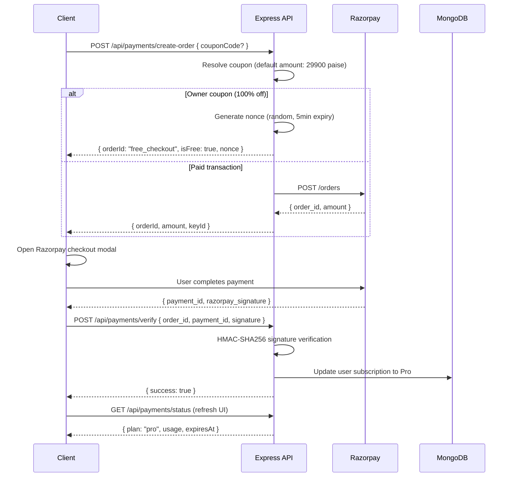

<picture>
  
</picture>

# Payment & Billing System

> Razorpay-powered subscription management with coupon-based discounts, free trials, and immediate cancellation.

## Table of Contents
- [Overview](#overview)
- [Pricing Tiers](#pricing-tiers)
- [Payment Flow](#payment-flow)
- [Coupon System](#coupon-system)
- [Subscription Lifecycle](#subscription-lifecycle)
- [Usage Tracking](#usage-tracking)
- [Client Integration](#client-integration)
- [Security & Keys](#security--keys)
- [Known Limitations](#known-limitations)
- [Related Documents](#related-documents)
- [Next Reading](#next-reading)

---

## Overview

DevFlow AI leverages **Razorpay** as the primary payment gateway for Pro subscription upgrades. The billing architecture is designed for simplicity, supporting one-time payments, coupon-based discounts, free trials via secret codes, and immediate subscription cancellation. All subscription states are directly embedded within the User document in MongoDB for optimal performance and minimal latency.

---

## Pricing Tiers

| Plan | Price | AI Prompts/Day | Features |
|---|---|---|---|
| **Free** | ₹0 | 20 | Basic AI chat, Markdown, code highlighting |
| **Pro** | ₹299/month (29,900 paise) | 999 | All Free features + priority support |

---

## Payment Flow

The payment flow handles both standard paid transactions and free bypasses via exclusive 100% off coupons.



---

## Coupon System

### Built-in Public Coupons

| Code | Discount | Duration | Type |
|---|---|---|---|
| `FREETRIAL` | 100% (29,900 paise off) | 7 days | Public |
| `OFF50` | 50% (14,950 paise off) | 30 days | Public |

### Owner / Secret Coupons

> [!IMPORTANT]
> The owner coupon bypasses the Razorpay flow entirely. The `create-order` endpoint generates a one-time cryptographic nonce (with a 5-minute expiry) and returns `{ isFree: true, orderId: "free_checkout", nonce }`. The verification endpoint validates this nonce before granting Pro access.

| Variable | Default | Description |
|---|---|---|
| `OWNER_COUPON` | — | Coupon code for 100% free Pro access (no hardcoded fallback) |
| `OWNER_COUPON_DURATION` | 30 | Subscription duration in days |

### Validation Rules

- **Storage & Lookup:** Coupons are case-insensitive during lookup but stored in uppercase format.
- **Redemption Limits:** Public coupons cannot be redeemed more than once per account. This is strictly tracked via `user.usedCoupons[]`.
- **Owner Privileges:** The `OWNER_COUPON` can be utilized multiple times by authorized users.
- **Processing:** Coupons are resolved server-side using the `resolveCoupon()` utility.

---

## Subscription Lifecycle

### Subscription States

| State | Description |
|---|---|
| `inactive` | Free tier, no active subscription |
| `active` | Pro subscription is currently active |
| `expired` | Pro has passed `expiresAt` (derived state — stored as `plan: "free"`) |
| `canceled` | User manually canceled the subscription |
| `past_due` | Reserved for future recurring billing implementations |
| `trialing` | Reserved for future free trial implementations |

### Auto-Downgrade

On every protected request (e.g., `/api/ai/prompt` and `/api/payments/status`), the server validates the subscription expiration.

> [!WARNING]
> There is no grace period. Access to Pro features is revoked immediately upon expiration.

```javascript
// Server-side evaluation logic
if (plan === "pro" && expiresAt && expiresAt <= now) {
  plan = "free";
  status = "inactive";
  expiresAt = undefined;
}
```

### Cancellation Policy

When a user initiates `POST /api/payments/cancel`:
1. The plan is immediately set to `free`, and the status to `canceled`.
2. Both `expiresAt` and `offerCode` are cleared from the User document.
3. If the daily usage exceeds the free tier limit (20), the current count is capped.

> [!NOTE]
> We do not offer prorated refunds. Cancellation is instantaneous and final.

---

## Usage Tracking

| Mechanism | Description |
|---|---|
| `user.usage.dailyCount` | Incremented precisely after each successful AI prompt |
| `user.usage.lastReset` | UTC date marking the last counter reset |
| Reset Condition | Triggered when a UTC date change is detected via `isSameUtcDate()` |

```javascript
// Enforcement logic
if (plan === "free" && dailyCount >= 20) {
  throw new AppError("Daily limit reached. Upgrade to Pro.", 429);
}
```

---

## Client Integration

### Billing Page Features

The client-side billing interface provides a seamless experience:
- **Usage Meter:** A visual progress bar detailing daily usage against the plan's limit.
- **Plan Display:** Clearly indicates the current active plan and expiry date for Pro users.
- **Coupon Input:** A dedicated text field featuring real-time validation feedback.
- **Checkout Action:** Triggers the native Razorpay payment modal.
- **Cancel Action:** Allows active Pro users to terminate their subscription instantly.
- **Expiry Banner:** Prompts users to re-upgrade when their Pro status lapses.

> [!TIP]
> **Performance & Fallbacks:** The client implements a **45-second watchdog timer** to abort the transaction if the Razorpay modal fails to load, alongside a **15-second request timeout** for all standard API calls.

### Razorpay Configuration Options

```javascript
const options = {
  key: process.env.NEXT_PUBLIC_RAZORPAY_KEY_ID,
  amount: order.amount,
  currency: "INR",
  name: "DevFlow AI",
  order_id: order.orderId,
  handler: async function (response) {
    // POST to /api/payments/verify
  },
};
```

---

## Security & Keys

### Signature Verification

To prevent spoofing, all Razorpay payment payloads are strictly verified server-side using HMAC-SHA256 signatures.

```javascript
const body = razorpay_order_id + "|" + razorpay_payment_id;
const expectedSignature = crypto
  .createHmac("sha256", process.env.RAZORPAY_KEY_SECRET)
  .update(body)
  .digest("hex");

if (expectedSignature !== razorpay_signature) {
  return res.status(400).json({ success: false, message: "Invalid signature" });
}
```

### Key Management

> [!CAUTION]
> The client application must **never** have access to `RAZORPAY_KEY_SECRET`. Exposure of this key compromises the integrity of the entire billing system.

| Key | Visibility | Usage |
|---|---|---|
| `RAZORPAY_KEY_ID` | Public (Client) | Identifies the merchant to the Razorpay SDK |
| `RAZORPAY_KEY_SECRET` | Private (Server only) | Order creation and cryptographic signature verification |

---

## Known Limitations

- **No Recurring Billing:** Subscriptions are strictly one-time payments with fixed durations. Automatic renewal is not supported.
- **No Prorated Refunds:** Cancellation terminates access immediately without partial reimbursement.
- **No Custom Invoices:** Receipts are managed exclusively through the external Razorpay dashboard.
- **No Webhook Handling:** The server does not actively listen for Razorpay webhooks (e.g., async payment failures or refunds).
- **Single Currency:** Transactions are strictly limited to INR.
- **No Post-Payment Trial:** Pro access is granted immediately post-verification, overriding any traditional trial periods.

---

## Related Documents

- [Architecture Overview](./architecture.md)
- [API Reference](./api.md)
- [Environment Variables](./environment.md)

## Next Reading

> **Next:** [Deployment Guide](./deployment.md) — Learn how to deploy the frontend to Netlify and the backend to Render with optimal production configurations.

---

<p align="center">
  <sub>© 2026 DevFlow AI. Built with Next.js, Express, MongoDB, and Groq AI.</sub>
</p>
