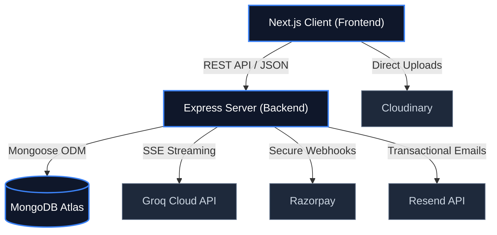

<div align="center">
  <picture>
    
  </picture>
</div>

# DevFlow AI Platform Documentation

> Comprehensive documentation for the DevFlow AI platform — an enterprise-grade AI-powered development assistant.

## Table of Contents

- [Overview](#overview)
- [Architecture at a Glance](#architecture-at-a-glance)
- [Documentation Index](#documentation-index)
  - [Core Architecture](#core-architecture)
  - [API & Integration](#api--integration)
  - [Operations & Guides](#operations--guides)
  - [Project Insights](#project-insights)
- [Quick Start](#quick-start)
- [Best Practices](#best-practices)
- [Related Documents](#related-documents)
- [Next Reading](#next-reading)

---

## Overview

**DevFlow AI** is a full-stack SaaS application providing an AI-powered development assistant. Built with the modern MERN stack, it features real-time AI chat capabilities via Groq Cloud, a resilient subscription billing engine powered by Razorpay, and a polished developer experience designed to scale.

| Layer | Technology |
|---|---|
| **Frontend** | Next.js 16, React 19, Tailwind CSS v4, Redux Toolkit |
| **Backend** | Node.js, Express 5, Mongoose 8, JWT |
| **Database** | MongoDB Atlas |
| **AI** | Groq Cloud (Llama 3.1 8B) |
| **Payments** | Razorpay (INR) |
| **Email** | Resend |
| **Media** | Cloudinary |

---

## Architecture at a Glance

The following diagram illustrates the high-level architecture and data flow across the DevFlow AI ecosystem:



> [!NOTE]
> The platform utilizes Server-Sent Events (SSE) to deliver real-time, token-by-token AI responses, ensuring low latency and an interactive user experience.

---

## Documentation Index

Explore our categorized guides to understand how to build, deploy, and scale DevFlow AI.

### Core Architecture
Deep dive into the structural foundations of the application.
- [Architecture Overview](./architecture.md) — System architecture, data flows, and design decisions
- [Frontend Architecture](./frontend.md) — Next.js routing, component structure, and Redux state management
- [Backend Architecture](./backend.md) — Express API architecture, middleware, controllers, and robust error handling
- [Database Schema](./database.md) — MongoDB collections, index strategies, and schema design rationale

### API & Integration
Resources for extending and integrating with the platform.
- [API Reference](./api.md) — Complete REST API documentation covering all 24 endpoints
- [AI Integration](./ai.md) — Groq Cloud connection, SSE streaming implementation, and usage limit handling
- [Authentication](./authentication.md) — JWT lifecycle, registration flow, and password reset procedures
- [Payment & Billing](./payment.md) — Razorpay integration, dynamic subscriptions, and coupon management

### Operations & Guides
Essential guides for deploying, securing, and maintaining the application.
- [Deployment Guide](./deployment.md) — Step-by-step Netlify (Frontend) and Render (Backend) deployment
- [Environment Variables](./environment.md) — Comprehensive reference of all required `.env` variables and default values
- [Security Overview](./security.md) — Auth security practices, payment webhook verification, and rate limiting setup
- [Testing Guide](./testing.md) — Jest test suites, configuration, and execution
- [Workflow](./workflow.md) — Complete user workflows mapped from signup to billing
- [Performance](./performance.md) — Core performance characteristics and optimization techniques
- [Troubleshooting Guide](./troubleshooting.md) — Common issues and their direct solutions
- [FAQ](./faq.md) — Frequently asked questions regarding platform behavior

### Project Insights
Reflections on the journey of building DevFlow AI.
- [Challenges](./challenges.md) — Primary development challenges and the solutions implemented
- [Lessons Learned](./lessons-learned.md) — Key takeaways from the engineering and design process
- [Case Study](./case-study.md) — The complete story of DevFlow AI, from initial concept to launch

---

## Quick Start

To quickly spin up the environment locally, verify your `.env` variables and run the following commands:

```bash
# 1. Clone the repository
git clone https://github.com/your-org/devflow-ai.git
cd devflow-ai

# 2. Install dependencies for both client and server
npm run install:all

# 3. Start the development environment concurrently
npm run dev
```

> [!WARNING]
> Ensure you have your **Groq Cloud** and **Razorpay** API keys properly configured in your `.env` file before attempting to test AI or payment workflows locally. Missing keys will result in runtime errors.

---

## Best Practices

When navigating and applying this documentation:
1. **Understand the Architecture First:** Review the [Architecture Overview](./architecture.md) before diving into specific integrations.
2. **Follow Security Guidelines:** Always reference the [Security Overview](./security.md) when modifying authentication or billing logic.
3. **Keep Environment Variables Sync:** Ensure any new `.env` variables are documented in [Environment Variables](./environment.md).

> [!TIP]
> Use standard code formatting and follow our [Contributing Guidelines](../CONTRIBUTING.md) when submitting pull requests.

---

## Related Documents

- [Contributing](../CONTRIBUTING.md) — Learn how to contribute to the DevFlow AI ecosystem.
- [Changelog](../CHANGELOG.md) — Review the detailed version history and patch notes.
- [Roadmap](../ROADMAP.md) — Discover planned features and upcoming development priorities.

---

## Next Reading

Ready to dive in? We recommend starting with the **[Architecture Overview](./architecture.md)** to get a foundational understanding of how the client and server communicate securely.

---

<div align="center">
  <p>
    <sub>© 2026 DevFlow AI. Built with Next.js, Express, MongoDB, and Groq AI.</sub>
  </p>
</div>
