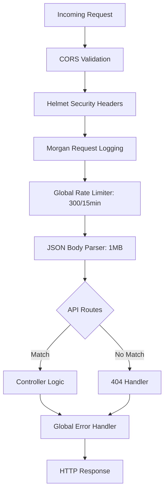

<div align="center">
  <picture>
    
  </picture>
  <h1>Backend Architecture</h1>
  <p>Express 5 REST API server with Mongoose 8 ODM, JWT authentication, Groq AI integration, Razorpay payments, and Cloudinary media uploads.</p>
</div>

## Table of Contents

- [Overview](#overview)
- [Tech Stack](#tech-stack)
- [Project Structure](#project-structure)
- [Middleware Architecture](#middleware-architecture)
- [Routes & Controllers](#routes--controllers)
- [Error Handling](#error-handling)
- [Graceful Shutdown](#graceful-shutdown)
- [Security Features](#security-features)
- [Best Practices](#best-practices)
- [Related Documents](#related-documents)
- [Next Reading](#next-reading)

---

## Overview

The backend infrastructure of DevFlow AI is designed for high performance and extensibility, built on an **Express 5** application written in CommonJS JavaScript. It provides scalable RESTful APIs that power authentication, chat management, AI inference (both streaming and non-streaming), payment processing, and resilient file uploads. 

The server maintains a robust connection to **MongoDB Atlas** via Mongoose, while integrating smoothly with four critical external services: 
- **Groq Cloud** for rapid AI model inference.
- **Razorpay** for secure subscription and payment processing.
- **Cloudinary** for scalable media asset uploads.
- **Resend** for reliable transactional email delivery.

> [!NOTE]
> All AI streaming endpoints use Server-Sent Events (SSE) to ensure ultra-low latency response streaming directly to the client.

---

## Tech Stack

We utilize a modern, production-ready stack designed to ensure reliability, security, and developer productivity.

| Library | Version | Purpose |
| :--- | :--- | :--- |
| **Express** | 5.1 | High-performance HTTP framework |
| **Mongoose** | 8.19 | MongoDB Object Data Modeling (ODM) |
| **jsonwebtoken** | 9.0 | JWT signing and verification |
| **bcryptjs** | 2.4 | Secure password hashing (12 rounds) |
| **groq-sdk** | 0.21 | Groq Cloud LLM client integration |
| **razorpay** | 2.9 | Payment gateway SDK |
| **cloudinary** | 2.7 | Media upload and optimization SDK |
| **resend** | 4.0 | Transactional email API |
| **express-rate-limit**| 8.1 | Endpoint rate limiting and DDOS mitigation |
| **express-validator** | 7.2 | Strict input validation |
| **helmet** | 8.1 | Security headers configuration |
| **cors** | 2.8 | Cross-Origin Resource Sharing |
| **morgan** | 1.10 | HTTP request logging |
| **multer** | 2.0 | Multipart form data parsing |
| **streamifier** | 0.1 | Stream-to-buffer transformation utility |
| **cookie-parser** | 1.4 | Secure cookie parsing |
| **dotenv** | 16.6 | Environment variable management |
| **nodemon** | 3.1 | Development server with hot reload |

---

## Project Structure

Our monolithic backend is structured by feature grouping and logical separation of concerns, ensuring maintainability as the application scales.

```text
server/src/
├── server.js                # Bootstrap: connect DB → listen → graceful shutdown
├── app.js                   # Express app: middleware, routes, error handlers
├── config/
│   ├── env.js               # Env loader + validation + CORS origin parsing
│   └── db.js                # Mongoose connection with pooling
├── models/
│   ├── User.js              # User schema (subscription, usage, bcrypt)
│   ├── Chat.js              # Chat schema (embedded messages)
│   └── Subscription.js      # Legacy subscription schema
├── controllers/
│   ├── authController.js    # Register, login, profile, settings, password reset
│   ├── aiController.js      # SSE streaming prompt, code explanation
│   ├── chatController.js    # Chat CRUD
│   ├── paymentController.js # Razorpay orders, verification, coupons
│   └── uploadController.js  # Cloudinary file uploads
├── routes/
│   ├── authRoutes.js        # 10 auth endpoints
│   ├── aiRoutes.js          # 2 AI endpoints
│   ├── chatRoutes.js        # 4 chat endpoints
│   ├── paymentRoutes.js     # 5 payment endpoints
│   └── uploadRoutes.js      # 2 upload endpoints
├── middleware/
│   ├── authMiddleware.js    # JWT verify (protect) + role authorization
│   ├── errorMiddleware.js   # Mongoose→HTTP mapping, infra errors, global handler
│   └── validateRequest.js   # express-validator result runner
├── validators/
│   ├── authValidators.js    # Password rules, disposable email blocklist
│   ├── aiValidators.js      # Prompt/code length limits
│   └── chatValidators.js    # Chat creation + MongoID validation
├── utils/
│   ├── AppError.js          # Custom error class
│   ├── asyncHandler.js      # Async wrapper for route handlers
│   ├── token.js             # JWT signing utility
│   └── email.js             # Resend integration with HTML template
└── __tests__/
    └── utils.test.js        # Jest tests for AppError + asyncHandler
```

---

## Middleware Architecture

The middleware stack intercepts incoming requests and processes them sequentially, enforcing security and validating payloads before they reach business logic controllers.



### Order of Execution (`app.js`)

1. **`cors()`** — Dynamic origin validation with trailing-slash normalization.
2. **`helmet()`** — Adds crucial security headers (XSS filtering, content-type sniffing protection, etc.).
3. **`morgan("dev")`** — Logs HTTP requests for observability.
4. **`rateLimit({ windowMs: 15min, limit: 300 })`** — Global rate limiter to prevent abuse.
5. **`express.json({ limit: "1mb" })`** — Strict JSON body parsing to prevent payload-based attacks.

> [!TIP]
> **Per-Endpoint Rate Limiters**
> To prevent brute force and resource exhaustion, critical routes have custom rate limits:
> - `POST /api/auth/login` — 20 requests / 15 mins
> - `POST /api/auth/forgot-password` — 20 requests / 15 mins
> - `POST /api/ai/prompt` — 30 requests / 1 min
> - `POST /api/ai/explain` — 30 requests / 1 min

---

## Routes & Controllers

The backend exposes 24 strictly typed and validated endpoints separated across primary functional domains.

### Auth (`/api/auth`)
| Method | Path | Controller | Auth Required |
| :--- | :--- | :--- | :---: |
| `POST` | `/register` | `authController.register` | ❌ |
| `POST` | `/signup` | `authController.signup` | ❌ |
| `POST` | `/login` | `authController.login` | ❌ |
| `GET` | `/me` | `authController.getMe` | ✅ |
| `PUT` | `/update` | `authController.updateProfile` | ✅ |
| `DELETE` | `/me` | `authController.deleteAccount` | ✅ |
| `POST` | `/forgot-password` | `authController.forgotPassword` | ❌ |
| `POST` | `/reset-password` | `authController.resetPassword` | ❌ |
| `GET` | `/settings` | `authController.getSettings` | ✅ |
| `PUT` | `/settings` | `authController.updateSettings` | ✅ |

### Chat (`/api/chats`)
| Method | Path | Controller | Auth Required |
| :--- | :--- | :--- | :---: |
| `GET` | `/` | `chatController.getChats` | ✅ |
| `POST` | `/` | `chatController.createChat` | ✅ |
| `GET` | `/:id` | `chatController.getChatById` | ✅ |
| `DELETE` | `/:id` | `chatController.deleteChat` | ✅ |

### AI Integration (`/api/ai`)
| Method | Path | Controller | Auth Required |
| :--- | :--- | :--- | :---: |
| `POST` | `/prompt` | `aiController.sendPrompt` (SSE) | ✅ |
| `POST` | `/explain` | `aiController.explainCode` | ✅ |

### Payments (`/api/payments`)
| Method | Path | Controller | Auth Required |
| :--- | :--- | :--- | :---: |
| `POST` | `/create-order` | `paymentController.createOrder` | ✅ |
| `POST` | `/verify` | `paymentController.verifyPayment` | ✅ |
| `POST` | `/apply-coupon` | `paymentController.applyCoupon` | ✅ |
| `POST` | `/cancel` | `paymentController.cancelSubscription` | ✅ |
| `GET` | `/status` | `paymentController.getBillingStatus` | ✅ |

### Uploads (`/api/uploads`)
| Method | Path | Controller | Auth Required |
| :--- | :--- | :--- | :---: |
| `POST` | `/` | `uploadController.uploadFile` | ✅ |
| `POST` | `/profile` | `uploadController.uploadProfileImage` | ✅ |

### Health Check
| Method | Path | Description |
| :--- | :--- | :--- |
| `GET` | `/api/health` | Returns `{ success: true, message: "DevFlow AI API running" }` |

---

## Error Handling

The application leverages a robust centralized error handling architecture configured in `errorMiddleware.js`. It utilizes three discrete layers to catch and map errors appropriately.

**1. Mongoose Error Mapping:**
- `CastError` transitions to **400 Bad Request**
- `ValidationError` transitions to **400 Bad Request** with joined constraint messages
- `11000 Duplicate Key` transitions to **409 Conflict**

**2. Infrastructure Error Detection:**
- Network patterns such as `ENOTFOUND`, `ECONNREFUSED`, `ETIMEDOUT`, and `MongoNetworkError` are safely caught and map to **503 Service Unavailable**.

**3. Global Fallback Handler:**
- Returns a standard JSON payload: `{ success: false, message, stack }`.
- > [!WARNING]
  > The `stack` trace is strictly stripped in non-development environments to prevent information leakage.

---

## Graceful Shutdown

Handling application termination cleanly is critical to prevent data corruption and ensure pending connections resolve. System events trigger the shutdown sequence dynamically.

```javascript
process.on("SIGINT", () => shutdown("SIGINT"));
process.on("SIGTERM", () => shutdown("SIGTERM"));
process.on("unhandledRejection", shutdown);
process.on("uncaughtException", shutdown);
```

**The automated shutdown sequence executes as follows:**
1. Close all idle connections.
2. Close the active HTTP server.
3. Disconnect gracefully from Mongoose.
4. Exit the Node.js process (with a 10-second forced shutdown timeout fallback).

---

## Security Features

Security is integrated at multiple layers of the application lifecycle, from database fields to HTTP headers.

- **Strict JWT Verification:** Enforced on all protected routes via `authMiddleware`.
- **Password Encryption:** Secured with bcrypt utilizing 12 salt rounds.
- **Input Validation:** Payload sanitization driven by `express-validator` runs *before* reaching business logic.
- **Disposable Email Blocklist:** Actively rejects temporary email domains inside `authValidators.js`.
- **Strong Password Policy:** Enforces complexity (8+ chars, uppercase, lowercase, and digit inclusion).
- **Throttling & Rate Limiting:** Applied at global routing and granular per-endpoint levels.
- **Helmet Headers:** Mitigation against XSS, clickjacking, and content-type sniffing.
- **CORS Allowlisting:** Dynamic and strictly enforced origin validation.
- **HMAC-SHA256 Signatures:** Secures all webhook and validation callbacks for Razorpay payments.

> [!IMPORTANT]
> Ensure environment variables like `JWT_SECRET` and `RAZORPAY_KEY_SECRET` are never hardcoded and always injected securely at runtime via a secrets manager or `.env`.

---

## Best Practices

To maintain standard API consistency across the project, please adhere to the following when adding new features:

1. **Keep Controllers Lean:** Move complex logic into utility services or helper classes.
2. **Always Use `asyncHandler`:** Wrap asynchronous route controller functions in `asyncHandler` to avoid manual `try-catch` blocks and leverage the global error handler.
3. **Validate All Inputs:** Never trust the client. Write comprehensive schemas in the `/validators` directory.
4. **Respond Uniformly:** Adhere to the standard `{ success, data, message }` JSON envelope for all API responses.

---

## Related Documents

- [Architecture Overview](./architecture.md)
- [Frontend Architecture](./frontend.md)
- [API Reference](./api.md)
- [Database Schema](./database.md)

## Next Reading

> **Next:** [API Reference](./api.md) — Dive into complete REST API documentation including precise request and response schemas for all 24 endpoints.

---

<div align="center">
  <sub>Built with Next.js, Express, MongoDB, and Groq AI</sub>
  <br/>
  <sub>&copy; DevFlow AI — Documentation</sub>
</div>
