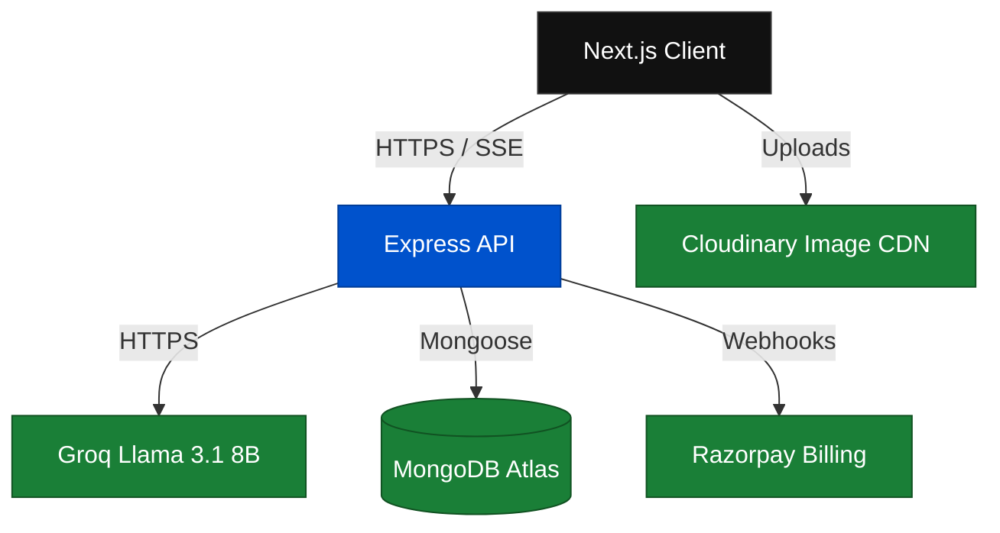
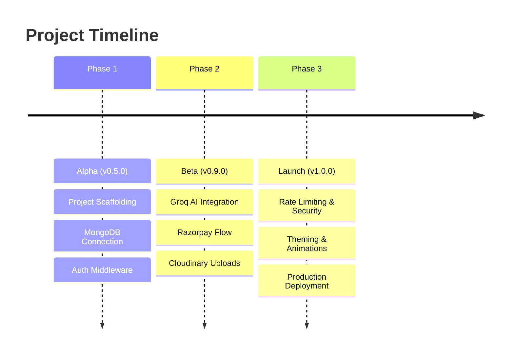

  <picture>
    
  </picture>

# DevFlow AI: Case Study

> The complete story of building DevFlow AI—from concept to a production-ready, AI-powered SaaS platform for developers.

## Table of Contents

- [Overview](#overview)
- [The Problem](#the-problem)
- [The Solution](#the-solution)
- [Architecture Decisions](#architecture-decisions)
- [Development Journey](#development-journey)
- [Key Metrics](#key-metrics)
- [What Went Well](#what-went-well)
- [What Could Be Improved](#what-could-be-improved)
- [Conclusion](#conclusion)
- [Related Documents](#related-documents)
- [Next Reading](#next-reading)

---

## Overview

DevFlow AI was conceived as an intelligent, self-contained development assistant. Moving from a rough Alpha to a polished v1.0 Launch, the platform seamlessly integrates conversational AI, subscription management, and user preferences into a singular, unified experience.

| Project Details | Information |
| :--- | :--- |
| **Project** | DevFlow AI — AI-Powered Development Assistant |
| **Timeline** | Alpha → Beta → v1.0 Launch |
| **Tech Stack** | Next.js 16, Express 5, MongoDB Atlas, Groq Cloud, Razorpay |
| **Author** | Digvijay Kumar Singh |

> [!NOTE]
> **Live Environments:**
> Explore the live application [Frontend](https://devflow-ai-client.netlify.app) and [API](https://devflow-api-ubnd.onrender.com).

---

## The Problem

Modern software development requires managing complex cognitive loads. Developers consistently spend a significant portion of their time:

- **Debugging** unfamiliar or poorly documented code.
- **Writing** repetitive boilerplate and structural scaffolding.
- **Understanding** large, complex, and legacy codebases.
- **Learning** new frameworks, libraries, and programming languages.

While existing AI coding assistants provided value, they came with notable friction points:
- **GitHub Copilot** required a VS Code environment and a paid subscription.
- **ChatGPT** lacked a tailored, developer-specific context and optimal streaming capabilities for code.
- **Claude** faced limited regional availability and restricted API access.
- **Fragmented Experiences:** Most solutions were standalone models, lacking integrated SaaS features like dedicated billing, user profiles, and synchronized settings.

The mandate was clear: Build a **self-contained, production-ready AI chat platform** expressly designed for developers, featuring low-latency streaming, usage-based billing, and a polished user experience (UX).

---

## The Solution

DevFlow AI is a comprehensive full-stack SaaS application that delivers an end-to-end AI coding assistant experience.

### Core Features

1. **Real-Time AI Chat:** Low-latency streaming responses via Groq Cloud's Llama 3.1 8B model, delivered token-by-token over Server-Sent Events (SSE).
2. **Code Explanation:** A dedicated non-streaming endpoint optimized for single-turn code analysis and review.
3. **Tiered Access (Free + Pro):** 20 free prompts/day, or an upgraded capacity of 999 prompts/day for ₹299/month.
4. **Razorpay Billing Engine:** Advanced payment infrastructure featuring a coupon system, HMAC-verified transactions, and manual renewal workflows.
5. **Persistent Chat History:** Seamless session management with auto-generated chat titles and optimally embedded message documents.
6. **Synchronized Preferences:** Cross-device syncing for dark/light mode, nickname, region, and language settings.
7. **Profile Image Management:** Integrated upload pipeline that crops, compresses, and serves avatars via Cloudinary.

---

## Architecture Decisions

Building a robust SaaS required strategic technical trade-offs to balance velocity, performance, and maintainability.

### 1. Plain JavaScript over TypeScript
- **Decision:** Utilize plain JavaScript (CommonJS for backend, ES Modules for frontend).
- **Rationale:** Reduced build complexity and lowered the contribution barrier, enabling faster initial development. TypeScript integration remains a viable option for future scaling.

### 2. Embedded Documents in MongoDB
- **Decision:** Embed messages directly within `Chat` documents and subscriptions within `User` documents.
- **Trade-off:** Sacrificed cross-collection query capabilities (e.g., "find all messages containing 'bug' across all chats") to achieve highly optimized per-chat loading performance. The 16 MB MongoDB document limit comfortably accommodates text-only conversational data.

### 3. Server-Sent Events (SSE) over WebSockets
- **Decision:** Leverage SSE for AI streaming.
- **Rationale:** SSE utilizes standard HTTP without requiring an upgrade handshake, supports automatic reconnection natively, and perfectly matches the unidirectional (server-to-client) data flow required for AI token streaming. WebSockets would have introduced unnecessary protocol complexity.

### 4. Razorpay over Stripe
- **Decision:** Integrate Razorpay as the exclusive payment gateway.
- **Rationale:** Razorpay is the leading payment provider in India, offering seamless native support for INR and an exceptionally developer-friendly API. At the time of development, Stripe's INR compliance and support were comparatively limited.

### 5. Netlify + Render over Vercel + Railway
- **Decision:** Deploy the frontend on Netlify and the backend API on Render.
- **Rationale:** Netlify's Next.js plugin ensures optimized frontend builds, while Render provides straightforward Node.js deployments with generous free tiers. Both platforms deliver free SSL, global CDNs, and seamless CI/CD integration from GitHub.

---

## Development Journey

The project evolved through three distinct phases, each overcoming specific technical hurdles.

### Phase 1: Alpha (v0.5.0)
**Focus:** Project scaffolding and core infrastructure (Weeks 1–6).
- Set up Next.js + Express, Tailwind CSS, and foundational routing.
- Designed Mongoose schemas (`User`, `Chat`, `Subscription`).
- Built robust authentication middleware and JWT utilities.
> [!TIP]
> **Key Challenge Overcome:** Adapting to Express 5's native asynchronous error handling, which significantly differs from Express 4 paradigms.

### Phase 2: Beta (v0.9.0)
**Focus:** Core features and third-party integrations (Weeks 7–12).
- Engineered Groq AI integrations and the critical SSE streaming pipeline.
- Implemented the Razorpay checkout flow and dynamic coupon logic.
- Finalized Cloudinary image processing and user preference settings.
> [!IMPORTANT]
> **Key Challenge Overcome:** Architecting a robust SSE error-handling mechanism. This led to the creation of a "two-phase" error approach handling both pre-stream connection failures and mid-stream API interruptions.

### Phase 3: Launch (v1.0.0)
**Focus:** Polish, security hardening, and production deployment (Weeks 13–20).
- Enforced rate limiting, input sanitization, and strict CORS policies.
- Perfected responsive UI behaviors, dark/light modes, and micro-interactions.
- Executed multi-environment deployment and comprehensive bug squashing.
> [!CAUTION]
> **Key Challenge Overcome:** Mitigating Netlify serverless cold starts and resolving complex multi-origin CORS configurations.

---

## Key Metrics

A high-level view of the application's scale and footprint:

| Metric | Value | Detail |
| :--- | :--- | :--- |
| **API Endpoints** | 24 | 10 Auth, 4 Chat, 2 AI, 5 Payment, 2 Upload, 1 Health |
| **Database Models** | 3 | User, Chat, Subscription |
| **External Integrations** | 5 | Groq, Razorpay, Cloudinary, Resend, MongoDB Atlas |
| **Frontend Pages** | 11 | Login, Signup, Dashboard, Chat, Settings, Billing, Account, Pricing, Password Mgmt, 404 |
| **Core Components** | 9 | Providers, Auth Guards, Theme Toggles, UI Primitives, Chat Windows, Avatar Cropper |
| **State Management** | 2 | Redux Slices: Auth, Chat |
| **Test Files** | 1 | `utils.test.js` |
| **Lines of Code** | ~5,300 | ~1,800 Backend API / ~3,500 Frontend Client |

---

## What Went Well

> [!TIP]
> **1. SSE Streaming UX**
> Token-by-token streaming guarantees a highly responsive interface. By memoizing the `MarkdownMessage` component, we ensured rapid re-renders wouldn't degrade browser performance. The innovative fallback error token gracefully handles mid-stream Groq API failures without breaking the UI.

> [!TIP]
> **2. Payment Security Architecture**
> A sophisticated three-layer verification system (HMAC validation, duplicate event detection, and nonce rotation) secures the billing infrastructure. The bespoke `free_checkout` nonce system safely processes 100% discount coupons without exposing the underlying Razorpay flow to zero-amount transaction errors.

> [!TIP]
> **3. Dual-Persistence State**
> User settings synchronize instantly to both `localStorage` and the MongoDB server. This "server-first-then-localStorage" fallback pattern ensures immediate UI responsiveness while guaranteeing consistent cross-device persistence.

> [!TIP]
> **4. Centralized Error Middleware**
> Mongoose internal errors are elegantly mapped to HTTP semantics (`CastError` → 400, `ValidationError` → 400, `11000` → 409). Infrastructure anomalies (like `ENOTFOUND`) return generic 503s, providing clarity to the client while hiding sensitive server implementation details.

---

## What Could Be Improved

Every production system has technical debt and areas for evolution.

> [!WARNING]
> **1. Immutable JWTs (No Token Revocation)**
> Currently, JWTs are valid for their entire 7-day lifespan. Without a blocklist (e.g., Redis), compromised tokens cannot be revoked prematurely.

> [!WARNING]
> **2. Lack of Refresh Tokens**
> Token rotation requires full user re-authentication. Implementing short-lived access tokens paired with long-lived refresh tokens would drastically improve both security posture and user convenience.

> [!WARNING]
> **3. Missing Email Verification**
> Accounts activate immediately upon registration. Mandating email verification would mitigate spam, secure account recovery, and ensure high-quality user data.

> [!NOTE]
> **4. Manual Billing Renewals**
> Pro tier subscriptions require manual monthly renewal. Adopting a recurring billing model (via Razorpay Subscriptions) would reduce friction and lower customer churn.

> [!NOTE]
> **5. Limited Test Coverage**
> Testing is currently restricted to backend utility modules (`AppError`, `asyncHandler`). Controller, integration, and E2E frontend testing remain critical gaps.

> [!NOTE]
> **6. Unpaginated Chat Histories**
> The chat retrieval endpoint fetches all user sessions at once. As active users accumulate hundreds of chats, implementing cursor-based or offset pagination will become necessary to maintain API performance.

---

## Conclusion

The development of DevFlow AI proves that a deeply integrated, highly performant AI SaaS platform can be successfully orchestrated by a solo developer using modern, accessible web technologies. 

The platform's success rests on four pillars:
1. **Pragmatic Tech Selection:** The Next.js + Express + MongoDB stack provides a predictable, highly productive foundation.
2. **Relentless Focus on UX:** Optimized SSE streaming makes the AI interactions feel instantaneous and engaging.
3. **Defensive Financial Engineering:** Multi-layered payment verification safeguards both the platform's revenue and the user's data.
4. **Clean Architecture:** Strict separation of concerns (Routes, Controllers, Middleware, Validators) guarantees long-term maintainability.

DevFlow AI is live, stable, and ready for production use. The roadmap continues to guide its evolution into an even more comprehensive developer tool.

---

## Related Documents

- [Architecture Overview](./architecture.md) — Detailed system architecture and infrastructure design.
- [Challenges](./challenges.md) — Deep dive into technical roadblocks and their solutions.
- [Lessons Learned](./lessons-learned.md) — Key takeaways and retrospective insights.
- [Roadmap](../ROADMAP.md) — Planned features, optimizations, and future enhancements.

## Next Reading

> **Next:** [Documentation Home](./README.md) — Browse the complete DevFlow AI documentation directory.

---

  
Building the future of developer tools.

  

    &copy; 2026 DevFlow AI. Built with Next.js, Express, MongoDB, and Groq AI.
  

