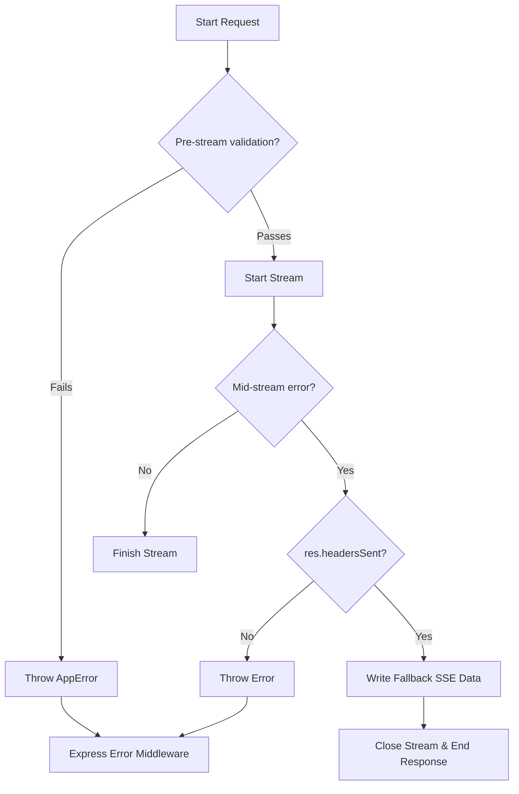
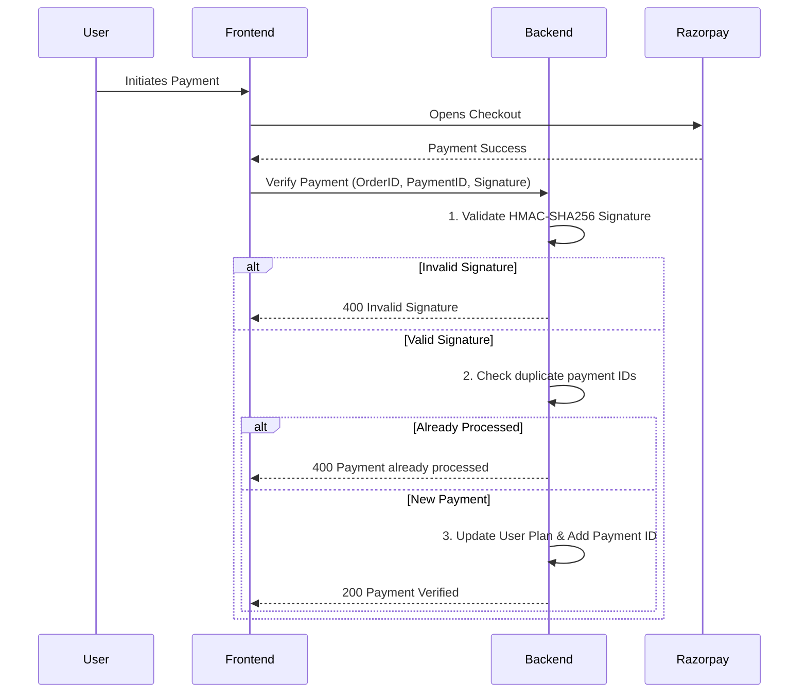
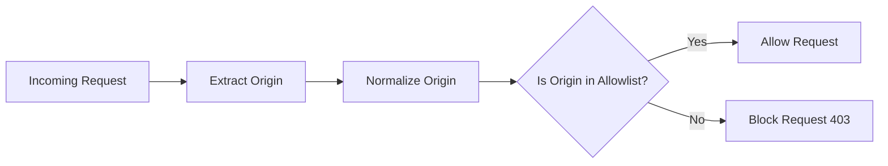
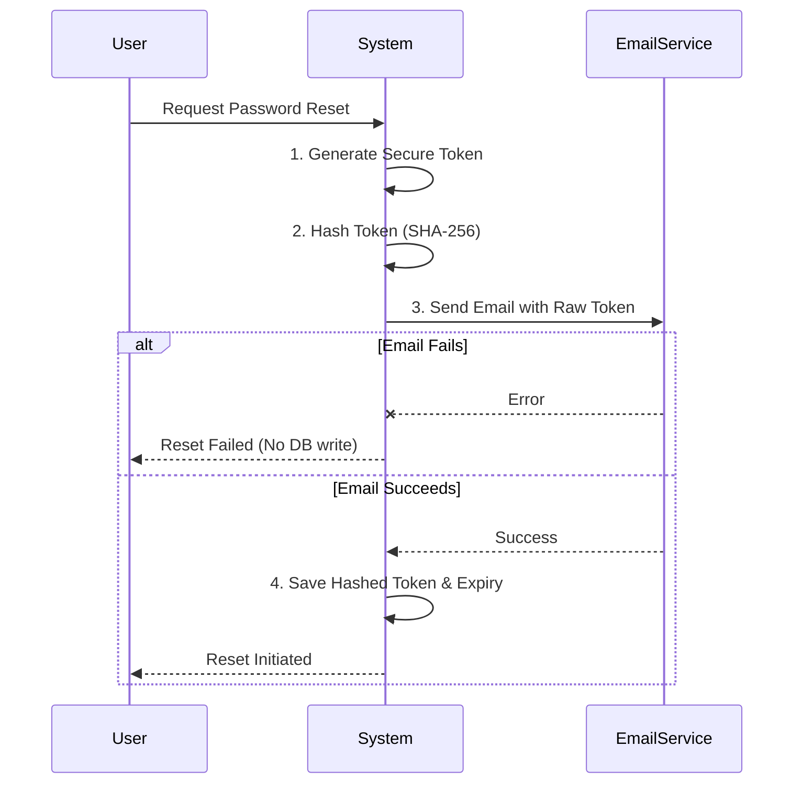

<div align="left">
  
</div>

# Development Challenges

> A comprehensive overview of the technical challenges encountered while building DevFlow AI, alongside their solutions, architectural decisions, and key lessons learned.

## Table of Contents

- [Overview](#overview)
- [1. SSE Streaming Error Handling](#1-sse-streaming-error-handling)
- [2. Express 5 Async Error Handling](#2-express-5-async-error-handling)
- [3. Razorpay Payment Verification Race Conditions](#3-razorpay-payment-verification-race-conditions)
- [4. MongoDB Embedded Document Size Limits](#4-mongodb-embedded-document-size-limits)
- [5. CORS with Dynamic Origins](#5-cors-with-dynamic-origins)
- [6. Password Reset Flow Reliability](#6-password-reset-flow-reliability)
- [7. Soft Delete and Data Integrity](#7-soft-delete-and-data-integrity)
- [8. Client-Side Auth State Hydration](#8-client-side-auth-state-hydration)
- [9. Migration from Legacy Subscription Schema](#9-migration-from-legacy-subscription-schema)
- [10. Rate Limiting Granularity](#10-rate-limiting-granularity)
- [Best Practices](#best-practices)
- [Related Documents](#related-documents)
- [Next Reading](#next-reading)

---

## Overview

Building a production-ready SaaS platform with real-time AI streaming, automated payment processing, and dynamic UI state management introduces numerous non-trivial engineering constraints. This document catalogs the most significant obstacles encountered, the architectural decisions made, and how they were systematically addressed to ensure system robustness, performance, and security.

---

## 1. SSE Streaming Error Handling

### The Challenge

When streaming AI responses via Server-Sent Events (SSE), errors from the Groq API can surface mid-stream (after response headers have been sent). Once `res.write()` has started, Express's default error middleware can no longer handle errors, as the response is already committed and cannot emit a standard HTTP error code.

### The Solution

We implemented a two-phase error handling strategy that guarantees clean stream termination.

> [!NOTE]
> Checking `res.headersSent` is the crucial step before deciding whether to invoke the error middleware or write a fallback SSE message.

```javascript
// Phase 1: Pre-stream errors — use Express error middleware
if (!prompt) throw new AppError("Prompt required", 400);

// Phase 2: Mid-stream errors — catch and write fallback to SSE
try {
  for await (const chunk of stream) { /* ... */ }
} catch (error) {
  if (res.headersSent) {
    res.write(`data: ${JSON.stringify({ token: "⚠️ Something went wrong..." })}\n\n`);
    res.write("data: [DONE]\n\n");
    res.end();
    return; // Never call next(error) when headers are sent
  }
  throw error; // Re-throw for Express error handler if headers not yet sent
}
```



---

## 2. Express 5 Async Error Handling

### The Challenge

Express 5 can catch some async errors natively, but not all. Without explicit asynchronous error wrappers, rejected promises within route handlers can cause unhandled promise rejections, leaving the Node.js process in an unstable state.

### The Solution

A dedicated `asyncHandler` wrapper was introduced for all controllers.

```javascript
const asyncHandler = (fn) => (req, res, next) => {
  Promise.resolve(fn(req, res, next)).catch(next);
};
```

All route handlers are wrapped with this utility. Controllers throw `AppError` instances, which are seamlessly caught and piped to the Express error middleware:

```javascript
throw new AppError("Invalid credentials", 401);
```

Additionally, global process event listeners ensure the server shuts down gracefully rather than lingering in a corrupted state:

> [!WARNING]
> Unhandled rejections should never be swallowed. Always log them and exit gracefully to let PM2 or Docker restart a fresh instance.

```javascript
process.on("unhandledRejection", (reason) => {
  console.error("Unhandled Promise Rejection:", reason);
  shutdown("unhandledRejection");
});
```

---

## 3. Razorpay Payment Verification Race Conditions

### The Challenge

Without proper safeguards, a malicious user could:
- Replay a successful payment request to activate Pro multiple times.
- Spoof the `free_checkout` flow to bypass payment entirely.
- Use a stale nonce from an expired free checkout session.

### The Solution

We built a three-layered defense mechanism for payment verification.



**1. HMAC-SHA256 Signature Verification:**
Ensures payload authenticity directly from Razorpay.
```javascript
const body = razorpay_order_id + "|" + razorpay_payment_id;
const expectedSignature = crypto
  .createHmac("sha256", process.env.RAZORPAY_KEY_SECRET)
  .update(body)
  .digest("hex");
if (expectedSignature !== razorpay_signature) {
  throw new AppError("Invalid signature", 400);
}
```

**2. Duplicate Payment Prevention:**
Ensures a payment ID is strictly consumed once.
```javascript
if (user.usedPaymentIds.includes(razorpay_payment_id)) {
  throw new AppError("This payment has already been processed", 400);
}
```

**3. One-Time Nonce with Expiry for Free Checkouts:**
Secures zero-cost plans against abuse.
```javascript
const nonce = crypto.randomBytes(16).toString("hex");
user.checkoutNonce = nonce;
user.checkoutNonceExpires = new Date(Date.now() + 5 * 60 * 1000);

// On verify:
if (!nonce || user.checkoutNonce !== nonce) throw new AppError("Invalid session", 400);
if (new Date() > user.checkoutNonceExpires) throw new AppError("Session expired", 400);
user.checkoutNonce = null; // Single-use
```

---

## 4. MongoDB Embedded Document Size Limits

### The Challenge

MongoDB enforces a strict 16 MB limit per document. Storing conversation messages as embedded subdocuments within a single Chat document could theoretically exceed this limit for exceptionally long interactions.

### The Solution

Extensive analysis confirmed the embedded document model is acceptable for the platform's current usage profile.

> [!TIP]
> **Data Projections**
> - Average message size: ~500 bytes (text content only, no media).
> - Maximum messages before 16 MB limit: ~30,000+.
> - Typical chat session: 50–200 messages (< 100 KB).

Most users create multiple, distinct, topic-focused chats rather than continuous, monolithic threads.

**Future Mitigations Planned:**
- Implement message pagination (load only recent N messages).
- Archive older messages to a separate dedicated `Messages` collection.
- Enforce configurable message count limits per chat thread.

---

## 5. CORS with Dynamic Origins

### The Challenge

The application acts as a central hub and must securely accept requests from diverse environments:
- Production Netlify frontend.
- Local development environments (e.g., ports 3000, 5173).
- Custom domains defined via environment variables.
- Potential future Chrome extensions.

Hardcoding static origins was overly rigid and unmaintainable.

### The Solution

A dynamic CORS evaluation function that standardizes origins and maps them against a flexible configuration allowlist.



```javascript
origin(origin, callback) {
  // Strip trailing slashes to prevent matching errors
  const normalizedOrigin = origin?.replace(/\/+$/, "");
  
  if (!origin || env.clientUrls.includes(normalizedOrigin)) {
    return callback(null, true);
  }
  
  const error = new Error(`CORS blocked origin: ${origin}`);
  error.statusCode = 403;
  return callback(error);
}
```

The allowlist seamlessly combines `CLIENT_URL` (primary frontend), `CLIENT_URLS` (comma-separated additional origins), and local fallbacks for seamless DX.

---

## 6. Password Reset Flow Reliability

### The Challenge

Password reset tokens are a critical attack vector. We needed to balance multiple constraints:
- Token must be unpredictable (generated via `crypto.randomBytes`).
- Storage must be secure (hashed, never plain text).
- Time bounds must be strict (15 minutes).
- The system must handle email delivery failures gracefully without stranding tokens.

### The Solution

> [!IMPORTANT]
> The critical design choice here is executing the email dispatch **before** committing the token to the database. This prevents orphaned, usable tokens in the event of third-party email service outages.



```javascript
// 1. Generate cryptographically secure token
const rawToken = crypto.randomBytes(32).toString("hex");

// 2. Hash before storing
const hashedToken = crypto.createHash("sha256").update(rawToken).digest("hex");

// 3. Send email BEFORE saving token — if email fails, no orphaned token
await sendPasswordResetEmail(normalizedEmail, rawToken);

// 4. Save hashed token with expiry
user.resetPasswordToken = hashedToken;
user.resetPasswordExpires = new Date(Date.now() + 15 * 60 * 1000);
```

---

## 7. Soft Delete and Data Integrity

### The Challenge

When a user requests account deletion, the system must:
- Immediately revoke authentication capabilities.
- Retain chat histories for referential integrity.
- Liberate the user's email and username for future potential registrations.
- Prevent destructive cascade deletes across critical business data.

### The Solution

Implemented a soft delete pattern leveraging field suffixing.

```javascript
user.isDeleted = true;
user.deletedAt = new Date();
user.email = `${user.email}_deleted_${Date.now()}`;

if (user.username) {
  user.username = `${user.username}_deleted_${Date.now()}`;
}
```

The core `protect` middleware blocks all subsequent API access globally:

```javascript
if (!user || user.isDeleted) throw new AppError("User not found", 401);
```

Because associated documents (like chats) maintain their original `userId` references, administrators can perform manual data recovery by toggling `isDeleted` back to `false` directly within the database.

---

## 8. Client-Side Auth State Hydration

### The Challenge

Upon page refresh or direct URL navigation, the Redux store wipes its state. While the JWT remains in `localStorage`, the user profile must be asynchronously requested from the API. The UI must elegantly suspend rendering protected routes to avoid aggressive "flash of login" visual artifacts.

### The Solution

A structured `<HydrationGate />` component injects the token into Redux early in the lifecycle.

```jsx
function HydrationGate({ children }) {
  const dispatch = useDispatch();
  
  useEffect(() => {
    const token = localStorage.getItem("devflow_token");
    if (token) dispatch(hydrateAuth({ token }));
  }, [dispatch]);
  
  return children;
}
```

Simultaneously, `ProtectedRoute` components await readiness:

```jsx
function ProtectedRoute({ children }) {
  const [ready, setReady] = useState(false);
  
  useEffect(() => {
    const token = localStorage.getItem("devflow_token");
    if (!token) { router.replace("/login"); return; }
    setReady(true);
  }, [router]);
  
  if (!ready) return null;
  return children;
}
```

An Axios response interceptor acts as a fail-safe, purging tokens on 401s and managing seamless redirects back to authentication endpoints.

---

## 9. Migration from Legacy Subscription Schema

### The Challenge

Initially, subscription models lived in an isolated `subscriptions` collection. This enforced a costly JOIN-like lookup via Mongoose `.populate()` for nearly every authenticated endpoint (since plan tiers drive core feature access). It also demanded two atomic database writes per subscription modification.

### The Solution

We embedded the subscription state directly into the User document, drastically reducing database overhead.

```diff
- // Legacy Relational Approach
- const user = await User.findById(id).populate("subscription");
- const status = user.subscription.status;

+ // Modern Embedded Approach
+ const status = user.subscription.status;
```

> [!NOTE]
> The legacy `Subscription` collection remains solely for backwards compatibility analytics, but core business logic relies exclusively on the optimized, embedded User schema.

The controller facilitates a just-in-time (JIT) migration for legacy users dynamically:

```javascript
if (!user.subscription || typeof user.subscription === "string") {
  const legacyPlan = typeof user.subscription === "string" ? user.subscription : "free";
  
  user.subscription = {
    plan: legacyPlan === "pro" ? "pro" : "free",
    status: legacyPlan === "pro" ? "active" : "inactive",
    expiresAt: legacyPlan === "pro" ? user.subscription?.expiresAt : undefined,
  };
}
```

---

## 10. Rate Limiting Granularity

### The Challenge

A solitary, blanket rate limit (e.g., 300 requests per 15 minutes) is dangerously coarse. It exposes the platform to:
- Brute-force dictionary attacks on authentication.
- Immediate financial bleed via AI prompt flooding.
- Resource starvation degrading the experience for legitimate traffic.

### The Solution

We integrated a multi-layered rate limiting topology.

| Layer | Limit Restriction | Applied Endpoint(s) |
| :--- | :--- | :--- |
| **Global Access** | 300 req / 15 min per IP | All endpoints |
| **Auth (Login)** | 20 req / 15 min per IP | `POST /api/auth/login` |
| **Auth (Recovery)**| 20 req / 15 min per IP | `POST /api/auth/forgot-password` |
| **AI (Prompt)** | 30 req / min per IP | `POST /api/ai/prompt` |
| **AI (Explain)** | 30 req / min per IP | `POST /api/ai/explain` |
| **Free Tier Usage**| 20 prompts / day per User | Application-level validation |

> [!IMPORTANT]
> The application-level usage check acts as a financial firewall. It runs **before** dispatching requests to the Groq API, effectively mitigating unexpected billing surges.

```javascript
if (finalPlan === "free" && user.usage.dailyCount >= DAILY_LIMIT) {
  throw new AppError("Daily limit reached. Upgrade to Pro.", 429);
}
```

---

## Best Practices

Through addressing these challenges, the following engineering best practices were cemented for DevFlow AI:

- **Design for Failure:** Always assume third-party services (like email providers or LLM APIs) can fail. Structure side-effects defensively (e.g., dispatching emails before persisting tokens).
- **Graceful Degradation:** When long-lived connections (SSE) fault, stream fallback messaging to inform the client gracefully, rather than dropping the connection.
- **Defense in Depth:** Utilize rate limits at multiple OSI layers (Global IP, Feature-level IP, and Application User) and construct multi-faceted validations for sensitive actions like payments (Signature, Nonce, Duplicate checks).
- **Forward Compatibility:** During schema migrations, gracefully bridge data schemas in the application layer (JIT migration) to prevent breaking changes for existing users.

---

## Related Documents

- [Lessons Learned](./lessons-learned.md) — Key takeaways from building DevFlow AI
- [Case Study](./case-study.md) — Complete story from concept to launch
- [Troubleshooting Guide](./troubleshooting.md) — Common issues and diagnostic steps

## Next Reading

> **Next:** [Lessons Learned](./lessons-learned.md) — Key takeaways and insights from building DevFlow AI.

---

<p align="center">
  <br>
  &copy; DevFlow AI Documentation. Built with Next.js, Express, MongoDB, and Groq AI.
</p>
