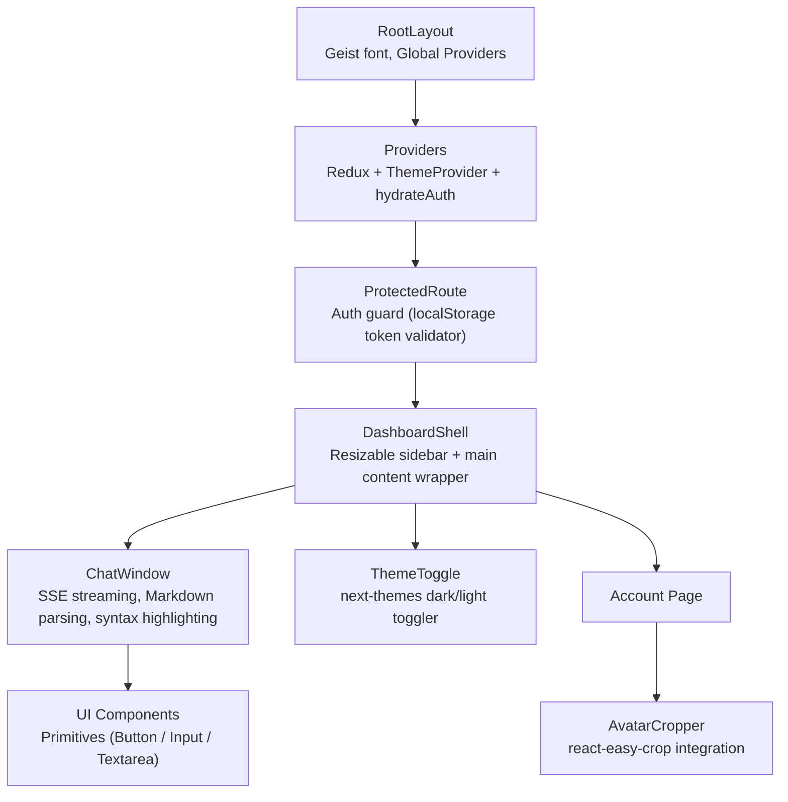

<picture>
  
</picture>

# DevFlow AI — Frontend Architecture

> Next.js 16 application built with React 19, Tailwind CSS v4, Redux Toolkit, and shadcn/ui, featuring SSR-disabled chat, dark/light mode, and responsive design.

---

## Table of Contents

- [Overview](#overview)
- [Tech Stack](#tech-stack)
- [Project Structure](#project-structure)
- [Pages & Routes](#pages--routes)
- [Component Architecture](#component-architecture)
- [State Management](#state-management)
- [Styling](#styling)
- [API Integration](#api-integration)
- [SSE Streaming](#sse-streaming)
- [Performance Considerations & Best Practices](#performance-considerations--best-practices)
- [Related Documents](#related-documents)
- [Next Reading](#next-reading)

---

## Overview

The frontend is a robust **Next.js 16** application utilizing the App Router. It is designed to deliver a highly interactive user experience with seamless performance. The application encompasses authentication flows (login, signup, password reset), a sophisticated dashboard with AI chat, user settings, profile management, and subscription billing. The chat interface is uniquely tailored to consume **Server-Sent Events (SSE)** for real-time AI response streaming, providing an instantaneous feedback loop reminiscent of premium SaaS platforms.

---

## Tech Stack

We utilize a modern ecosystem of libraries to guarantee optimal performance, robust state management, and an elegant UI.

| Library | Version | Purpose |
|---|---|---|
| Next.js | 16.2 | Application Framework (App Router) |
| React | 19.2 | Core UI Library |
| Tailwind CSS | 4.2 | Utility-first Styling |
| Redux Toolkit | 2.11 | Predictable State Management |
| Axios | 1.15 | Promise-based HTTP Client |
| react-markdown | 10.1 | Markdown Rendering for Chat |
| react-syntax-highlighter | 16.1 | Code Block Highlighting |
| react-easy-crop | 5.5 | Avatar Cropping & Manipulation |
| next-themes | 0.4 | Seamless Dark/Light Mode |
| Geist font | 1.7 | Premium Typography |
| lucide-react | 1.8 | Modern Iconography |
| class-variance-authority | 0.7 | Component Variants Management |

---

## Project Structure

A clean, modular directory structure ensures scalability and developer velocity.

```text
client/
├── app/                        # App Router pages and layouts
│   ├── layout.jsx              # Root layout (SEO, fonts, providers)
│   ├── globals.css             # Tailwind v4 + custom properties
│   ├── page.jsx                # / → redirect to /dashboard
│   ├── error.jsx               # Global Error boundary
│   ├── loading.jsx             # Root loading spinner
│   ├── not-found.jsx           # Custom 404 page
│   ├── login/page.jsx          # Authentication screens
│   ├── signup/page.jsx         # 
│   ├── forgot-password/page.jsx# 
│   ├── reset-password/page.jsx # 
│   ├── dashboard/              # 
│   │   ├── page.jsx            # 
│   │   └── loading.jsx         # 
│   ├── chat/[id]/              # 
│   │   ├── page.jsx            # SSR-disabled dynamic chat route
│   │   └── loading.jsx         # 
│   ├── settings/               # 
│   │   ├── page.jsx            # User preferences
│   │   └── billing/page.jsx    # Subscription management
│   ├── account/page.jsx        # Profile management
│   └── pricing/page.jsx        # Plan comparison
├── components/                 # Reusable UI architecture
│   ├── providers.jsx           # Redux + ThemeProvider + auth hydration
│   ├── protected-route.jsx     # Higher-order auth guard
│   ├── theme-toggle.jsx        # Dark/light environment toggle
│   ├── ui/                     # Primitives (Button, Input, Textarea via shadcn)
│   ├── layout/                 # 
│   │   └── dashboard-shell.jsx # Interactive sidebar + main layout structure
│   ├── chat/                   # 
│   │   └── chat-window.jsx     # Complex SSE streaming chat interface
│   └── account/                # 
│       └── avatar-cropper.jsx  # Image crop integration
├── lib/                        # Core utilities
│   ├── api.js                  # Axios instance with auth interceptors
│   ├── utils.js                # cn() helper for Tailwind classes
│   └── image-processing.js     # Canvas crop + client-side compression
├── store/                      # Global State Management
│   ├── index.js                # configureStore setup
│   └── slices/                 # 
│       ├── authSlice.js        # Token + robust user state management
│       └── chatSlice.js        # Chats + activeChat + streamText handling
└── public/                     # Static assets (logo, icons, manifest)
```

---

## Pages & Routes

> [!NOTE]
> Unauthenticated routes primarily serve the onboarding flow, while authenticated routes encompass the core product offering.

| Route | Page | Auth Required | Description |
|---|---|---|---|
| `/` | Index | No | Root redirect to `/dashboard` |
| `/login` | Login | No | Credential entry (Email/Username + Password) |
| `/signup` | Signup | No | Registration providing a unique username |
| `/forgot-password` | Forgot Password | No | Email input for password reset workflow |
| `/reset-password` | Reset Password | No | Secure token validation + new password creation |
| `/dashboard` | Dashboard | Yes | Overview of prompt templates and recent chat sessions |
| `/chat/[id]` | Chat Window | Yes | Dedicated AI chat session (SSR intentionally disabled) |
| `/settings` | Settings | Yes | Centralized user preferences |
| `/settings/billing` | Billing | Yes | Comprehensive subscription and invoice management |
| `/account` | Account | Yes | Profile editing including avatar modifications |
| `/pricing` | Pricing | Yes | Transparent plan comparison and upgrade paths |

---

## Component Architecture

Our component architecture heavily relies on nested composition to separate concerns, enforce authentication boundaries, and provide global providers gracefully.



---

## State Management

We use **Redux Toolkit** to maintain predictable and debuggable state across the application.

### Redux Store (`store/index.js`)

Configured centrally using `@reduxjs/toolkit` and split into domain-specific slices.

**authSlice:**
- `token` — JWT string for API authorization.
- `user` — User object (sanitized strictly via `mapUser`).
- **Actions:** `setCredentials`, `logout`, `hydrateAuth`.
- **Persistence:** Token is securely persisted to `localStorage` under the key `devflow_token`.

**chatSlice:**
- `chats` — Array of contextual chat sessions.
- `activeChat` — Currently selected and active chat ID.
- `streamText` — Accumulated real-time streaming response text.
- **Actions:** `setChats`, `setActiveChat`, `setStreamText`.

### Auth Hydration

> [!IMPORTANT]
> The application seamlessly maintains state across reloads.

On initialization, the `hydrateAuth` action reads the token from `localStorage`. It then automatically revalidates the session by fetching the user profile via a `GET /api/auth/me` request.

---

## Styling

DevFlow AI achieves its aesthetic through a disciplined combination of the latest styling tools:

- **Tailwind CSS v4** coupled with the `@tailwindcss/postcss` plugin for ultra-fast, utility-first styling.
- **Custom properties** nested in `globals.css` enforcing our theme colors (a sophisticated zinc palette).
- **CSS animations** defining interactions like message entry (`message-enter`), skeleton loading patterns, and page transitions.
- **Dark mode** supported gracefully via `next-themes`, incorporating automatic system preference detection.
- **shadcn/ui** inspired components heavily utilizing `class-variance-authority` for robust variant management (e.g., standardizing Button sizes and variants).

---

## API Integration

Data fetching and API communication are consolidated through a structured Axios instance located at `lib/api.js`.

```javascript
import axios from 'axios';

const api = axios.create({
  baseURL: process.env.NEXT_PUBLIC_API_URL || "http://localhost:5000",
});
```

- **Request Interceptor:** Automatically injects the `Authorization: Bearer <token>` header on every request if a token is available in localStorage.
- **Response Interceptor:** Gracefully monitors for `401 Unauthorized` or JWT expiry errors. Upon detection, it automatically forces a redirect to `/login`, utilizing a guard flag to strictly prevent infinite redirect loops.

---

## SSE Streaming

> [!TIP]
> Instead of traditional polling, our chat interface uses Server-Sent Events (SSE) for low-latency, real-time message rendering.

The chat window establishes the SSE connection directly using the native `fetch()` API and processes chunks through a `ReadableStream` reader.

**Sample Request & Response Protocol:**

```http
POST /api/ai/prompt
{ "chatId": "...", "prompt": "..." }

// Response Stream:
data: {"token":"Hello"}
data: {"token":" "}
data: {"token":"World"}
data: {"token":"!"}
data: [DONE]
```

**Client-Side Streaming Responsibilities:**
- Token-by-token accumulation updating the Redux `streamText` state.
- Integration of an `AbortController` to handle user-initiated manual stops and hard timeouts (60s).
- Robust error recovery logic displaying fallback notifications.
- Automatic background refresh of account usage counters post-response.

---

## Performance Considerations & Best Practices

To maintain snappy interactions within a data-heavy application, we enforce several critical performance strategies:

- **SSR Disabled for Chat:** The `/chat/[id]` page utilizes Next.js dynamic imports with `ssr: false`. This strictly prevents hydration mismatches that occur when mixing initial server renders with immediate SSE state changes.
- **Memoization:** The `MarkdownMessage` component is strictly wrapped in `React.memo`. This guarantees that long chat histories do not trigger costly re-renders when parent states (like streaming input) update.
- **Debounced Interactions:** The sidebar resize mechanism employs a transition (`transition-[width] duration-300`) alongside debounced event handlers for a flawlessly smooth UX.
- **Optimistic UI Updates:** Actions such as chat deletion immediately remove the UI element before the API completes. The system silently re-fetches and reverts only if an error occurs.
- **Lazy Load Scripts:** Third-party heavy SDKs (e.g., Razorpay) are loaded dynamically and exclusively on billing pages, preserving bundle size for core routes.

---

## Related Documents

- [Architecture Overview](./architecture.md)
- [Backend Architecture](./backend.md)
- [API Reference](./api.md)
- [AI Integration](./ai.md)

---

## Next Reading

> **Next:** [Backend Architecture](./backend.md) — Dive into the Node.js / Express 5 backend, understanding the middleware stack, controller logic, and utility functions that power the DevFlow API.

---

<br />
<p align="center">
  <sub>Built with Next.js, Express, MongoDB, and Groq AI</sub><br />
  <sub>&copy; DevFlow AI — Documentation</sub>
</p>
