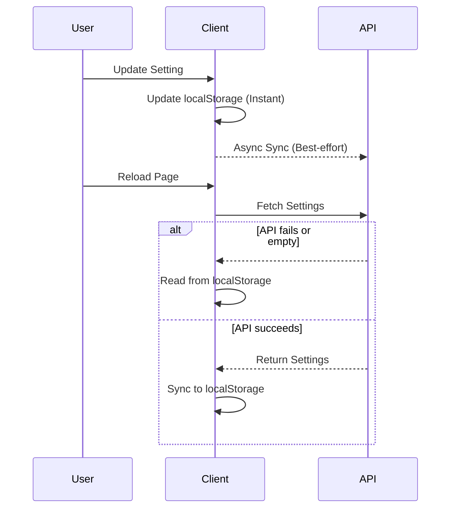
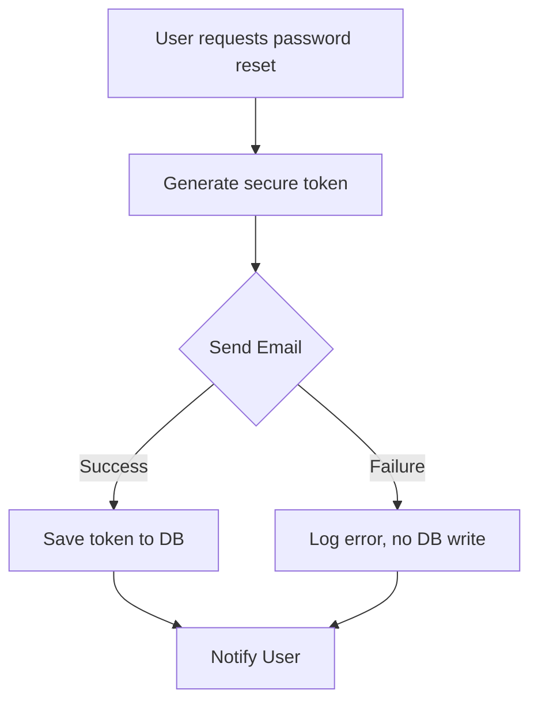

<div align="center">
  <picture>
    
  </picture>
  
# DevFlow AI — Lessons Learned

> Key takeaways, engineering insights, and retrospective learnings from building DevFlow AI.
</div>

## Table of Contents

- [Overview](#overview)
- [1. SSE Streaming Requires Two Error Paths](#1-sse-streaming-requires-two-error-paths)
- [2. Payment Verification Must Be Multi-Layered](#2-payment-verification-must-be-multi-layered)
- [3. Embed Documents, but Know the Limits](#3-embed-documents-but-know-the-limits)
- [4. Rate Limiting Is a Product Feature](#4-rate-limiting-is-a-product-feature)
- [5. Dual Persistence for Settings](#5-dual-persistence-for-settings)
- [6. Soft Delete Over Hard Delete](#6-soft-delete-over-hard-delete)
- [7. Client-Side Auth Needs Careful Hydration](#7-client-side-auth-needs-careful-hydration)
- [8. CORS Config Must Be Flexible Yet Secure](#8-cors-config-must-be-flexible-yet-secure)
- [9. Email Is the Weakest Link in Password Reset](#9-email-is-the-weakest-link-in-password-reset)
- [10. Plain JavaScript Reduces Friction](#10-plain-javascript-reduces-friction)
- [Best Practices](#best-practices)
- [Related Documents](#related-documents)
- [Next Reading](#next-reading)

---

## Overview

Every project teaches valuable lessons. This document captures the most important engineering and product insights gained while developing DevFlow AI — both what went right and what we would do differently. 

By analyzing these decisions, we aim to establish robust patterns for future iterations and platform scaling.

---

## 1. SSE Streaming Requires Two Error Paths

Server-Sent Events (SSE) fundamentally change how error handling is executed on the server. Once `res.write()` initiates the stream, you can no longer rely on standard Express error middleware.

**The Implementation:** We created a two-phase error handler.
- **Phase 1 (Pre-Stream):** Before headers are sent, throw an `AppError` to be caught by Express middleware.
- **Phase 2 (Post-Stream):** Catch errors mid-stream, write a fallback token, send `[DONE]`, and gracefully close the connection.

> [!WARNING]
> Failing to check `res.headersSent` can result in server crashes or hanging client connections. Always verify this state before determining your error path. This pattern applies to any streaming protocol (WebSockets, SSE, chunked responses).

```javascript
// Example: Two-Phase Error Handling
if (!res.headersSent) {
  // Phase 1: Forward to Express error middleware
  return next(new AppError('Generation failed', 500));
} else {
  // Phase 2: Handle inline
  res.write('data: {"error": "Interrupted"}\n\n');
  res.write('data: [DONE]\n\n');
  res.end();
}
```

---

## 2. Payment Verification Must Be Multi-Layered

Relying on a single HMAC signature for payment verification is insufficient. Robust systems require duplicate detection, nonce rotation, and session expiry.

**The Implementation:** We instituted a three-layer verification model:
1. **HMAC-SHA256** signature matching.
2. **Duplicate tracking** via an array of `usedPaymentIds[]`.
3. **Cryptographic nonces** with a 5-minute expiry window for free checkout flows.

> [!IMPORTANT]
> Payment security extends beyond preventing forgery. Replay attacks, stale sessions, and race conditions are equally critical threat vectors that must be mitigated.

---

## 3. Embed Documents, but Know the Limits

MongoDB's embedded documents provide powerful, access-pattern-optimized schemas, but the 16 MB document size limit must be accounted for upfront.

**The Implementation:** 
- Embedded `messages` within `Chat` documents.
- Embedded `subscription` details within `User` documents.

> [!NOTE]
> The 16 MB limit accommodated our use case comfortably (~500 bytes per message, allowing for 30,000+ messages per chat). We established a migration path (pagination and archiving) for future scale. Always calculate worst-case document sizes before choosing embedded vs. referenced models.

---

## 4. Rate Limiting Is a Product Feature

Rate limits are not just a security measure to prevent abuse—they actively enforce the business model and define the user experience.

**The Implementation:**
- **Free Tier:** 20 requests per day, enforced at the application level before downstream API costs are incurred.
- **Pro Tier:** 999 requests per day (effectively unlimited).
- **Security Limits:** Strict per-endpoint rate limiting for sensitive operations.

> [!TIP]
> Ensure free tier limits are transparent to the user. Displaying a clear tracker (e.g., `"5 / 20 prompts used today"`) reduces frustration and drives conversion.

---

## 5. Dual Persistence for Settings

Users expect their preferences to persist across devices (via server sync) while demanding instant responsiveness (via local cache).

**The Implementation:** 
We employed a dual-write pattern. Settings are saved to both `localStorage` and the server. On initial page load, the application queries the server first; if empty, it falls back to `localStorage`.



> [!NOTE]
> This dual-write pattern adds complexity but provides the best UX. The server sync is best-effort (doesn't block the UI), while `localStorage` provides instant reads.

---

## 6. Soft Delete Over Hard Delete

Hard-deleting user data introduces cascading data integrity challenges. Soft delete strategies preserve essential relationships and allow for data recovery.

**The Implementation:** 
- Added an `isDeleted: true` flag.
- Suffixed the email and username with `_deleted_{timestamp}`.
- Kept all related documents structurally intact.

> [!TIP]
> Soft delete preserves chat histories (valuable for analytics and legal compliance), enables admin recovery, and prevents orphaned data references. The negligible increase in database size is a worthwhile trade-off.

---

## 7. Client-Side Auth Needs Careful Hydration

In applications relying on client-side state (like Redux), state resets upon page refresh. Without precise hydration, users experience a jarring flash of the login page during navigation.

**The Implementation:**
- **HydrationGate:** Reads the token from `localStorage` and dispatches `hydrateAuth` prior to rendering protected routes.
- **ProtectedRoute:** Verifies the token and conditionally redirects unauthorized access.

> [!WARNING]
> Beware of infinite redirect loops. Implementing a `redirectingToLogin` flag in Axios interceptors prevents a 401 response on the login page from triggering an endless cycle.

---

## 8. CORS Config Must Be Flexible Yet Secure

Hardcoded CORS origins frequently fail across development, staging, and extension environments. Dynamic origin validation provides a robust alternative.

**The Implementation:** 
Created a validation function that normalizes origins (stripping trailing slashes) and compares them against a configurable allowlist generated from environment variables and strict fallbacks.

> [!TIP]
> Always account for the `!origin` check to permit same-origin requests or non-browser clients (like Postman). Implementing precise error messaging (`CORS blocked origin: ${origin}`) drastically simplifies debugging for new developers.

---

## 9. Email Is the Weakest Link in Password Reset

Email delivery networks are notoriously unreliable due to blocked SMTP ports, expired API keys, and rate limits. The password reset flow must gracefully accommodate these failure modes.

**The Implementation:** 
We sequence the operation to send the email **before** writing the reset token to the database. If the email dispatch fails, the system avoids generating an orphaned token. In development, a console fallback logs the token if the email fails.



> [!IMPORTANT]
> Although sending the email prior to database insertion feels counterintuitive, it prevents users from encountering a "token already generated" error if they need to retry after an initial delivery failure.

---

## 10. Plain JavaScript Reduces Friction

While TypeScript introduces powerful compile-time safety, it can also inflate build complexity, increase maintenance overhead, and introduce a learning curve for new contributors.

**The Implementation:** 
We utilized standard JavaScript throughout the stack: CommonJS on the server and ES Modules with JSX on the client.

> [!NOTE]
> For a small or solo engineering team, avoiding TypeScript's setup overhead yielded significant productivity gains. Combining ESLint with thorough automated testing provided sufficient code quality, though scaling the platform may warrant a TypeScript migration in the future.

---

## Best Practices

Summarizing the lessons learned into actionable best practices for the team moving forward:

- **Assume Unreliability:** Whether it's network requests, SMTP delivery, or database availability, always code defensively with graceful fallbacks.
- **Fail Gracefully in Streams:** Streams demand specialized error handling. Always confirm header states before emitting errors.
- **Security is Multi-Faceted:** Avoid single points of failure in authentication and payments. Use combinations of HMAC, nonces, and session limits.
- **UX > Strict Architecture:** If a complex pattern (like dual persistence) significantly improves user experience, it justifies the implementation effort.

---

## Related Documents

- [Challenges](./challenges.md) — Technical challenges faced during development.
- [Case Study](./case-study.md) — Complete story from concept to launch.
- [Architecture Overview](./architecture.md) — System architecture shaped by these lessons.

## Next Reading

> **Next:** [FAQ](./faq.md) — Frequently asked questions about DevFlow AI.

---

<p align="center">
  <sub>© 2024 DevFlow AI. Built with Next.js, Express, MongoDB, and Groq AI</sub>
</p>
