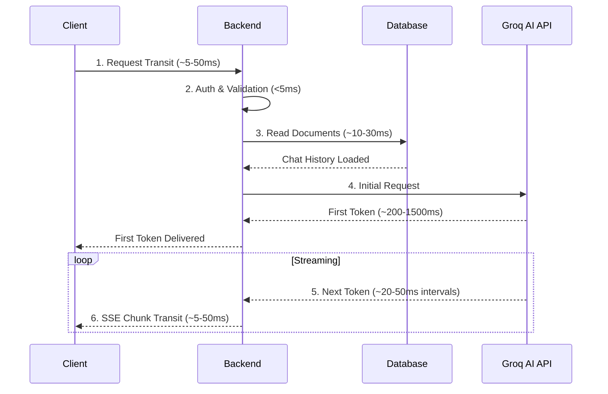

<picture>
  
</picture>
<br><br><br>

# Performance & Optimizations

> Performance characteristics, optimization decisions, and infrastructure behavior of the DevFlow AI platform. Designed for responsive real-time interaction and efficiency at scale.

## Table of Contents

- [Overview](#overview)
- [Frontend Performance](#frontend-performance)
- [Backend Performance](#backend-performance)
- [Database Performance](#database-performance)
- [AI Streaming Performance](#ai-streaming-performance)
- [Infrastructure Constraints](#infrastructure-constraints)
- [Optimizations & Best Practices](#optimizations--best-practices)
- [Related Documents](#related-documents)
- [Next Reading](#next-reading)

---

## Overview

DevFlow AI is designed for responsive, real-time interaction. The most performance-sensitive path is the AI chat streaming flow, where token-by-token delivery via Server-Sent Events (SSE) must feel instantaneous. Below are the core performance characteristics and optimizations of each layer of the platform.

---

## Frontend Performance

### SSR-Disabled Chat Page

The core chat interface (`/chat/[id]`) relies heavily on client-side state for SSE streaming. To prevent hydration conflicts and reduce server processing load, this page utilizes Next.js dynamic imports with Server-Side Rendering (SSR) disabled:

```javascript
const ChatWindow = dynamic(() => import("@/components/chat/chat-window"), { ssr: false });
```

> [!NOTE]
> **Trade-off:** The chat page has no server-side rendered content. The user sees a loading skeleton before the client bundle is loaded and rendered, prioritizing stable interactive streaming over initial HTML delivery.

### React Memoization for Markdown Rendering

The `MarkdownMessage` component is wrapped in `React.memo()` to prevent unnecessary re-renders when parent state changes but the message content remains static. 

> [!TIP]
> Each streaming token triggers a state update in the parent. Memoization ensures that **only the active assistant message** re-renders during the stream, maintaining a smooth 60fps UI experience.

### Debounced Layout Adjustments

The sidebar utilizes `transition-[width] duration-300` CSS transitions paired with debounced mouse event handlers. 
- The resize operation is capped between `200px` and `400px`.
- The final width is persisted to `localStorage` only after the drag event concludes, avoiding expensive frequent writes.

### Optimistic UI Updates

When a user deletes a chat, it is removed from the UI immediately (optimistic update) before the API call completes. If the deletion fails, the chat list is silently re-fetched from the server. This eliminates perceived latency for the most common chat management action.

### Lazy Loading Dependencies

To keep the initial JavaScript bundle lean, heavy third-party SDKs are dynamically loaded:
- **Razorpay SDK:** Loaded only when the billing page is visited. It is explicitly excluded from the main application bundle.
- **Font Loading:** The Geist font is served locally via the `geist` npm package, eliminating external network requests to font hosts at runtime.

---

## Backend Performance

### Connection Pooling

Mongoose is configured with a robust connection pool optimized for typical workloads:

```javascript
maxPoolSize: 10,
minPoolSize: 2,
serverSelectionTimeoutMS: 5000,
socketTimeoutMS: 45000,
```

> [!IMPORTANT]
> This configuration maintains 2 persistent connections with a ceiling of 10 concurrent operations. The pool is established exactly once at startup and shared across all incoming requests.

### Rate Limiting

We employ multi-tiered rate limiting to protect the application from abuse while preserving service quality for legitimate users. Rate limits are evaluated **before** any business logic or external API calls are executed.

| Layer | Limit | Purpose |
|---|---|---|
| **Global** | 300 req / 15 min per IP | Prevents abuse of the entire API |
| **Login / Forgot Password** | 20 req / 15 min per IP | Prevents credential stuffing & brute force |
| **AI Endpoints** | 30 req / min per IP | Prevents cost overruns from rapid-fire requests |
| **Free Tier** | 20 prompts / day per user | Enforces business model constraints |

### API Timeouts

Stringent timeouts are enforced to prevent stale connections from draining server resources.

| Endpoint | Timeout | Behavior on Timeout |
|---|---|---|
| `POST /api/ai/prompt` | 60 seconds | Stream closed with an error fallback token |
| `POST /api/ai/explain` | 15 seconds | Returns `504 Gateway Timeout` |

### Streaming Overhead

SSE streaming adds minimal overhead per token. Each chunk is wrapped in standard SSE framing (`data: {"token":"..."}\n\n`), resulting in approximately **~25 bytes** of overhead per token. For a typical 500-token response, this adds merely ~12.5 KB of framing overhead on top of the response body.

---

## Database Performance

### Embedded Document Architecture

Chat messages are stored as **embedded subdocuments** within the parent `Chat` document, rather than in a separate relational collection. This deliberately optimizes the primary access pattern: loading all messages for a single chat requires only one database query instead of complex joins or multiple round-trips.

> [!NOTE]
> **Size Constraints Calculation:**
> - **Average message size:** ~500 bytes
> - **Average chat length:** ~50–200 messages
> - **Messages required to hit MongoDB's 16 MB limit:** ~30,000+
> 
> This approach safely accommodates virtually all user chat behaviors without hitting BSON limitations.

### Indexing Strategy

Indexes are optimized for frequent lookups and uniqueness constraints. 

| Collection | Index | Purpose |
|---|---|---|
| `chats` | `{ userId: 1 }` | Fast listing of a user's chats |
| `chats` | `{ userId: 1, _id: 1 }` | Compound index for ownership-verified single-chat lookups |
| `users` | `{ email: 1 }` (unique) | Fast login email lookup |
| `users` | `{ username: 1 }` (unique, sparse) | Fast login username lookup |
| `users` | `{ isDeleted: 1 }` | Filtering active accounts globally |

> [!WARNING]
> Indexes are auto-created in development mode only. For production deployments, index creation should be managed manually or via CI/CD pipelines targeting MongoDB Atlas to avoid locking collections during startup.

### Connection Overhead

MongoDB Atlas free tier (M0) imposes a hard limit of 500 concurrent connections. By restricting the application to `maxPoolSize: 10`, the cluster utilizes only a small fraction of the limit, reserving ample headroom for monitoring, scaling out additional instances, and admin tools.

---

## AI Streaming Performance

### Token Delivery Sequence

The end-to-end latency for AI chat responses involves multiple hops. Understanding this sequence is crucial for debugging perceived slowness.



- **Time to first token (TTFT):** ~300–2000 ms under normal conditions.
- **Streaming throughput:** ~20–50 tokens/second for Llama 3.1 8B on Groq LPU hardware.

### Lifecycle & Abort Signal Handling

Both client and server robustly support aborting in-flight streams to conserve resources.

> [!TIP]
> - **Client Abort:** When the component unmounts or the user clicks the "Stop" button, `AbortController.abort()` is executed, terminating the fetch request and signaling the server.
> - **Server Abort:** A 60-second absolute timeout (`STREAM_TIMEOUT`) aborts the stream automatically. Additionally, client disconnection (`req.on("close")`) triggers an immediate upstream abort.
> - **Graceful SSE Error Handling:** If the Groq stream fails *after* SSE headers are sent, an error fallback token is written to the stream, the `[DONE]` signal is transmitted, and the connection closes gracefully without triggering the global Express error middleware.

---

## Infrastructure Constraints

Be aware of the environmental limits imposed by the current infrastructure tiering.

| Component | Free Tier Constraint | Paid Upgrade Path |
|---|---|---|
| **Render (Backend)** | Spins down after 15 min idle; cold start 5–10s | Always-on, zero cold starts |
| **MongoDB Atlas** | M0: 512 MB storage, 500 connections | M2+ for higher throughput |
| **Groq Cloud** | Pay-as-you-go; rate limited by API key quota | Provisioned throughput & higher limits |
| **Resend** | 100 emails/day free | Paid plans for high-volume delivery |
| **Cloudinary** | 25 GB storage, 25 GB bandwidth free | Paid plans available |

---

## Optimizations & Best Practices

### Architecture Optimizations Summary

The following architectural optimizations are currently deployed across the stack:

| Optimization | Layer | Benefit |
|---|---|---|
| **Embedded documents** | Database | Avoids JOIN-like lookups for chat messages |
| **Connection pooling** | Backend | Reuses database connections across requests |
| **Rate limiting** | Backend | Prevents abuse before reaching business logic |
| **SSE streaming** | Backend/Frontend | No polling overhead, minimal framing |
| **Abort controllers** | Both | Frees server resources on client disconnect |
| **Memoized components** | Frontend | Prevents unnecessary re-renders |
| **Optimistic UI updates** | Frontend | Instant feedback for delete actions |
| **Lazy SDK loading** | Frontend | Reduces initial bundle size |
| **SSR-disabled chat** | Frontend | Avoids server render cost for streaming pages |
| **Strict rate limits on auth** | Backend | Prevents brute-force attacks |

### Key Best Practices

- **Avoid Relational Joins in NoSQL:** Storing chat messages as embedded documents eliminates expensive cross-collection lookups.
- **Strict Pre-Execution Rate Limiting:** Checking request limits before evaluating business logic or database queries guards against DDoS and abuse.
- **Disconnect-Aware Streaming:** Tying client disconnects directly to upstream AbortControllers ensures that the server does not waste CPU cycles generating tokens the client will never receive.
- **Progressive UI Degradation:** Disabling SSR on real-time SSE components prioritizes stable interactivity over SEO/initial paint, a valid trade-off for authenticated app interfaces.
- **Aggressive Frontend Memoization:** Shielding complex markdown rendering pipelines with `React.memo()` is essential when parent components receive high-frequency token updates.

---

## Related Documents

- [Architecture Overview](./architecture.md) — System architecture and design decisions
- [Deployment Guide](./deployment.md) — Infrastructure setup and hosting configuration
- [Database Schema](./database.md) — MongoDB schema design rationale
- [Troubleshooting Guide](./troubleshooting.md) — Diagnosing performance issues

## Next Reading

> **Next:** [Workflow](./workflow.md) — Complete user workflows from signup to AI chat to subscription management.

---

<div align="center">
  <p>Built with Next.js, Express, MongoDB, and Groq AI</p>
  <p><strong>DevFlow AI — Documentation</strong></p>
</div>
