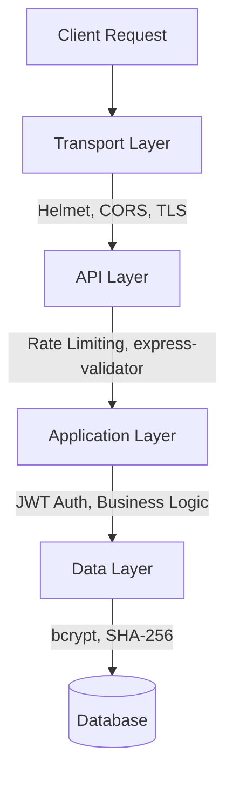

<picture>
  
</picture>

# Security Overview

> Multi-layered security covering authentication, payment verification, rate limiting, input validation, and infrastructure protection for DevFlow AI.

## Table of Contents

- [Overview](#overview)
- [Authentication Security](#authentication-security)
- [Payment Security](#payment-security)
- [API Security](#api-security)
- [Data Protection](#data-protection)
- [Infrastructure Security](#infrastructure-security)
- [Security Headers](#security-headers)
- [Current Limitations](#current-limitations)
- [Best Practices](#best-practices)
- [Related Documents](#related-documents)
- [Next Reading](#next-reading)

---

## Overview

DevFlow AI implements robust security at multiple layers, ensuring your data and infrastructure remain protected. Our approach encompasses transport layer security (Helmet headers, CORS), application logic (JWT, bcrypt, input validation, rate limiting), and business rules (usage limits, HMAC payment verification, disposable email blocking).



> [!NOTE]
> All infrastructure errors are mapped gracefully to standard HTTP 4xx or 5xx codes, masking internal stack traces in production environments.

---

## Authentication Security

### Password Protection
- **bcrypt Hashing**: We use 12 salt rounds for robust password hashing.
- **Hidden by Default**: Passwords are stored with `select: false` and are never returned in database queries.
- **Pre-save Hooks**: Passwords are only hashed upon modification, preventing double-hashing issues.

### JWT Security
Our JSON Web Token implementation ensures stateless yet secure session management.

> [!IMPORTANT]
> JWT tokens are signed using HMAC-SHA256. The payload strictly contains `id` and `role` to prevent sensitive data exposure.

- **Configurable Expiry**: Defaults to 7-day expiry (configurable via `JWT_EXPIRES_IN`).
- **Secure Transmission**: Tokens must be transmitted via the `Authorization: Bearer` header.

### Password Reset Security
When a user forgets their password, a secure reset token is generated:
1. `crypto.randomBytes(32)` generates the raw token.
2. Stored as a **SHA-256 hash** in the database (never in plaintext).
3. 15-minute expiry on all reset tokens.
4. Single-use: tokens are cleared immediately after a successful reset.
5. The raw token is never returned in the API response; it falls back to the console log if the email service is unavailable.

### Account Protection
- **Soft Deletion**: Accounts are soft-deleted to preserve data integrity, while the email/username is freed immediately via a `_deleted_{timestamp}` suffix.
- **Brute Force Prevention**: Rate limiting strictly enforced on login (20 requests per 15 minutes) and forgot-password endpoints (20 requests per 15 minutes).

---

## Payment Security

### Razorpay Signature Verification
To prevent fraudulent transactions, every webhook and payment completion event is cryptographically verified.

```javascript
const body = razorpay_order_id + "|" + razorpay_payment_id;
const expectedSignature = crypto
  .createHmac("sha256", process.env.RAZORPAY_KEY_SECRET)
  .update(body)
  .digest("hex");

if (expectedSignature !== razorpay_signature) {
  throw new AppError("Invalid signature", 400);
}
```

> [!WARNING]
> The `RAZORPAY_KEY_SECRET` must strictly remain on the server and never be exposed in the client bundle. The `RAZORPAY_KEY_ID` (public) is the only key exposed to the client SDK.

### Free Checkout Security
- **One-time Nonce**: Generated via `crypto.randomBytes`.
- **Time-bound**: Stored with a 5-minute expiry in the user document.
- **Replay Protection**: Validated strictly on the verify endpoint to prevent replay attacks.
- **Owner Coupon**: Verification uses a cryptographic nonce with a 5-minute expiry.

---

## API Security

### Input Validation
All endpoints validate input via `express-validator` prior to executing business logic.

| Validator | Rules Enforced |
|---|---|
| `authValidators.js` | Password strength, disposable email blocklist, username regex |
| `aiValidators.js` | Prompt max 8,000 chars, code max 50,000 chars |
| `chatValidators.js` | Chat title, MongoID validation |

### Rate Limiting

| Layer | Limit | Scope |
|---|---|---|
| Global | 300 req / 15 min | Per IP |
| Login / Forgot-password | 20 req / 15 min | Per IP |
| AI endpoints | 30 req / min | Per IP |
| Free tier usage | 20 prompts / day | Per user |

### Error Handling
- Mongoose errors mapped to appropriate HTTP 4xx codes.
- Infrastructure errors (e.g., `ENOTFOUND`, `ECONNREFUSED`) return a 503 Service Unavailable.
- Stack traces are completely hidden in production (`NODE_ENV=production`).
- Streaming errors are handled gracefully without invoking Express error middleware.

---

## Data Protection

### Environment Variables
- `.env` and `.env.local` are explicitly added to `.gitignore` — never committed to version control.
- Example files (e.g., `.env.example`) contain placeholder values only.
- The server validates all required variables at startup.

### Database Security
- **Data Integrity**: Soft deletes preserve referential integrity.
- **Zero Plaintext Storage**: No raw password storage; bcrypt hashes only. Reset tokens are stored as SHA-256 hashes.
- **Field Exclusion**: `select: false` on sensitive fields like passwords and reset tokens.

### CORS Strategy
- **Dynamic Origin Validation**: Features trailing-slash normalization.
- **Strict Allowlist**: Only known and approved origins can make cross-origin requests.
- **Credentials Enabled**: Explicitly permitted with appropriate methods and headers.

---

## Infrastructure Security

### Helmet Middleware
The server employs `helmet()` to enforce essential security-related HTTP headers automatically.

### Other Protections
- `app.disable("x-powered-by")` — obscures the Express identity.
- `app.set("trust proxy", 1)` — securely respects proxy IP headers (e.g., behind a load balancer).
- JSON body parser strictly limited to a **1 MB payload** to prevent memory exhaustion.
- Multer file uploads are validated strictly by MIME type.

---

## Security Headers

The complete set of Helmet headers applied to every HTTP response:

| Header | Effect |
|---|---|
| `X-Content-Type-Options: nosniff` | Prevents MIME type sniffing vulnerabilities |
| `X-Frame-Options: SAMEORIGIN` | Mitigates clickjacking attacks |
| `X-XSS-Protection: 0` | Disables the legacy XSS filter (modern mode) |
| `Strict-Transport-Security` | Enforces HTTPS connections (when deployed) |
| `Content-Security-Policy` | Restricts resource loading to trusted domains |

---

## Current Limitations

> [!WARNING]
> Be aware of the following security limitations within the current architecture:

- **No token revocation**: A compromised JWT remains valid until its natural expiry (up to 7 days). There is currently no active blocklist mechanism.
- **No refresh tokens**: Tokens cannot be rotated gracefully without requiring user re-authentication.
- **No email verification**: Accounts become active immediately after signup.
- **No MFA/2FA**: Authentication relies strictly on a single factor.
- **No HTTPS enforcement**: Application code does not enforce HTTPS internally, relying entirely on infrastructure (e.g., Netlify/Render) to terminate SSL.
- **Razorpay webhooks**: Signature verification for Razorpay webhooks is not currently implemented.

---

## Best Practices

> [!TIP]
> Follow these guidelines to maintain a secure DevFlow AI deployment:

1. **Rotate Secrets Regularly**: Ensure high-value keys, especially `JWT_SECRET` and `RAZORPAY_KEY_SECRET`, are rotated periodically.
2. **Use Strong JWT Secrets**: Generate secrets with a minimum of 32 characters, combining mixed cases, numbers, and symbols.
3. **Restrict Database Access**: Monitor your MongoDB Atlas IP whitelist and restrict it to Render's outbound IPs in production.
4. **Enforce Production Environments**: Always set `NODE_ENV=production` to prevent stack trace leakage.
5. **Protect Server Secrets**: Never expose `RAZORPAY_KEY_SECRET` or any database credentials to the client bundle.
6. **Maintain Email Filters**: Periodically review and update the disposable email blocklist inside `authValidators.js`.
7. **Consider Token Revocation**: Plan for the implementation of a JWT blocklist (e.g., using Redis) for rapid token revocation in future updates.

---

## Related Documents

- [Authentication](./authentication.md)
- [Payment & Billing](./payment.md)
- [Environment Variables](./environment.md)
- [API Reference](./api.md)

## Next Reading

> **Next:** [Testing Guide](./testing.md) — Discover how to configure Jest unit tests and execute the test suite effectively.

---

<p align="center">
  &copy; 2024 DevFlow AI. All rights reserved.<br>
  Built with Next.js, Express, MongoDB, and Groq AI.
</p>
