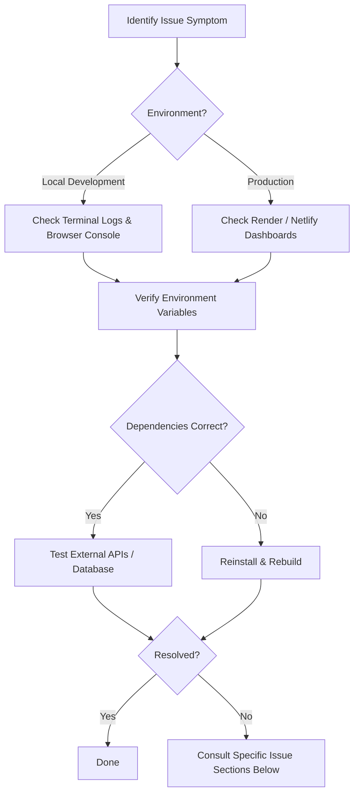

<div align="center">
  
</div>

# Troubleshooting Guide

> Common issues encountered during development, deployment, and production — with solutions and diagnostic steps to resolve them efficiently.

---

## Table of Contents

- [Overview](#overview)
- [Diagnostic Workflow](#diagnostic-workflow)
- [Development Issues](#development-issues)
- [Deployment Issues](#deployment-issues)
- [Authentication Issues](#authentication-issues)
- [Payment Issues](#payment-issues)
- [AI Chat Issues](#ai-chat-issues)
- [Database Issues](#database-issues)
- [General Debugging](#general-debugging)
- [Best Practices](#best-practices)
- [Related Documents](#related-documents)
- [Next Reading](#next-reading)

---

## Overview

This guide covers common issues across the DevFlow AI stack. Most problems stem from environment misconfigurations, CORS settings, or missing dependencies. Follow the diagnostic steps outlined in each section to quickly identify and resolve your issue.

> [!NOTE]
> If you encounter an issue not listed here, please check the server and client logs for specific error messages before opening an issue on GitHub.

---

## Diagnostic Workflow

When encountering an unexpected error, follow this standard troubleshooting path:



---

## Development Issues

### CORS Errors in Browser Console

**Symptom:** The browser console displays CORS-related errors when making API requests.

**Solutions:**
1. Verify that `CLIENT_URL` in `server/.env` matches your frontend URL exactly.
2. Ensure there is no trailing slash (the server normalizes these, but avoiding them prevents edge cases).
3. Check that your frontend origin is included in the `CLIENT_URLS` list if you are utilizing additional URLs.
4. Confirm `http://localhost:3000` (or your specific dev port) is in the allowed origins.

### MongoDB Connection Fails Locally

**Symptom:** The server crashes at startup with a connection error.

**Solutions:**
1. Verify the `MONGO_URI` is correct in `server/.env`.
2. Add `0.0.0.0/0` to your MongoDB Atlas IP whitelist (**Network Access** → **Add IP Address**).
3. Double-check your MongoDB Atlas user credentials.
4. Ensure `retryWrites=true` is appended to the connection string.

> [!IMPORTANT]
> For production, replace `0.0.0.0/0` with the specific IP addresses of your hosting provider for enhanced security.

### Module Not Found Errors

**Symptom:** Terminal displays `Error: Cannot find module '...'`.

**Solutions:**
1. Run `npm.cmd install` (or standard `npm install` on Unix) in both the `server/` and `client/` directories.
2. If the issue persists, delete `node_modules` and `package-lock.json`, then reinstall.
3. Verify you are running Node.js version **>= 18**.

### Port Already in Use

**Symptom:** Terminal displays `Error: listen EADDRINUSE :::5000`.

**Solution:** Kill the zombie process utilizing the port.

```bash
# Find the process using port 5000 (Windows)
netstat -ano | findstr :5000

# Kill the process using the PID found above
taskkill /PID <PID> /F
```

> [!TIP]
> On macOS/Linux, use `lsof -i :5000` followed by `kill -9 <PID>`.

---

## Deployment Issues

### Render Cold Starts

**Symptom:** The first API call after a period of idle time takes 5–10 seconds.

**Cause:** Render's free tier automatically spins down instances after 15 minutes of inactivity.

**Solutions:**
- Accept the delay (it only affects the initial request).
- Upgrade to Render's paid tier for continuous, zero-downtime operation.
- Implement a cron job to ping the API health endpoint every 10 minutes to keep the instance awake.

### Netlify Build Failures

**Symptom:** The build fails on Netlify with cryptic errors.

**Solutions:**
1. Verify the Node version is explicitly set to **20** in the Netlify dashboard (**Site settings** → **Build & deploy**).
2. Confirm the base directory is configured as `client/`.
3. Check that all necessary environment variables are populated (e.g., `NEXT_PUBLIC_API_URL`, `NEXT_PUBLIC_RAZORPAY_KEY_ID`).
4. Ensure the `netlify.toml` file is present in the root of the `client/` directory.

### 500 Errors in Production

**Symptom:** The API returns 500 internal server errors for all requests.

**Solutions:**
1. Check the Render logs for detailed error stack traces.
2. Verify that `NODE_ENV=production` is explicitly set.
3. Ensure all required environment variables are correctly configured in the Render dashboard.
4. Confirm your MongoDB Atlas IP whitelist includes Render's outgoing IP range.

---

## Authentication Issues

### JWT Expired

**Symptom:** You receive 401 Unauthorized errors after being logged in for a while.

**Solution:** The JWT token expires after 7 days by default. Log out and log back in to generate a fresh token. If necessary, adjust `JWT_EXPIRES_IN` in your environment variables.

### Invalid Credentials

**Symptom:** The API returns 401 on login despite using correct credentials.

**Solutions:**
1. Check that `JWT_SECRET` hasn't been changed since the account was created.
2. Verify the user account isn't soft-deleted (check the `isDeleted` flag in MongoDB).
3. Ensure the submitted password meets all strength requirements during registration.

### Password Reset Email Not Received

**Symptom:** No email is delivered after requesting a password reset.

**Solutions:**
1. Check the server console/logs. If `RESEND_API_KEY` is not configured, the reset token falls back to being logged to the console for development.
2. Verify that `RESEND_API_KEY` is set correctly in your environment.
3. Check the user's spam/junk folder.
4. Verify your sender domain is authenticated and verified in the Resend dashboard.

---

## Payment Issues

### Razorpay Checkout Fails

**Symptom:** The Razorpay modal displays an error or fails to open entirely.

**Solutions:**
1. Verify `NEXT_PUBLIC_RAZORPAY_KEY_ID` on the client is the **Key ID** (which starts with `rzp_test_`), *not* the Key Secret.
2. Confirm both `RAZORPAY_KEY_ID` and `RAZORPAY_KEY_SECRET` on the server exactly match your Razorpay dashboard.
3. Ensure Razorpay "test mode" is enabled when utilizing test keys.
4. Check the browser console for related JavaScript runtime errors.

### Payment Verification Fails

**Symptom:** Payment succeeds on the Razorpay interface, but the server returns a verification error.

**Solutions:**
1. Check that `RAZORPAY_KEY_SECRET` is exactly correct on the server (HMAC verification relies directly on this secret).
2. Verify the full required payload is being sent (`order_id`, `payment_id`, and `signature`).
3. Inspect server logs for specific crypto or verification errors.

### Coupon Not Working

**Symptom:** A seemingly valid coupon code returns an error upon application.

**Solutions:**
1. Check if the coupon has already been redeemed by this account (inspect `user.usedCoupons[]` in the database).
2. Verify the coupon code string is correct (input is case-insensitive, but data is stored in uppercase).
3. **FREETRIAL Note:** The `FREETRIAL` coupon can strictly only be used once per account.
4. **Owner Coupon Note:** Verify `OWNER_COUPON` is set in the server environment variables.

---

## AI Chat Issues

### No Response from AI

**Symptom:** The chat interface hangs and eventually shows a "No response from AI" message.

**Solutions:**
1. Inspect server logs for detailed Groq API errors.
2. Verify `GROQ_API_KEY` is valid and the associated account has sufficient quota remaining.
3. Check that the prompt message isn't exceeding token limits (max 8,000 characters for a single prompt).
4. Verify the configured AI model hasn't been changed, deprecated, or taken offline by Groq.

### Streaming Not Working

**Symptom:** The AI response appears all at once rather than streaming token-by-token.

**Solutions:**
1. Check that the `Content-Type: text/event-stream` header is actively being sent by the server.
2. Verify the client-side logic is correctly reading the response as an event stream.
3. Check if a reverse proxy (like Nginx) is incorrectly buffering the response.
4. Test locally using curl to verify the SSE format is working at the network level:
   ```bash
   curl -N http://localhost:5000/api/ai/prompt ...
   ```

### Daily Limit Reached

**Symptom:** You receive a 429 Too Many Requests error after utilizing the free tier.

**Solution:** The daily usage counter automatically resets on UTC date change. You must wait for the next UTC day or upgrade your account to Pro for increased limits.

---

## Database Issues

### Slow Queries

**Symptom:** Chat loading or chat listing operations take more than 1 second to complete.

**Solutions:**
1. Verify that standard indexes are created (e.g., `{ userId: 1 }` on the chats collection).
2. Check the MongoDB Atlas performance tab for specifically identified slow queries.
3. Consider implementing pagination for the chat listing view (the default implementation returns all chats at once).

### Document Size Limit

**Symptom:** Errors occur when attempting to save a chat containing a large volume of messages.

**Solution:** MongoDB enforces a strict **16 MB** document size limit. With an average of ~500 bytes per message, this allows for roughly 30,000+ messages per document. For highly active threads, consider archiving old chats or implementing a message pagination strategy to distribute messages across multiple documents.

---

## General Debugging

### Enable Detailed Logging

Switch your logging middleware to standard production formats to surface more granular details.

```javascript
// Server-side: set Morgan to 'combined' for production-level detail
// Inside app.js:
app.use(morgan("combined"));
```

> [!TIP]
> **Checking Logs:**
> - **Render:** Navigate to the "Logs" tab in your service dashboard.
> - **Local:** Monitor your standard terminal output.

### Verify API is Running

Ensure your server is appropriately handling requests by pinging the health endpoint.

```bash
curl http://localhost:5000/api/health

# Expected output:
# {"success":true,"message":"DevFlow AI API running"}
```

### Test Environment Variables

Quickly test if your environment variables are being successfully parsed and loaded by the configuration file.

```bash
cd server
node -e "require('./src/config/env'); console.log('Config successfully loaded');"
```

---

## Best Practices

- **Keep Secrets Secret:** Never commit `.env` files to version control. If a key is accidentally committed, rotate it immediately.
- **Log Aggregation:** For scale, consider integrating tools like Datadog or Sentry to automatically track backend errors and client-side crashes.
- **Graceful Degradation:** Ensure your frontend falls back gracefully if third-party services (like Razorpay or Groq) experience temporary outages.

---

## Related Documents

- [Deployment Guide](./deployment.md)
- [Environment Variables](./environment.md)
- [API Reference](./api.md)

## Next Reading

> **Next:** [Contributing Guide](../CONTRIBUTING.md) — Learn how to contribute to DevFlow AI, understand our coding standards, and review the pull request process.

---

<div align="center">
  <sub>Built with Next.js, Express, MongoDB, and Groq AI</sub>
  <br />
  <sub>&copy; DevFlow AI — Documentation</sub>
</div>
