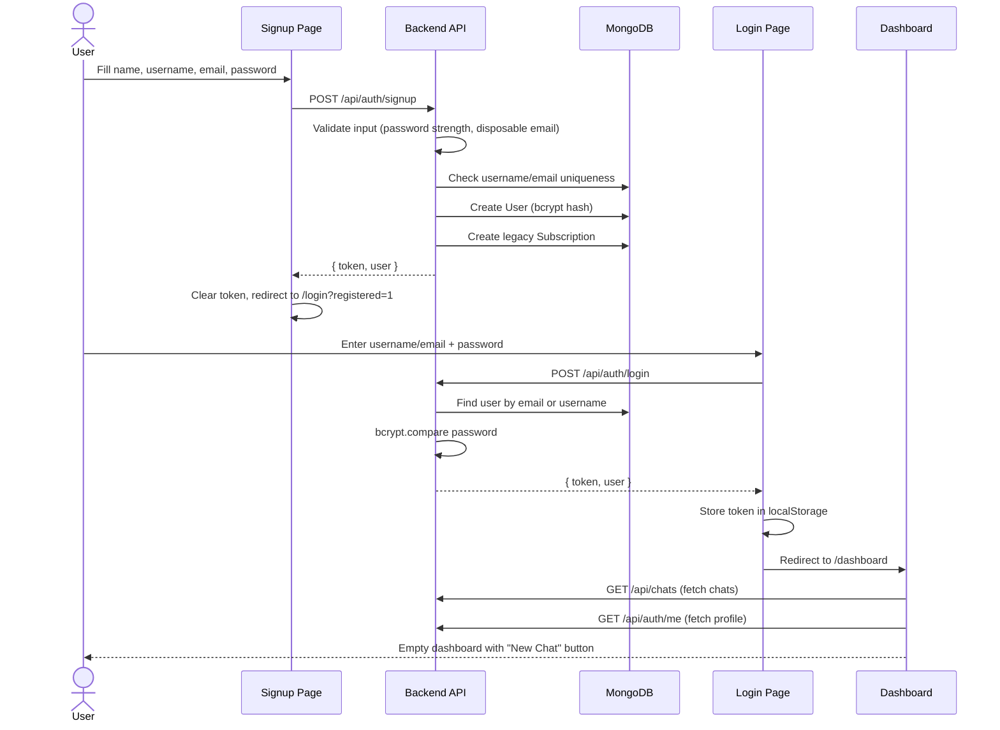
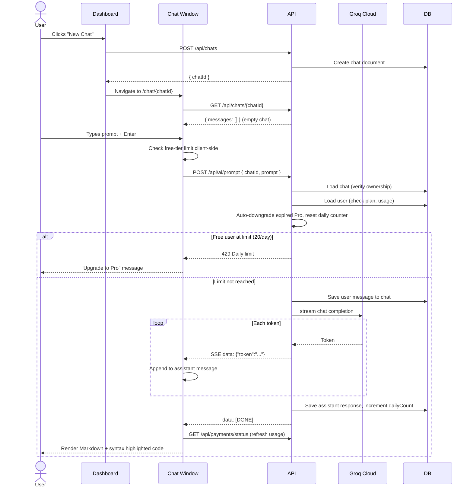
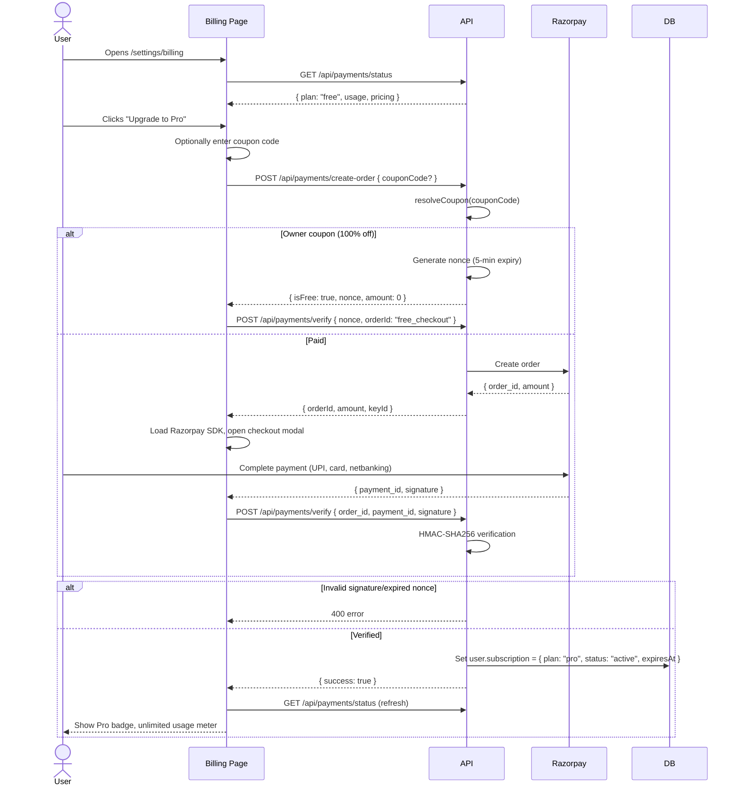
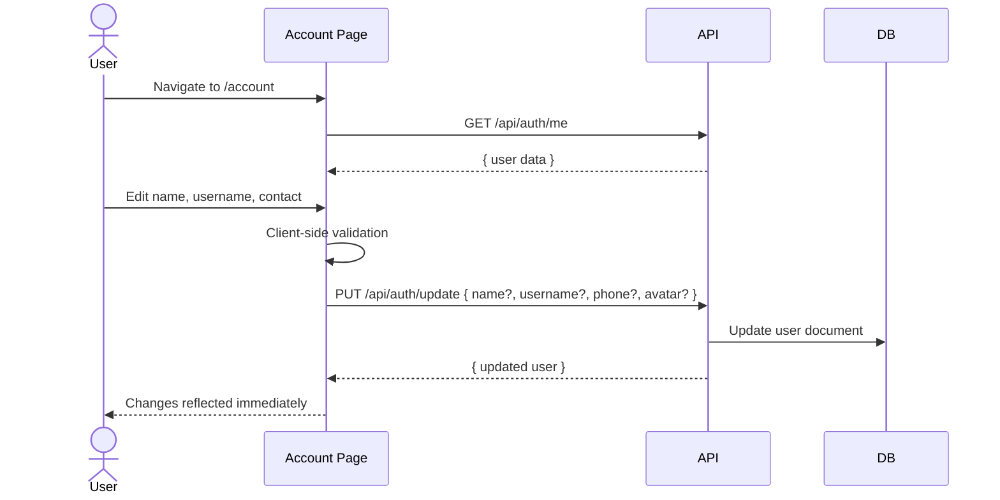
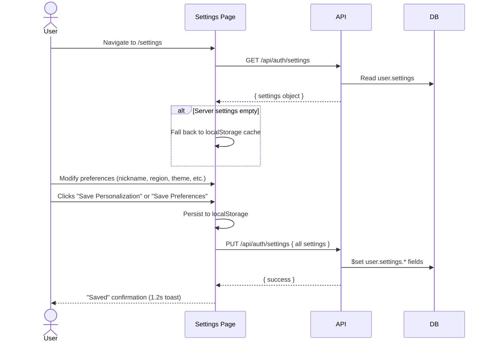
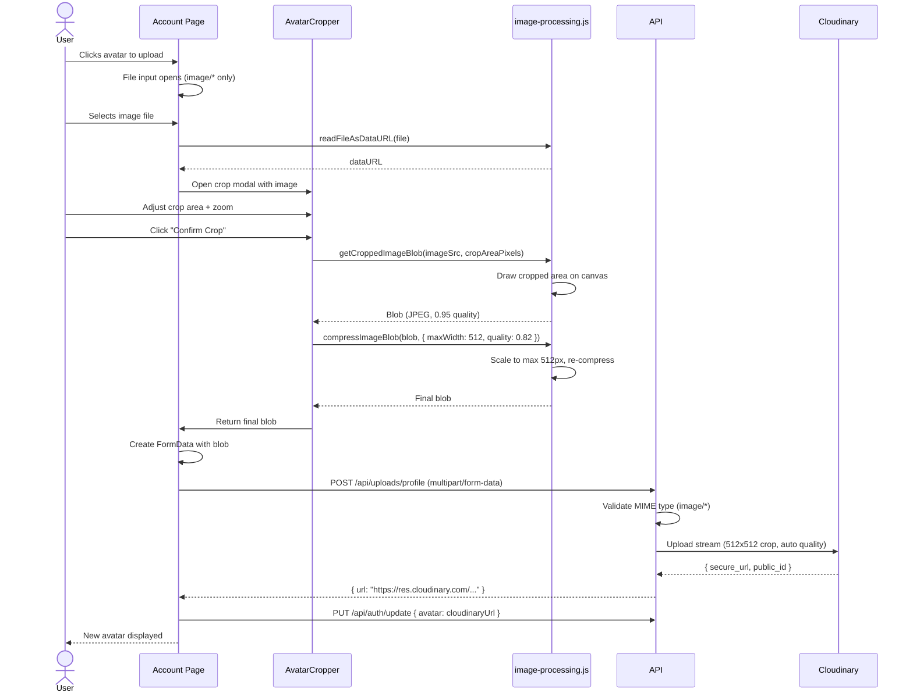
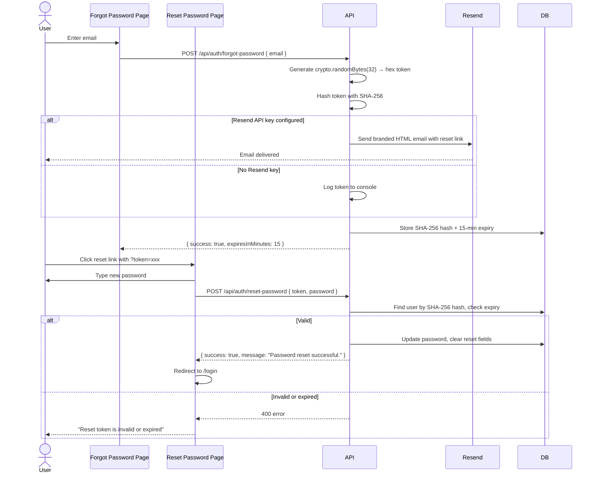
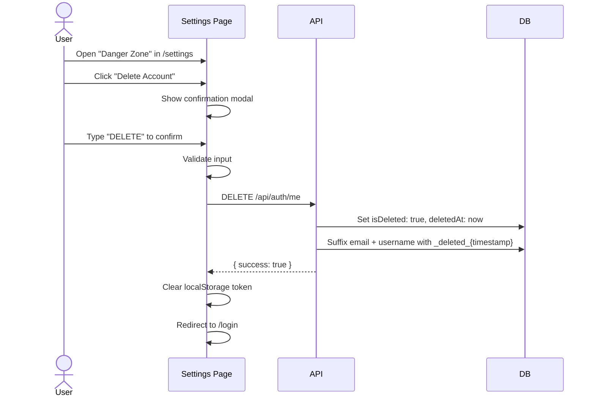

<picture>
  
</picture>

# User Workflows

> Complete walkthrough of the primary user journeys — from account creation to AI chat to subscription management.

## Table of Contents

- [Overview](#overview)
- [1. User Onboarding](#1-user-onboarding)
- [2. AI Chat Session](#2-ai-chat-session)
- [3. Subscription Purchase](#3-subscription-purchase)
- [4. Account Management](#4-account-management)
- [5. Settings Configuration](#5-settings-configuration)
- [6. Profile & Avatar](#6-profile--avatar)
- [7. Password Reset](#7-password-reset)
- [8. Account Deletion](#8-account-deletion)
- [Best Practices](#best-practices)
- [Related Documents](#related-documents)
- [Next Reading](#next-reading)

---

## Overview

DevFlow AI supports eight primary user workflows. Each workflow involves multiple screens, API calls, and state transitions. The diagrams below illustrate the complete flow for each journey, providing developers with clear visibility into the system's lifecycle and error handling.

---

## 1. User Onboarding

The onboarding flow ensures a seamless transition from registration to the active dashboard.

### Flow: Signup → Login → Dashboard

> [!NOTE]  
> **Key Decision Points:**
> - User can use either `register` (quick, no username) or `signup` (full) endpoint.
> - Client-side fallback: if `/signup` returns 404, it tries `/register` and then updates username via `/update`.
> - Token is NOT stored on signup — the user is redirected to login for first-time authentication.
> - "Remember me" persists the email/username to `localStorage` for pre-fill on the next visit.

---

## 2. AI Chat Session

The AI chat session outlines the creation of a chat instance and the streaming of AI responses.

### Flow: Create Chat → Send Prompt → Stream Response → View History

> [!WARNING]  
> **Error Recovery Paths:**
> - **Client disconnect:** Server aborts Groq stream, closes SSE connection.
> - **Groq API error mid-stream:** Server writes error token + `[DONE]` without invoking Express error handler.
> - **Network error:** Client shows "Error occurred" message and allows retry.
> - **Timeout (60s):** AbortController terminates stream, SSE connection closed.

---

## 3. Subscription Purchase

Handles the complete checkout flow, verifying payments securely via Razorpay.

### Flow: Pricing Page → Create Order → Razorpay Checkout → Verification → Pro Activated

> [!IMPORTANT]  
> **Watchdog timer:** The billing page starts a 45-second watchdog when opening the Razorpay modal. If the modal fails to load within that window, the user is notified and the checkout is cancelled.

---

## 4. Account Management

Simple user profile updates and sync logic to keep the UI up-to-date.

### Flow: Profile Update → Settings Sync

> [!NOTE]  
> **Field Mapping:**
> - Client sends `phone` → server maps to `contact` in DB
> - Client sends `profileImage` → server maps to `avatar` in DB
> - Username is lowercased and trimmed server-side
> - Duplicate username returns `409 Conflict`

---

## 5. Settings Configuration

Dual persistence strategy for fast offline access and server syncing.

### Flow: Load Settings → Modify → Sync to Server + localStorage

> [!TIP]  
> **Available Settings Fields:**  
> `nickname`, `interests`, `region`, `language`, `country`, `timezone`, `startPage`, `emailUpdates`, `compactMode`  
> 
> *Settings are dual-persisted: `localStorage` for offline/instant access, and server for cross-device sync.*

---

## 6. Profile & Avatar

A robust client-side cropping and optimization pipeline before cloud upload.

### Flow: Upload → Crop → Compress → Cloudinary → Profile Updated

---

## 7. Password Reset

A secure, token-based recovery process.

### Flow: Request Reset → Receive Email → Set New Password → Login

> [!CAUTION]  
> **Security Guarantees:**
> - Raw reset token is **never** returned in the API response.
> - Token stored as SHA-256 hash (not plaintext) in the database.
> - 15-minute expiry on all tokens.
> - Single-use: token is cleared after a successful reset.
> - Email is sent **before** saving the token to DB — if the email fails, no orphaned token is left.

---

## 8. Account Deletion

Ensures referential integrity while gracefully removing user access.

### Flow: Settings → Delete Confirmation → Soft Delete → Redirect

> [!NOTE]  
> **What Happens to Data:**
> - User document remains in the database (soft delete).
> - Chat histories are preserved (referential integrity).
> - Email and username are freed for reuse via `_deleted_{timestamp}` suffix.
> - The JWT continues to be technically valid but the `protect` middleware now rejects the user.
> - Account can be recovered by an admin by toggling `isDeleted` back to `false`.

---

## Best Practices

To ensure system stability across these workflows, observe the following best practices:
- **Resilience**: Always assume network interrupts and implement appropriate timeout catches (e.g., the 60s stream timeout and 45s Razorpay watchdog).
- **Consistency**: Centralize user state mapping on the backend (e.g., mapping `phone` to `contact`) to maintain a unified data shape.
- **Security**: Never expose cryptographic primitives (like the reset token) in plaintext; rely heavily on short-lived hashes.
- **Optimization**: Perform image manipulations (crop, compress) strictly on the client before delegating stream uploads to Cloudinary to save server compute and bandwidth.

---

## Related Documents

- [Architecture Overview](./architecture.md) — System architecture and data flows.
- [Frontend Architecture](./frontend.md) — Component structure and state management.
- [API Reference](./api.md) — All API endpoints used in these workflows.
- [Authentication](./authentication.md) — Detailed auth flow with middleware code.

## Next Reading

> **Next:** [Roadmap](../ROADMAP.md) — Planned features and development priorities.

---

  <small>© 2024 DevFlow AI. Built with Next.js, Express, MongoDB, and Groq AI.</small>

